# Statistical Visualization Skill

<p align="center">
  
</p>

Team:  
Developer：Haotian Jiang, Wenxiao Du, Bangyu Wang  
Supervisor and Sponsor：Prof. Yongyue Wei, Peking University  
tester: Miao Cui, Qiaochu Wei, Ziwei Xi

**Language:** English | [简体中文](README.zh-CN.md)

StatsVisual-Skill provides skills for publication-ready medical and biostatistical graphics. It helps an AI assistant inspect data first, recommend appropriate figure types, generate reproducible plotting code, and export journal-ready artwork for manuscripts, submissions, and research presentations.

## Motivation

The visual philosophy of this project is mainly inspired by *Statistical Graphics and Art*, edited by Prof. Yongyue Wei from the Peking University Center for Public Health Strategy. The skill follows the principles of faithfulness, expressiveness, and elegance: a figure should stay loyal to the data, reveal the scientific message clearly, and present evidence with refined visual order. We hope the project helps medical researchers turn statistical results into graphics that are scientifically rigorous, readable, and worthy of careful public communication.

## Chart Types Overview

This skill covers **16 statistical chart families**. All figure examples are from *Statistical Graphics and Art*.

| Chart Type | Preview | Description |
|------------|---------|-------------|
| **1. Bar Chart** | <table cellpadding="0" cellspacing="0" border="0" style="border-collapse:collapse;border-spacing:0;"><tr style="line-height:0;"><td style="padding:0;line-height:0;font-size:0;"></td><td style="padding:0;line-height:0;font-size:0;"></td><td style="padding:0;line-height:0;font-size:0;"></td><td style="padding:0;line-height:0;font-size:0;"></td></tr></table> | Compare categorical data with rectangular bars; supports grouped, stacked, and polar variants. |
| **2. Line Chart** | <table cellpadding="0" cellspacing="0" border="0" style="border-collapse:collapse;border-spacing:0;"><tr style="line-height:0;"><td style="padding:0;line-height:0;font-size:0;"></td><td style="padding:0;line-height:0;font-size:0;"></td><td style="padding:0;line-height:0;font-size:0;"></td><td style="padding:0;line-height:0;font-size:0;"></td></tr></table> | Display trends and changes over continuous intervals; includes time series, area, step, and stream graphs. |
| **3. Pie Chart** | <table cellpadding="0" cellspacing="0" border="0" style="border-collapse:collapse;border-spacing:0;"><tr style="line-height:0;"><td style="padding:0;line-height:0;font-size:0;"></td><td style="padding:0;line-height:0;font-size:0;"></td><td style="padding:0;line-height:0;font-size:0;"></td><td style="padding:0;line-height:0;font-size:0;"></td></tr></table> | Show proportions of a whole; supports doughnut, rose, and nested pie variants. |
| **4. Histogram** | <table cellpadding="0" cellspacing="0" border="0" style="border-collapse:collapse;border-spacing:0;"><tr style="line-height:0;"><td style="padding:0;line-height:0;font-size:0;"></td><td style="padding:0;line-height:0;font-size:0;"></td><td style="padding:0;line-height:0;font-size:0;"></td><td style="padding:0;line-height:0;font-size:0;"></td></tr></table> | Visualize the distribution of continuous variables; includes ridgeline, spiral, and pyramid variants. |
| **5. Dot Plot** | <table cellpadding="0" cellspacing="0" border="0" style="border-collapse:collapse;border-spacing:0;"><tr style="line-height:0;"><td style="padding:0;line-height:0;font-size:0;"></td><td style="padding:0;line-height:0;font-size:0;"></td><td style="padding:0;line-height:0;font-size:0;"></td><td style="padding:0;line-height:0;font-size:0;"></td></tr></table> | Present values with dots along a common axis; includes Cleveland dot, lollipop, interaction lollipop, and Manhattan plots. |
| **6. Box Plot** | <table cellpadding="0" cellspacing="0" border="0" style="border-collapse:collapse;border-spacing:0;"><tr style="line-height:0;"><td style="padding:0;line-height:0;font-size:0;"></td><td style="padding:0;line-height:0;font-size:0;"></td><td style="padding:0;line-height:0;font-size:0;"></td><td style="padding:0;line-height:0;font-size:0;"></td></tr></table> | Summarize data distribution through quartiles; includes violin, beeswarm, and raincloud variants. |
| **7. Scatter Plot** | <table cellpadding="0" cellspacing="0" border="0" style="border-collapse:collapse;border-spacing:0;"><tr style="line-height:0;"><td style="padding:0;line-height:0;font-size:0;"></td><td style="padding:0;line-height:0;font-size:0;"></td><td style="padding:0;line-height:0;font-size:0;"></td><td style="padding:0;line-height:0;font-size:0;"></td></tr></table> | Reveal relationships between two continuous variables; supports bubble, smooth scatter, and matrix layouts. |
| **8. Heatmap** | <table cellpadding="0" cellspacing="0" border="0" style="border-collapse:collapse;border-spacing:0;"><tr style="line-height:0;"><td style="padding:0;line-height:0;font-size:0;"></td><td style="padding:0;line-height:0;font-size:0;"></td><td style="padding:0;line-height:0;font-size:0;"></td><td style="padding:0;line-height:0;font-size:0;"></td></tr></table> | Encode values with color intensity in a grid; includes contour lines, filled contours, and calendar layouts. |
| **9. Ternary Plot** | <table cellpadding="0" cellspacing="0" border="0" style="border-collapse:collapse;border-spacing:0;"><tr style="line-height:0;"><td style="padding:0;line-height:0;font-size:0;"></td><td style="padding:0;line-height:0;font-size:0;"></td><td style="padding:0;line-height:0;font-size:0;"></td><td style="padding:0;line-height:0;font-size:0;"></td></tr></table> | Display compositional data on a triangular coordinate system; supports density, interpolation, and interval variants. |
| **10. Q-Q Plot** | <table cellpadding="0" cellspacing="0" border="0" style="border-collapse:collapse;border-spacing:0;"><tr style="line-height:0;"><td style="padding:0;line-height:0;font-size:0;"></td><td style="padding:0;line-height:0;font-size:0;"></td><td style="padding:0;line-height:0;font-size:0;"></td><td style="padding:0;line-height:0;font-size:0;"></td></tr></table> | Compare two probability distributions through quantiles; includes P-P, ladder Q-Q, and symmetry tests. |
| **11. Probability Distribution** | <table cellpadding="0" cellspacing="0" border="0" style="border-collapse:collapse;border-spacing:0;"><tr style="line-height:0;"><td style="padding:0;line-height:0;font-size:0;"></td><td style="padding:0;line-height:0;font-size:0;"></td><td style="padding:0;line-height:0;font-size:0;"></td><td style="padding:0;line-height:0;font-size:0;"></td></tr></table> | Visualize theoretical probability density functions; covers normal, beta, binomial, and gamma distributions. |
| **12. Smoothing Curve** | <table cellpadding="0" cellspacing="0" border="0" style="border-collapse:collapse;border-spacing:0;"><tr style="line-height:0;"><td style="padding:0;line-height:0;font-size:0;"></td><td style="padding:0;line-height:0;font-size:0;">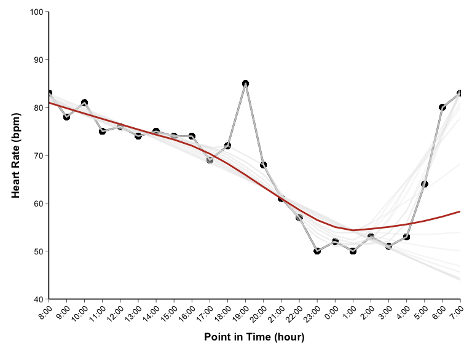</td><td style="padding:0;line-height:0;font-size:0;">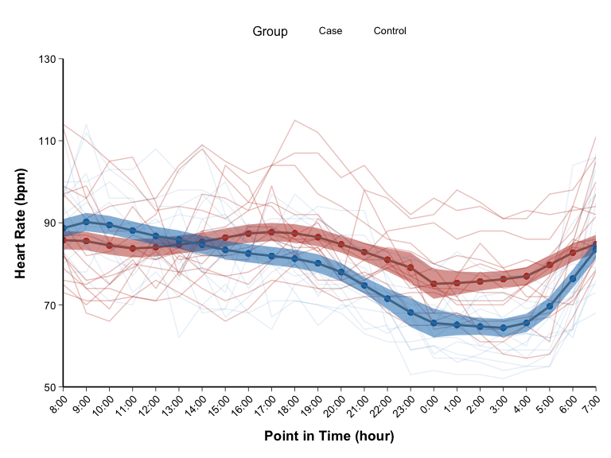</td></tr></table> | Fit a smooth trend through noisy data using LOWESS and other nonparametric methods. |
| **13. Linear Regression** | <table cellpadding="0" cellspacing="0" border="0" style="border-collapse:collapse;border-spacing:0;"><tr style="line-height:0;"><td style="padding:0;line-height:0;font-size:0;"></td><td style="padding:0;line-height:0;font-size:0;"></td><td style="padding:0;line-height:0;font-size:0;"></td><td style="padding:0;line-height:0;font-size:0;"></td></tr></table> | Model linear relationships with confidence bands, ellipses, and response surfaces. |
| **14. Nonlinear Regression** | <table cellpadding="0" cellspacing="0" border="0" style="border-collapse:collapse;border-spacing:0;"><tr style="line-height:0;"><td style="padding:0;line-height:0;font-size:0;"></td><td style="padding:0;line-height:0;font-size:0;"></td><td style="padding:0;line-height:0;font-size:0;"></td><td style="padding:0;line-height:0;font-size:0;"></td></tr></table> | Capture curved relationships through polynomial, sigmoid, convex-concave, and quantile models. |
| **15. Regression Diagnostics** | <table cellpadding="0" cellspacing="0" border="0" style="border-collapse:collapse;border-spacing:0;"><tr style="line-height:0;"><td style="padding:0;line-height:0;font-size:0;"></td><td style="padding:0;line-height:0;font-size:0;"></td><td style="padding:0;line-height:0;font-size:0;"></td><td style="padding:0;line-height:0;font-size:0;"></td></tr></table> | Assess model assumptions with residual plots, Cook's distance, leverage, and influence metrics. |
| **16. Survival Curve** | <table cellpadding="0" cellspacing="0" border="0" style="border-collapse:collapse;border-spacing:0;"><tr style="line-height:0;"><td style="padding:0;line-height:0;font-size:0;"></td><td style="padding:0;line-height:0;font-size:0;"></td><td style="padding:0;line-height:0;font-size:0;"></td><td style="padding:0;line-height:0;font-size:0;"></td></tr></table> | Analyze time-to-event data with Kaplan-Meier curves, group comparisons, and adjusted survival estimates. |

## Included Skills

- `StatsVisual-Skill`: creates data-profile-first medical statistics figures and biostatistical graphics with R.
- `r-journal-style-calibrator`: extends `StatsVisual-Skill` with journal-specific visual styles based on example figures and author guidance.

## What It Does

- Profiles CSV, TSV, XLSX, and RDS datasets before plotting.
- Recommends a primary single figure, up to two alternatives, and an optional multi-panel figure when complementary analyses are useful.
- Uses a first-turn gate: when data are first provided, the assistant profiles and recommends before writing plotting code.
- Supports `general`, `nature`, `lancet`, `nejm`, `jama`, and `bmj` figure styles.
- Exports PDF, editable SVG, high-resolution TIFF, and a compact web preview.
- Records reproducibility artifacts such as the plotting script, data profile, figure rationale, readability QA, and R session information.

## Figure Gallery

The gallery focuses on three comparisons: four medical journal visual styles, domestic-versus-international model outputs, and skill outputs with or without guidance from *Statistical Graphics and Art*.

### 1. Four Medical Journal Style Differences

This group compares graphical styles across four major medical journals, especially color use. In forest plots, *The Lancet* favors black-and-white styling, while *NEJM*, *JAMA*, and *BMJ* do not require it.

#### 1. Kaplan-Meier Curves

<table>
  <tr bgcolor="#ffffff">
    <td width="50%" align="center" valign="bottom" bgcolor="#ffffff">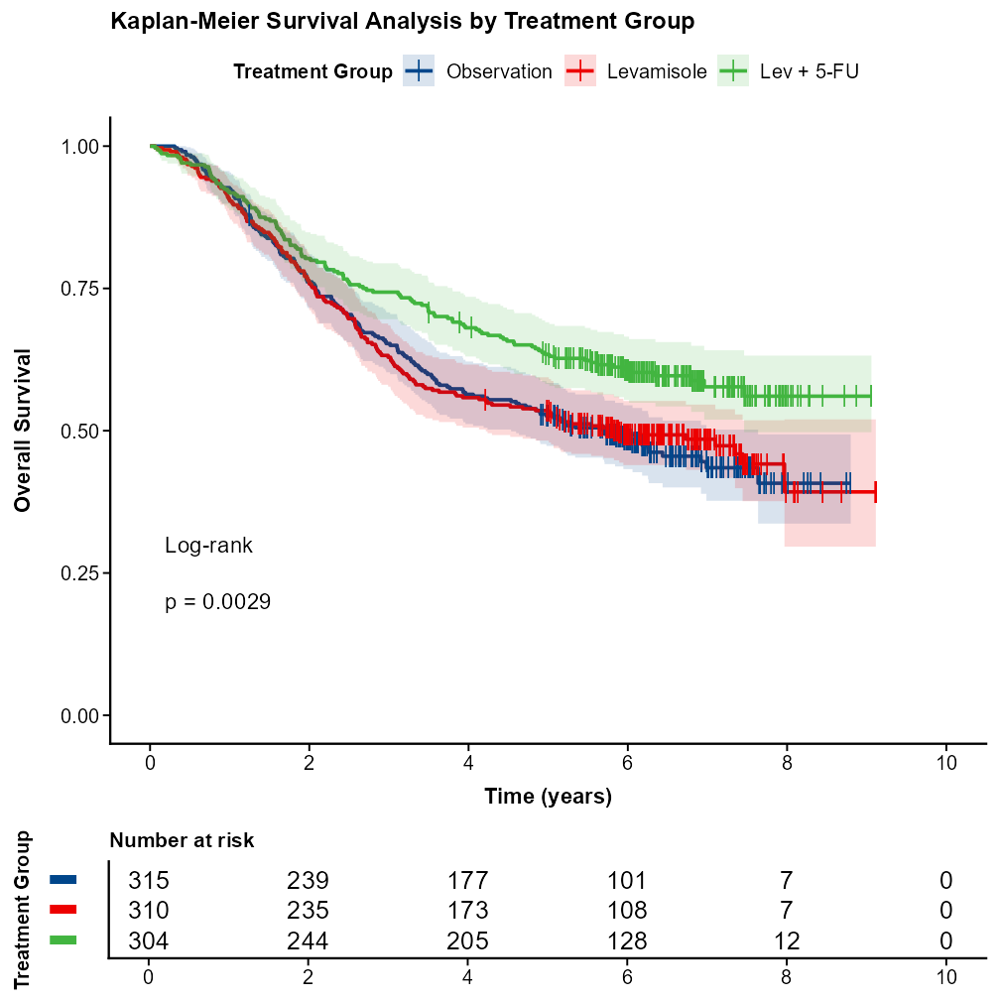</td>
    <td width="50%" align="center" valign="bottom" bgcolor="#ffffff"></td>
  </tr>
  <tr bgcolor="#ffffff">
    <td align="center" bgcolor="#ffffff"><b>(1) Lancet</b></td>
    <td align="center" bgcolor="#ffffff"><b>(2) NEJM</b></td>
  </tr>
  <tr bgcolor="#ffffff">
    <td width="50%" align="center" valign="bottom" bgcolor="#ffffff">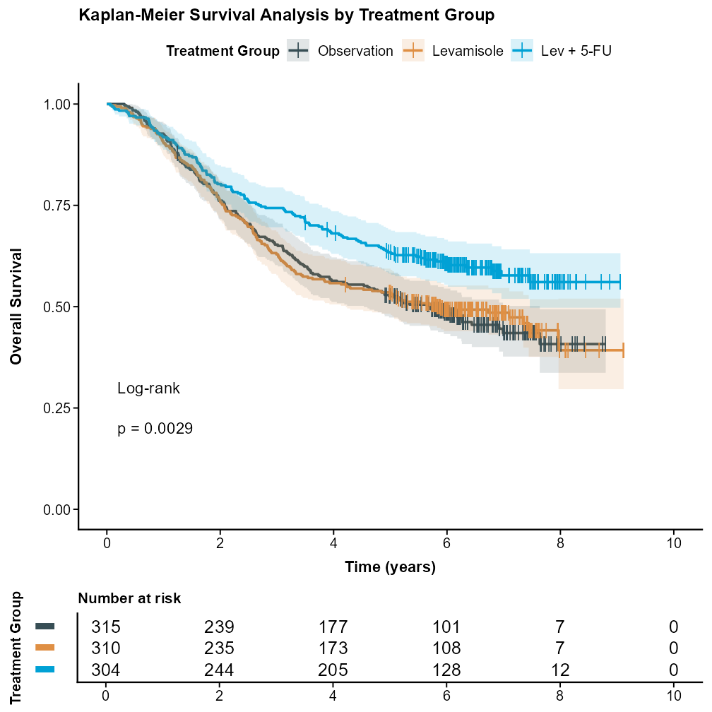</td>
    <td width="50%" align="center" valign="bottom" bgcolor="#ffffff"></td>
  </tr>
  <tr bgcolor="#ffffff">
    <td align="center" bgcolor="#ffffff"><b>(3) JAMA</b></td>
    <td align="center" bgcolor="#ffffff"><b>(4) BMJ</b></td>
  </tr>
</table>

#### 2. Forest Plots

<table>
  <tr bgcolor="#ffffff">
    <td width="50%" align="center" valign="bottom" bgcolor="#ffffff">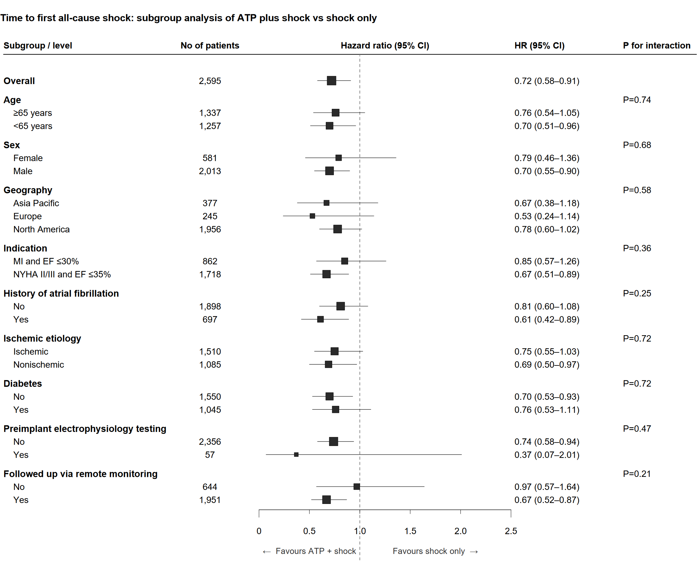</td>
    <td width="50%" align="center" valign="bottom" bgcolor="#ffffff">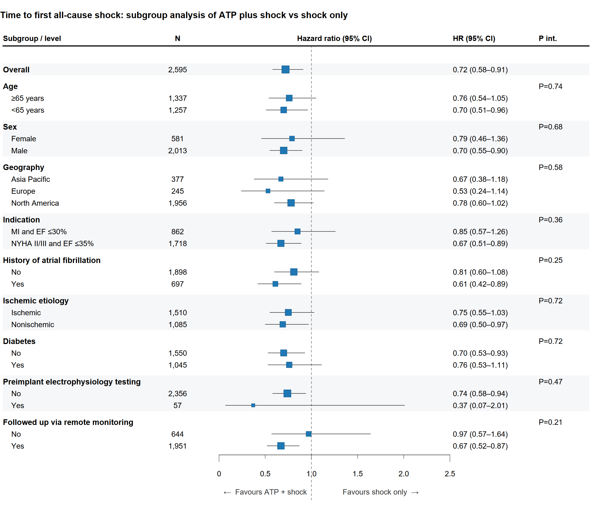</td>
  </tr>
  <tr bgcolor="#ffffff">
    <td align="center" bgcolor="#ffffff"><b>(1) Lancet</b></td>
    <td align="center" bgcolor="#ffffff"><b>(2) NEJM</b></td>
  </tr>
  <tr bgcolor="#ffffff">
    <td width="50%" align="center" valign="bottom" bgcolor="#ffffff"></td>
    <td width="50%" align="center" valign="bottom" bgcolor="#ffffff"></td>
  </tr>
  <tr bgcolor="#ffffff">
    <td align="center" bgcolor="#ffffff"><b>(3) JAMA</b></td>
    <td align="center" bgcolor="#ffffff"><b>(4) BMJ</b></td>
  </tr>
</table>

### 2. Domestic And International Model Outputs

This group uses the exact model labels to compare the domestic LLM `minimax-m3` and the international LLM `chatgpt-5.5` across ROC curves, volcano plots, and rose charts.

#### 1. ROC Curves

<table>
  <tr bgcolor="#ffffff">
    <td width="50%" align="center" valign="bottom" bgcolor="#ffffff">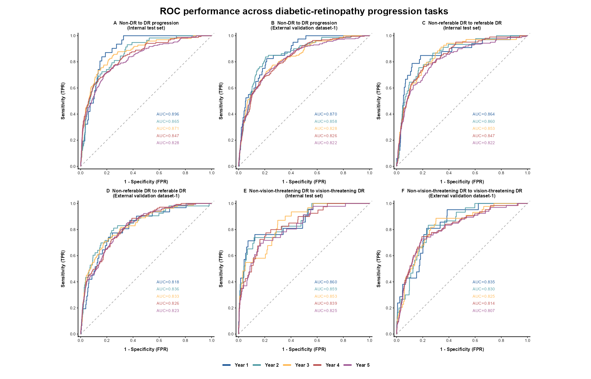</td>
    <td width="50%" align="center" valign="bottom" bgcolor="#ffffff"></td>
  </tr>
  <tr bgcolor="#ffffff">
    <td align="center" bgcolor="#ffffff"><b>(1) Domestic LLM: minimax-m3</b></td>
    <td align="center" bgcolor="#ffffff"><b>(2) International LLM: chatgpt-5.5</b></td>
  </tr>
</table>

#### 2. Volcano Plots

<table>
  <tr bgcolor="#ffffff">
    <td width="50%" align="center" valign="bottom" bgcolor="#ffffff"></td>
    <td width="50%" align="center" valign="bottom" bgcolor="#ffffff">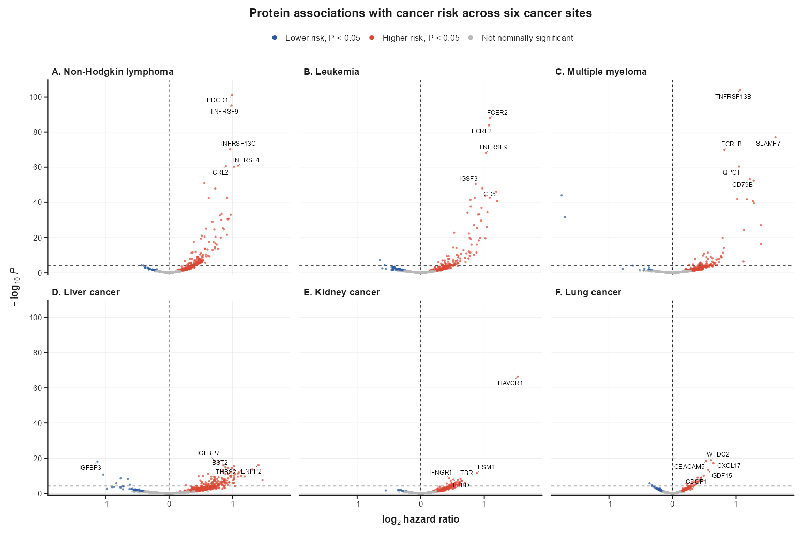</td>
  </tr>
  <tr bgcolor="#ffffff">
    <td align="center" bgcolor="#ffffff"><b>(1) Domestic LLM: minimax-m3</b></td>
    <td align="center" bgcolor="#ffffff"><b>(2) International LLM: chatgpt-5.5</b></td>
  </tr>
</table>

#### 3. Rose Charts

<table>
  <tr bgcolor="#ffffff">
    <td width="50%" align="center" valign="bottom" bgcolor="#ffffff">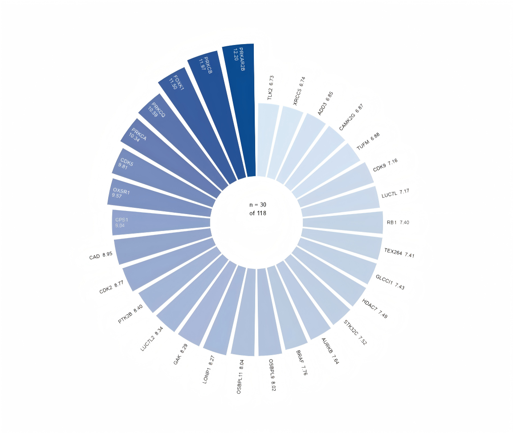</td>
    <td width="50%" align="center" valign="bottom" bgcolor="#ffffff"></td>
  </tr>
  <tr bgcolor="#ffffff">
    <td align="center" bgcolor="#ffffff"><b>(1) Domestic LLM: minimax-m3</b></td>
    <td align="center" bgcolor="#ffffff"><b>(2) International LLM: chatgpt-5.5</b></td>
  </tr>
</table>

### 3. Skill Outputs With Or Without *Statistical Graphics And Art* Guidance

This group shows how adding the core ideas of *Statistical Graphics and Art* changes grouping, spacing, reference scales, label completeness, and visual hierarchy.

#### 1. Radar Charts

<table>
  <tr bgcolor="#ffffff">
    <td width="50%" align="center" valign="bottom" bgcolor="#ffffff"></td>
    <td width="50%" align="center" valign="bottom" bgcolor="#ffffff"></td>
  </tr>
  <tr bgcolor="#ffffff">
    <td align="center" bgcolor="#ffffff"><b>(1) Without <i>Statistical Graphics and Art</i> guidance</b></td>
    <td align="center" bgcolor="#ffffff"><b>(2) With <i>Statistical Graphics and Art</i> guidance</b></td>
  </tr>
</table>

#### 2. Rose Charts

<table>
  <tr bgcolor="#ffffff">
    <td width="50%" align="center" valign="bottom" bgcolor="#ffffff">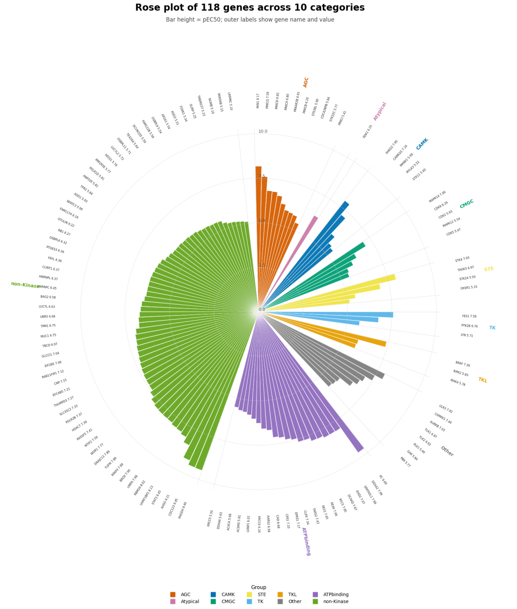</td>
    <td width="50%" align="center" valign="bottom" bgcolor="#ffffff">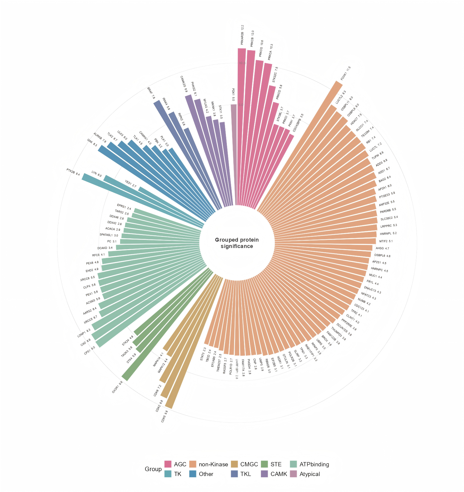</td>
  </tr>
  <tr bgcolor="#ffffff">
    <td align="center" bgcolor="#ffffff"><b>(1) Without <i>Statistical Graphics and Art</i> guidance</b></td>
    <td align="center" bgcolor="#ffffff"><b>(2) With <i>Statistical Graphics and Art</i> guidance</b></td>
  </tr>
</table>

## Repository Layout

```text
assets/
  brand/
    r-medical-graphics-logo.svg
    r-medical-graphics-mark.svg
    statistical-graphics-art.jpg
  gallery/
    journal-km-lancet.png ... art-rose-with-guidance.png
skills/
  StatsVisual-Skill/
    SKILL.md
    agents/openai.yaml
    assets/
    references/
    scripts/
  r-journal-style-calibrator/
    SKILL.md
    agents/openai.yaml
    references/
```

## Installation

Clone the repository and copy both skill folders into the skills directory for your target client.

### Codex

```powershell
git clone https://github.com/HaotianJiang056/R-plot-skill.git StatsVisual-Skill
Copy-Item ".\StatsVisual-Skill\skills\StatsVisual-Skill\*" "$env:USERPROFILE\.codex\skills\StatsVisual-Skill" -Recurse -Force
Copy-Item ".\StatsVisual-Skill\skills\r-journal-style-calibrator\*" "$env:USERPROFILE\.codex\skills\r-journal-style-calibrator" -Recurse -Force
```

If `CODEX_HOME` is set, replace `$env:USERPROFILE\.codex` with `$env:CODEX_HOME`.

### CodeBuddy

The CodeBuddy trial provides 500 base credits each month for free use.

```powershell
git clone https://github.com/HaotianJiang056/R-plot-skill.git StatsVisual-Skill
Copy-Item ".\StatsVisual-Skill\skills\StatsVisual-Skill\*" "$env:USERPROFILE\.codebuddy\skills\StatsVisual-Skill" -Recurse -Force
Copy-Item ".\StatsVisual-Skill\skills\r-journal-style-calibrator\*" "$env:USERPROFILE\.codebuddy\skills\r-journal-style-calibrator" -Recurse -Force
```

## Windows R Setup

From the repository root, install the recommended R packages:

```powershell
powershell -ExecutionPolicy Bypass -File skills/StatsVisual-Skill/scripts/bootstrap_windows_dependencies.ps1
```

Verify the active R environment:

```powershell
Rscript skills/StatsVisual-Skill/scripts/check_dependencies.R
```

If the default CRAN mirror is unavailable, pass a mirror explicitly:

```powershell
powershell -ExecutionPolicy Bypass -File skills/StatsVisual-Skill/scripts/bootstrap_windows_dependencies.ps1 -CranRepo "https://mirrors.tuna.tsinghua.edu.cn/CRAN/"
```

Optional Bioconductor heatmap packages can be checked with:

```powershell
Rscript skills/StatsVisual-Skill/scripts/check_dependencies.R --include-optional
```

## Quick Smoke Test

From the repository root:

```powershell
Rscript skills/StatsVisual-Skill/scripts/create_plot_project.R demo
Copy-Item skills/StatsVisual-Skill/assets/example_data/example_continuous_by_group.csv demo/data/
Copy-Item skills/StatsVisual-Skill/assets/plot_template.R demo/R/plot_boxplot.R
$env:R_MEDICAL_GRAPHICS_SKILL = "skills/StatsVisual-Skill"
Rscript demo/R/plot_boxplot.R demo demo/data/example_continuous_by_group.csv example_boxplot
Rscript skills/StatsVisual-Skill/scripts/validate_r_plot.R demo/figures
```

## Example Prompts

```text
Use $StatsVisual-Skill. I have a CSV and do not know which chart is appropriate. Please inspect it and recommend options first.
```

```text
Use $StatsVisual-Skill to draw a publication-ready Kaplan-Meier curve with risk table and log-rank P value.
```

```text
Use $r-journal-style-calibrator to add a JAMA-style visual profile to StatsVisual-Skill from example figures and official guidelines.
```

Even for direct drawing requests, the first response should inspect the data, confirm whether the requested chart is suitable, recommend the best single figure and any optional multi-panel figure, then ask for confirmation before generating R code.

## Community And Use

We welcome everybody to co-build, test, and share improvements to this skill. The skill materials, documentation, examples, and visual assets are protected by copyright. If you plan to cite, reproduce, adapt, redistribute, or use these materials in a public work, please contact the development team in advance.

## Acknowledgements

This project was inspired by [Yuan1z0825/nature-skills](https://github.com/Yuan1z0825/nature-skills),but follows a different focus. It centers on medical statistical visualization principles from four leading medical journals—The Lancet, NEJM, JAMA, and BMJ—and is structured around the framework of Statistical Graphics and Art. It covers a broader range of chart types and helps users choose suitable visualizations based on their data structure and statistical intent.

## Recruitment Notice
The research group is seeking postdoctoral researchers. Applicants with relevant research backgrounds are encouraged to apply. For details, please visit: http://phepr.pku.edu.cn/info/1038/2521.htm

## References

1. Wei Y. *Statistical Graphics and Art*. Beijing: China Science and Technology Press; 2025.

<p align="center">
  
</p>

2. Jambor HK. A checklist for designing and improving the visualization of scientific data. *Nature Cell Biology*. 2025;27(6):879-883.
3. Lin Y, Zhang L, Chen F, Wei Y. Specification of statistical graphics in medical research. *Chinese Journal of Epidemiology*. 2022;43(10):1666-1670.
4. Zhang L, Lin Y, Huang L, Chen F, Wei Y. Essential elements and design principles of statistical graphics in medical research. *Chinese Journal of Epidemiology*. 2023;44(11).

## License

See [LICENSE](LICENSE).