# StatsVisual-Skill

<p align="center">
  
</p>

**语言：** [English](README.md) | 简体中文

StatsVisual-Skill 提供一组用于 R 医学统计绘图的 Codex skills，帮助 AI 助手先检查数据，再推荐合适图形，生成可复现 R 代码，并导出适合论文、投稿和汇报使用的高质量图形。当前核心绘图 skill 仍以 `r-medical-graphics` 作为 Codex 调用名。

## 包含的 Skills

- `r-medical-graphics`：以数据画像为起点，创建医学统计图和生物统计图。
- `r-journal-style-calibrator`：基于期刊例图和作者指南，为 `r-medical-graphics` 扩展期刊风格。

## 核心能力

- 在绘图前分析 CSV、TSV、XLSX 和 RDS 数据。
- 推荐一个首选单图、最多两个备选单图；当互补分析有价值时，推荐可选组图。
- 使用首轮推荐门：第一次收到数据时，只做数据画像和图形推荐，不直接写绘图代码。
- 支持 `general`、`nature`、`lancet`、`nejm`、`jama` 和 `bmj` 图形风格。
- 当分类数值摘要达到 20 个或更多类别，且竖向布局过高或标签过密时，优先推荐 polar plot 或 rose chart。
- 导出 PDF、可编辑 SVG、高分辨率 TIFF 和网页预览图。
- 保存 R 脚本、数据画像、图形说明、可读性 QA 和 R 会话信息等复现材料。

## 绘图效果展示

以下展示按 `skill测试结果.docx` 中更新后的分类和图片顺序重新排版。图片以 Word 中出现的 19 个图片位置为准逐一保留，重点展示三类对比：四大医学期刊风格差异、国内外模型绘制效果差异，以及有无《统计图形与艺术》精华思想支撑的 skill 绘图差异。

### 一、四大医学期刊风格差异

这一组主要观察配色差异；森林图中 Lancet 明确采用黑白配色，而 NEJM、JAMA、BMJ 没有这种硬性要求。展示顺序与 Word 一致。

#### 1. KM 曲线

<table>
  <tr>
    <td width="50%" align="center"><br><b>（1）Lancet</b></td>
    <td width="50%" align="center">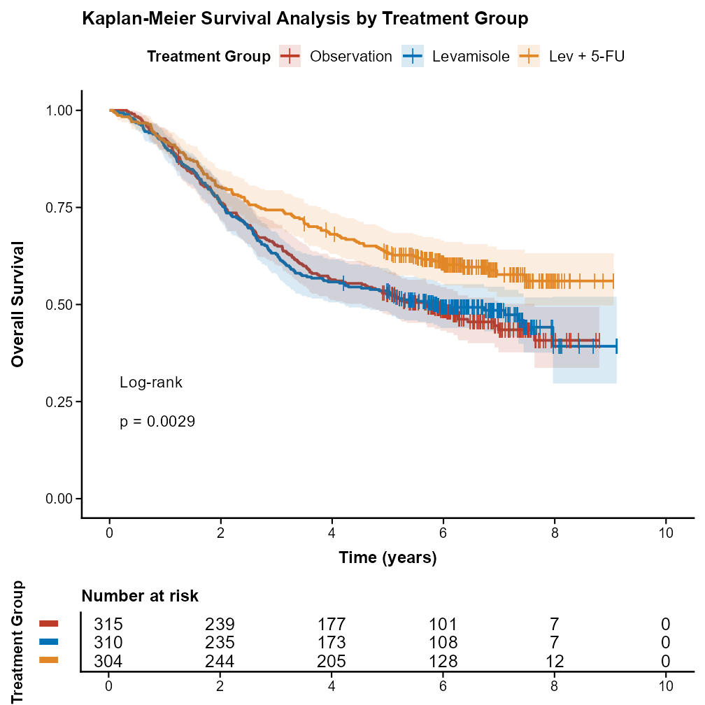<br><b>（2）NEJM</b></td>
  </tr>
  <tr>
    <td width="50%" align="center"><br><b>（3）JAMA</b></td>
    <td width="50%" align="center">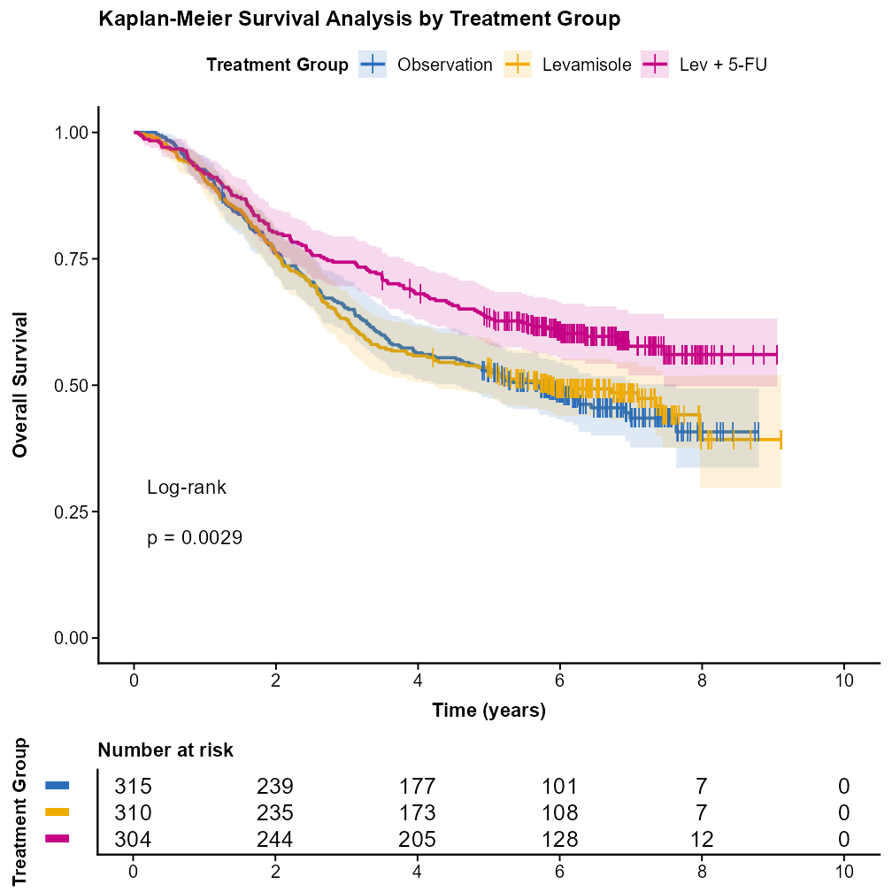<br><b>（4）BMJ</b></td>
  </tr>
  <tr>
    <td colspan="2" align="center"><br><b>（3）JAMA：Word 中保留的补充图片</b></td>
  </tr>
</table>

#### 2. 森林图

<table>
  <tr>
    <td width="50%" align="center"><br><b>（1）Lancet</b></td>
    <td width="50%" align="center"><br><b>（2）NEJM</b></td>
  </tr>
  <tr>
    <td width="50%" align="center">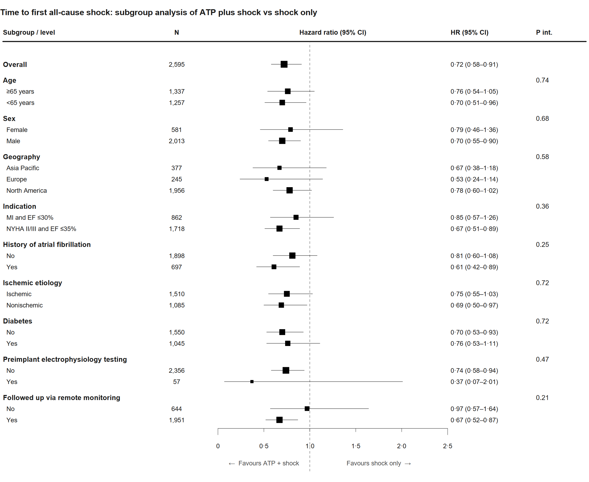<br><b>（3）JAMA</b></td>
    <td width="50%" align="center">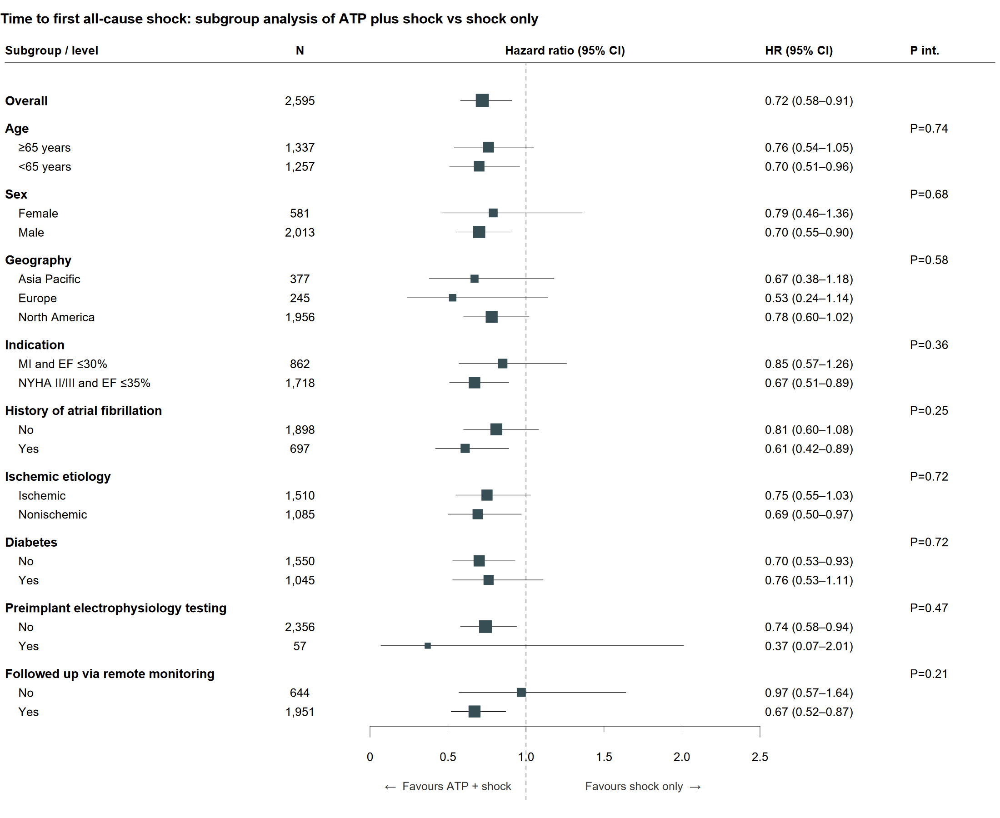<br><b>（4）BMJ</b></td>
  </tr>
</table>

### 二、国内外模型绘制效果差异较小

这一组按 Word 中的具体名称比较国内 LLM `minimax-m3` 与国外 LLM `chatgpt-5.5` 的绘制结果，分为 ROC 曲线、火山图和玫瑰图。

#### 1. ROC 曲线

<table>
  <tr>
    <td width="50%" align="center">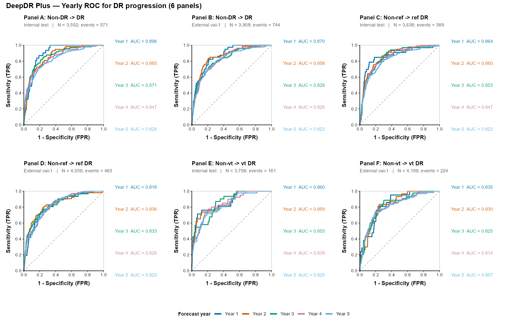<br><b>（1）国内 LLM：minimax-m3</b></td>
    <td width="50%" align="center">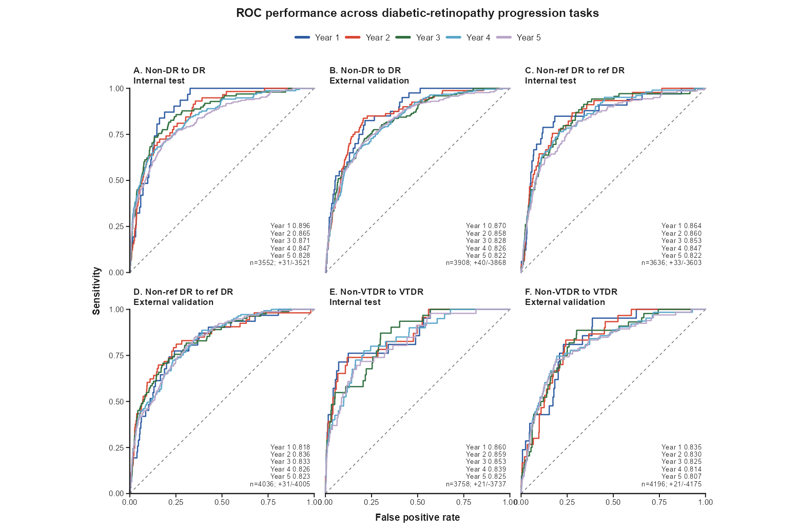<br><b>（2）国外 LLM：chatgpt-5.5</b></td>
  </tr>
</table>

#### 2. 火山图

<table>
  <tr>
    <td width="50%" align="center">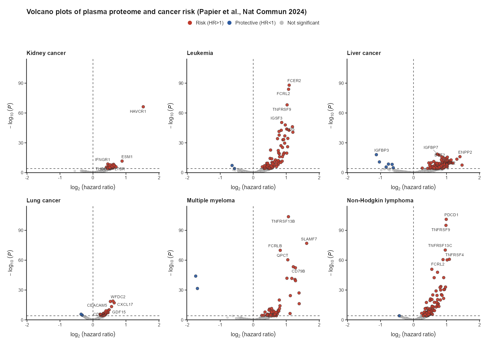<br><b>（1）国内 LLM：minimax-m3</b></td>
    <td width="50%" align="center"><br><b>（2）国外 LLM：chatgpt-5.5</b></td>
  </tr>
</table>

#### 3. 玫瑰图

<table>
  <tr>
    <td width="50%" align="center">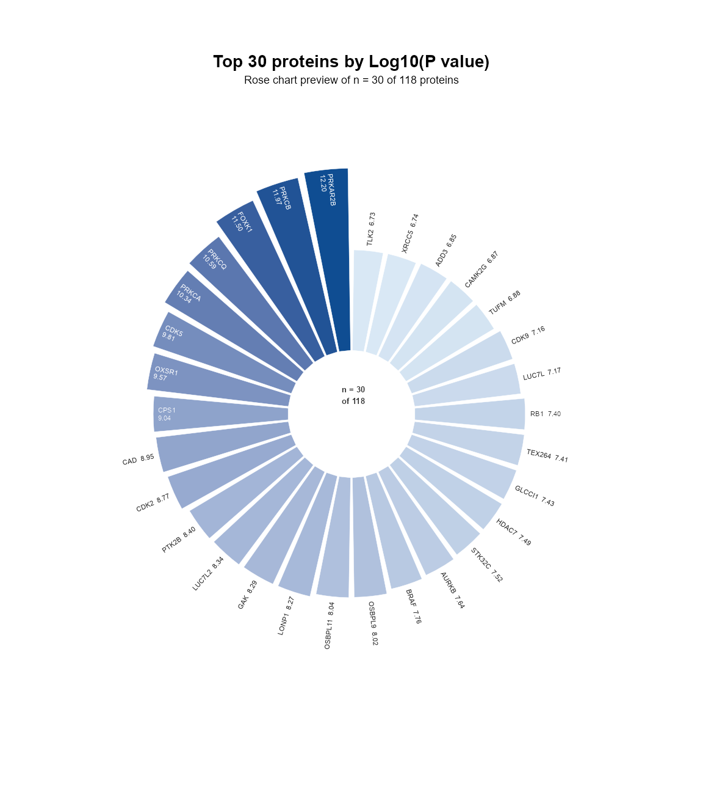<br><b>（1）国内 LLM：minimax-m3</b></td>
    <td width="50%" align="center">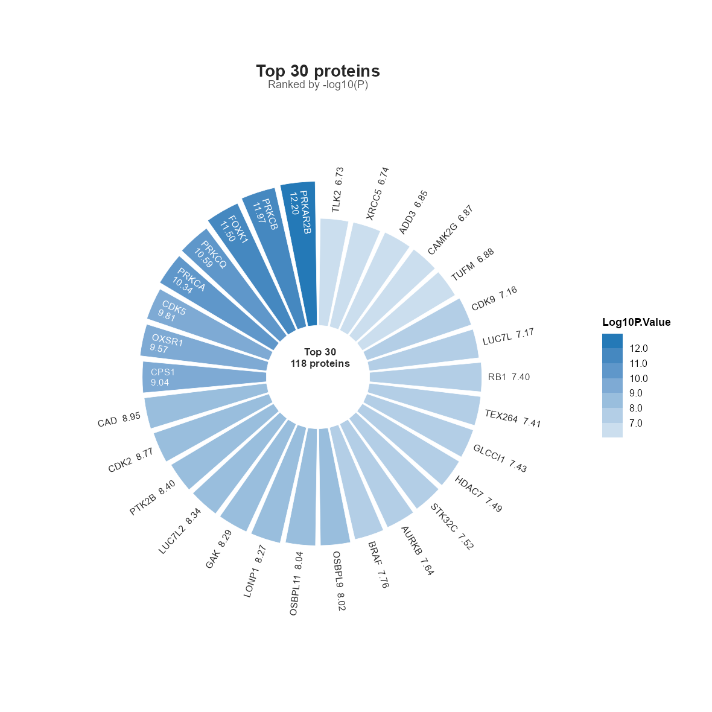<br><b>（2）国外 LLM：chatgpt-5.5</b></td>
  </tr>
</table>

### 三、有无《统计图形与艺术》精华思想支撑的 skill 绘图差异

这一组展示 skill 是否增加《统计图形与艺术》的绘图思想作为支撑后，在分组、留白、刻度参考、标签完整性和图形层级上的差异。

#### 1. 雷达图

<table>
  <tr>
    <td width="50%" align="center">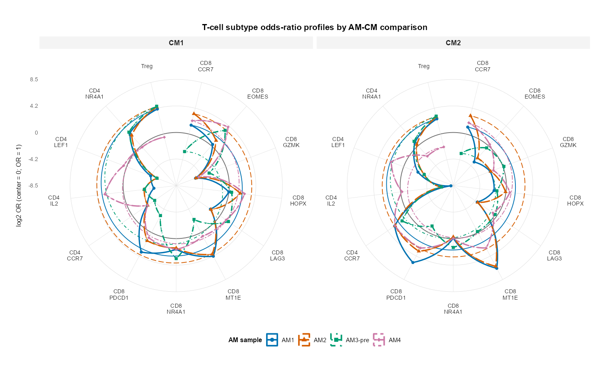<br><b>（1）无《统计图形与艺术》的绘图思想作为支撑</b></td>
    <td width="50%" align="center">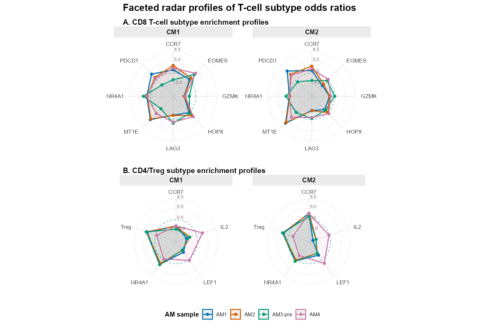<br><b>（2）有《统计图形与艺术》的绘图思想作为支撑</b></td>
  </tr>
</table>

#### 2. 玫瑰图

<table>
  <tr>
    <td width="50%" align="center"><br><b>（1）无《统计图形与艺术》的绘图思想作为支撑</b></td>
    <td width="50%" align="center">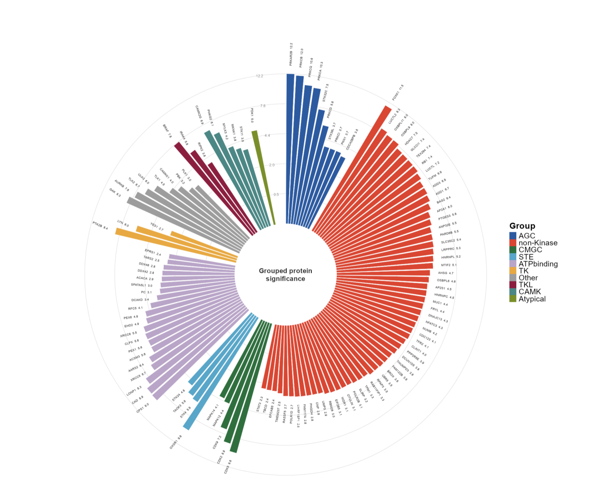<br><b>（2）有《统计图形与艺术》的绘图思想作为支撑</b></td>
  </tr>
</table>
## 仓库结构

```text
assets/
  brand/
    r-medical-graphics-logo.svg
    r-medical-graphics-mark.svg
  gallery/
    word-01-km-lancet.png ... word-19-rose-with-art.png
skills/
  StatsVisual-Skill/
    SKILL.md
    agents/openai.yaml
    assets/
    references/
    scripts/
  r-journal-style-calibrator/
    SKILL.md
    agents/openai.yaml
    references/
```

本仓库只包含精简改写后的规则和合成示例数据。研究数据、源文档、生成图形和运行输出请保存在单独的工作目录中。

## 安装

克隆仓库，然后把 skill 文件夹复制到 Codex skills 目录。

```powershell
git clone https://github.com/HaotianJiang056/R-plot-skill.git StatsVisual-Skill
Copy-Item StatsVisual-Skill/skills/StatsVisual-Skill "$env:USERPROFILE/.codex/skills/r-medical-graphics" -Recurse -Force
Copy-Item StatsVisual-Skill/skills/r-journal-style-calibrator "$env:USERPROFILE/.codex/skills/" -Recurse -Force
```

如果设置了 `CODEX_HOME`，请复制到 `$env:CODEX_HOME/skills/`。

## Windows R 环境

在仓库根目录安装推荐的 R 包：

```powershell
powershell -ExecutionPolicy Bypass -File skills/StatsVisual-Skill/scripts/bootstrap_windows_dependencies.ps1
```

验证当前 R 环境：

```powershell
Rscript skills/StatsVisual-Skill/scripts/check_dependencies.R
```

如果默认 CRAN 镜像不可用，可以显式指定镜像：

```powershell
powershell -ExecutionPolicy Bypass -File skills/StatsVisual-Skill/scripts/bootstrap_windows_dependencies.ps1 -CranRepo "https://mirrors.tuna.tsinghua.edu.cn/CRAN/"
```

可选 Bioconductor 热图包可用以下命令检查：

```powershell
Rscript skills/StatsVisual-Skill/scripts/check_dependencies.R --include-optional
```

## 快速测试

在仓库根目录运行：

```powershell
Rscript skills/StatsVisual-Skill/scripts/create_plot_project.R demo
Copy-Item skills/StatsVisual-Skill/assets/example_data/example_continuous_by_group.csv demo/data/
Copy-Item skills/StatsVisual-Skill/assets/plot_template.R demo/R/plot_boxplot.R
$env:R_MEDICAL_GRAPHICS_SKILL = "skills/StatsVisual-Skill"
Rscript demo/R/plot_boxplot.R demo demo/data/example_continuous_by_group.csv example_boxplot
Rscript skills/StatsVisual-Skill/scripts/validate_r_plot.R demo/figures
```

## 示例请求

```text
请使用 $r-medical-graphics。我有一个 CSV，不确定适合画什么图。请先检查数据并推荐方案。
```

```text
请使用 $r-medical-graphics 绘制出版级 Kaplan-Meier 生存曲线，包含风险表和 log-rank P 值。
```

```text
请使用 $r-journal-style-calibrator，根据期刊例图和官方指南，为 r-medical-graphics 新增 JAMA 风格。
```

即使用户直接提出绘图请求，第一次回复也应先检查数据，确认请求图形是否合适，推荐最佳单图和可选组图，然后等待用户确认再生成 R 代码。

## 课题组诚招博士后研究员

## 致谢

本项目灵感来源于 [Yuan1z0825/nature-skills](https://github.com/Yuan1z0825/nature-skills)。

## 许可证

请见 [LICENSE](LICENSE)。