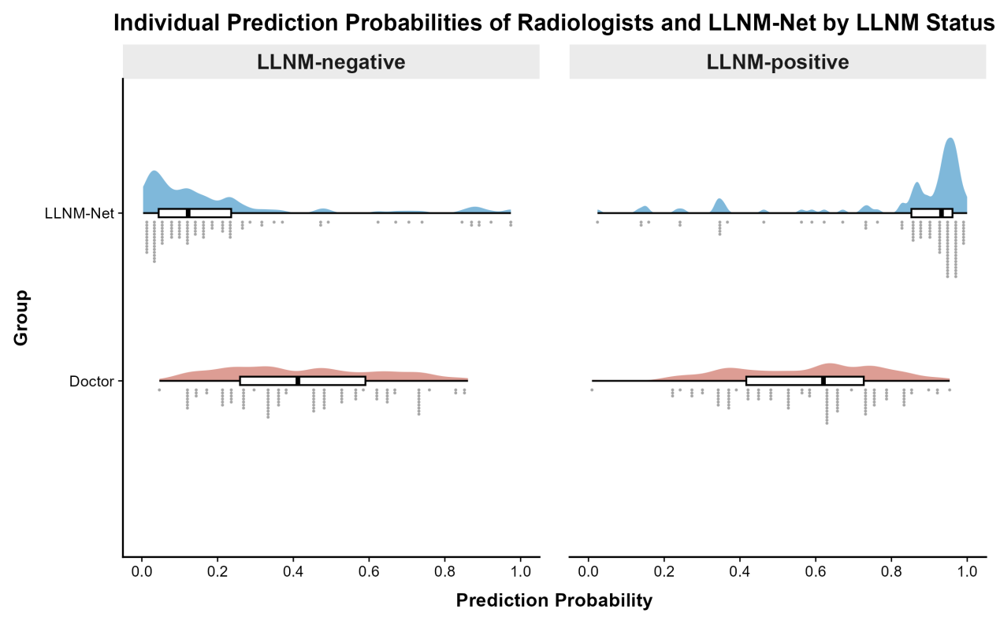
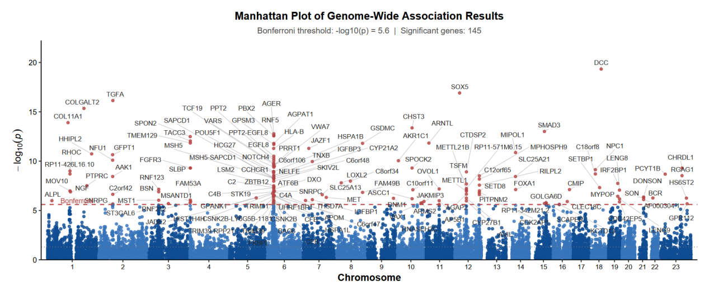
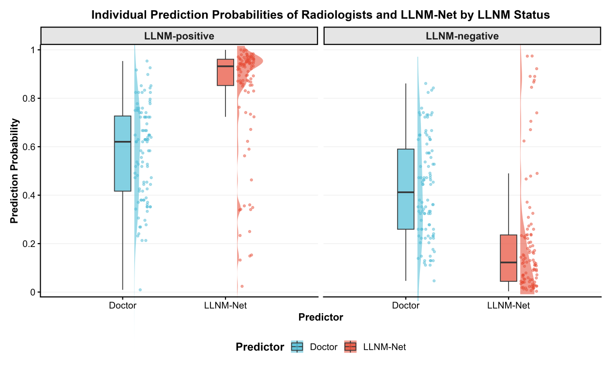
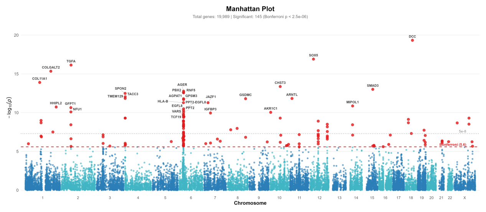

# Statistical Visualization Skill

<p align="center">
  
</p>

**语言：** [English](README.md) | 简体中文

Team:  
开发人员：江昊天，杜文晓，王邦宇  
指导老师：Prof. Yongyue Wei, Peking University  
内部测试: 崔淼、魏翘楚、奚梓玮

## Motivation

StatsVisual-Skill 是一组面向医学统计绘图的 AI skills，旨在帮助 AI 助手先检查数据，再推荐合适图形，生成可复现代码，并导出适合论文、投稿和汇报使用的高质量图形。其绘图理念主要来源于北京大学公众健康战略研究中心魏永越老师主编的《统计图形与艺术》。我们希望把“信、达、雅”的思想融入医学统计可视化：忠实于数据本身，清楚表达科学发现，并以克制、精致且有秩序的视觉形式呈现证据，使图形兼具科学性、可读性与审美品质。

## 图形大类概览

本 skill 涵盖 **16 种统计图形大类**，图形示例均来自《统计图形与艺术》。

| 图形类别 | 预览 | 图形说明 |
|----------|------|----------|
| **1. 柱状图** | <table cellpadding="0" cellspacing="0" border="0" style="border-collapse:collapse;border-spacing:0;"><tr style="line-height:0;"><td style="padding:0;line-height:0;font-size:0;"></td><td style="padding:0;line-height:0;font-size:0;"></td><td style="padding:0;line-height:0;font-size:0;"></td><td style="padding:0;line-height:0;font-size:0;"></td></tr></table> | 用矩形条对比分类数据，支持分组、堆叠和极坐标变体。 |
| **2. 折线图** | <table cellpadding="0" cellspacing="0" border="0" style="border-collapse:collapse;border-spacing:0;"><tr style="line-height:0;"><td style="padding:0;line-height:0;font-size:0;"></td><td style="padding:0;line-height:0;font-size:0;"></td><td style="padding:0;line-height:0;font-size:0;"></td><td style="padding:0;line-height:0;font-size:0;"></td></tr></table> | 展示连续区间上的趋势变化，包含时间序列、面积、阶梯和河流图。 |
| **3. 饼图** | <table cellpadding="0" cellspacing="0" border="0" style="border-collapse:collapse;border-spacing:0;"><tr style="line-height:0;"><td style="padding:0;line-height:0;font-size:0;"></td><td style="padding:0;line-height:0;font-size:0;"></td><td style="padding:0;line-height:0;font-size:0;"></td><td style="padding:0;line-height:0;font-size:0;"></td></tr></table> | 展示整体中各部分的比例关系，支持环形、玫瑰和嵌套饼图。 |
| **4. 直方图** | <table cellpadding="0" cellspacing="0" border="0" style="border-collapse:collapse;border-spacing:0;"><tr style="line-height:0;"><td style="padding:0;line-height:0;font-size:0;"></td><td style="padding:0;line-height:0;font-size:0;"></td><td style="padding:0;line-height:0;font-size:0;"></td><td style="padding:0;line-height:0;font-size:0;"></td></tr></table> | 可视化连续变量的分布特征，包含山脊、螺旋和金字塔图。 |
| **5. 点图** | <table cellpadding="0" cellspacing="0" border="0" style="border-collapse:collapse;border-spacing:0;"><tr style="line-height:0;"><td style="padding:0;line-height:0;font-size:0;"></td><td style="padding:0;line-height:0;font-size:0;"></td><td style="padding:0;line-height:0;font-size:0;"></td><td style="padding:0;line-height:0;font-size:0;"></td></tr></table> | 沿公共轴线用点表示数值，包含 Cleveland 点图、棒棒糖、交互棒棒糖和曼哈顿图。 |
| **6. 箱线图** | <table cellpadding="0" cellspacing="0" border="0" style="border-collapse:collapse;border-spacing:0;"><tr style="line-height:0;"><td style="padding:0;line-height:0;font-size:0;"></td><td style="padding:0;line-height:0;font-size:0;"></td><td style="padding:0;line-height:0;font-size:0;"></td><td style="padding:0;line-height:0;font-size:0;"></td></tr></table> | 通过四分位数概括数据分布，包含小提琴、蜂群和雨云图。 |
| **7. 散点图** | <table cellpadding="0" cellspacing="0" border="0" style="border-collapse:collapse;border-spacing:0;"><tr style="line-height:0;"><td style="padding:0;line-height:0;font-size:0;"></td><td style="padding:0;line-height:0;font-size:0;"></td><td style="padding:0;line-height:0;font-size:0;"></td><td style="padding:0;line-height:0;font-size:0;"></td></tr></table> | 揭示两个连续变量之间的关系，支持气泡图、平滑散点图和散点图矩阵。 |
| **8. 热图** | <table cellpadding="0" cellspacing="0" border="0" style="border-collapse:collapse;border-spacing:0;"><tr style="line-height:0;"><td style="padding:0;line-height:0;font-size:0;"></td><td style="padding:0;line-height:0;font-size:0;"></td><td style="padding:0;line-height:0;font-size:0;"></td><td style="padding:0;line-height:0;font-size:0;"></td></tr></table> | 用颜色强度编码矩阵数值，包含等高线、填充等高线和日历图。 |
| **9. 三元图** | <table cellpadding="0" cellspacing="0" border="0" style="border-collapse:collapse;border-spacing:0;"><tr style="line-height:0;"><td style="padding:0;line-height:0;font-size:0;"></td><td style="padding:0;line-height:0;font-size:0;"></td><td style="padding:0;line-height:0;font-size:0;"></td><td style="padding:0;line-height:0;font-size:0;"></td></tr></table> | 在三角形坐标系中展示成分数据，支持密度、插值和区间三元图。 |
| **10. Q-Q 图** | <table cellpadding="0" cellspacing="0" border="0" style="border-collapse:collapse;border-spacing:0;"><tr style="line-height:0;"><td style="padding:0;line-height:0;font-size:0;"></td><td style="padding:0;line-height:0;font-size:0;"></td><td style="padding:0;line-height:0;font-size:0;"></td><td style="padding:0;line-height:0;font-size:0;"></td></tr></table> | 通过分位数比较两个概率分布，包含 P-P 图、阶梯 Q-Q 和对称性检验。 |
| **11. 概率分布图** | <table cellpadding="0" cellspacing="0" border="0" style="border-collapse:collapse;border-spacing:0;"><tr style="line-height:0;"><td style="padding:0;line-height:0;font-size:0;"></td><td style="padding:0;line-height:0;font-size:0;"></td><td style="padding:0;line-height:0;font-size:0;"></td><td style="padding:0;line-height:0;font-size:0;"></td></tr></table> | 可视化理论概率密度函数，涵盖正态、Beta、二项和 Gamma 分布。 |
| **12. 平滑曲线** | <table cellpadding="0" cellspacing="0" border="0" style="border-collapse:collapse;border-spacing:0;"><tr style="line-height:0;"><td style="padding:0;line-height:0;font-size:0;"></td><td style="padding:0;line-height:0;font-size:0;"></td><td style="padding:0;line-height:0;font-size:0;"></td></tr></table> | 用 LOWESS 等非参数方法为噪声数据拟合平滑趋势。 |
| **13. 线性回归** | <table cellpadding="0" cellspacing="0" border="0" style="border-collapse:collapse;border-spacing:0;"><tr style="line-height:0;"><td style="padding:0;line-height:0;font-size:0;"></td><td style="padding:0;line-height:0;font-size:0;"></td><td style="padding:0;line-height:0;font-size:0;"></td><td style="padding:0;line-height:0;font-size:0;"></td></tr></table> | 建模线性关系，包含置信带、置信椭圆和响应面。 |
| **14. 非线性回归** | <table cellpadding="0" cellspacing="0" border="0" style="border-collapse:collapse;border-spacing:0;"><tr style="line-height:0;"><td style="padding:0;line-height:0;font-size:0;"></td><td style="padding:0;line-height:0;font-size:0;"></td><td style="padding:0;line-height:0;font-size:0;"></td><td style="padding:0;line-height:0;font-size:0;"></td></tr></table> | 捕捉曲线关系，通过多项式、Sigmoid、凸凹性和分位数回归建模。 |
| **15. 回归诊断** | <table cellpadding="0" cellspacing="0" border="0" style="border-collapse:collapse;border-spacing:0;"><tr style="line-height:0;"><td style="padding:0;line-height:0;font-size:0;"></td><td style="padding:0;line-height:0;font-size:0;"></td><td style="padding:0;line-height:0;font-size:0;"></td><td style="padding:0;line-height:0;font-size:0;"></td></tr></table> | 评估模型假设，包含残差图、Cook 距离、杠杆值和影响度。 |
| **16. 生存曲线** | <table cellpadding="0" cellspacing="0" border="0" style="border-collapse:collapse;border-spacing:0;"><tr style="line-height:0;"><td style="padding:0;line-height:0;font-size:0;"></td><td style="padding:0;line-height:0;font-size:0;"></td><td style="padding:0;line-height:0;font-size:0;"></td><td style="padding:0;line-height:0;font-size:0;"></td></tr></table> | 分析时间-事件数据，包含 Kaplan-Meier 曲线、分组比较和调整生存估计。 |

## 包含的 Skills

- `StatsVisual-Skill`：以数据画像为起点，创建医学统计图和生物统计图。
- `r-journal-style-calibrator`：基于期刊例图和作者指南，为 `StatsVisual-Skill` 扩展期刊风格。

## 核心能力

- 在绘图前分析 CSV、TSV、XLSX 和 RDS 数据。
- 推荐一个首选单图、最多两个备选单图；当互补分析有价值时，推荐可选组图。
- 使用首轮推荐门槛：第一次收到数据时，只做数据画像和图形推荐，不直接写绘图代码。
- 支持 `general`、`nature`、`lancet`、`nejm`、`jama` 和 `bmj` 图形风格。
- 导出 PDF、可编辑 SVG、高分辨率 TIFF 和网页预览图。
- 保存 R 脚本、数据画像、图形说明、可读性 QA 和 R 会话信息等复现材料。

## 绘图效果展示

skill 的绘图效果围绕三组对比展开。

| 对比组 | 预览 | 说明 |
|--------|------|------|
| **一、四大医学期刊风格差异** | <table cellpadding="0" cellspacing="0" border="0" style="border-collapse:collapse;border-spacing:0;"><tr style="line-height:0;"><td style="padding:0;line-height:0;font-size:0;"></td><td style="padding:0;line-height:0;font-size:0;"></td><td style="padding:0;line-height:0;font-size:0;"></td><td style="padding:0;line-height:0;font-size:0;"></td></tr><tr style="line-height:0;"><td style="padding:0;line-height:0;font-size:0;"></td><td style="padding:0;line-height:0;font-size:0;"></td><td style="padding:0;line-height:0;font-size:0;"></td><td style="padding:0;line-height:0;font-size:0;"></td></tr><tr style="line-height:0;"><td style="padding:4px 0;text-align:center;font-size:11px;color:#555;width:140;">Lancet</td><td style="padding:4px 0;text-align:center;font-size:11px;color:#555;width:140;">NEJM</td><td style="padding:4px 0;text-align:center;font-size:11px;color:#555;width:140;">JAMA</td><td style="padding:4px 0;text-align:center;font-size:11px;color:#555;width:140;">BMJ</td></tr></table> | 比较 Lancet、NEJM、JAMA、BMJ 四大期刊的 KM 曲线和森林图风格差异，主要体现在配色方案上。 |
| **二、国内外模型绘制效果差异** | <table cellpadding="0" cellspacing="0" border="0" style="border-collapse:collapse;border-spacing:0;"><tr style="line-height:0;"><td style="padding:0;line-height:0;font-size:0;"></td><td style="padding:0;line-height:0;font-size:0;"></td><td style="padding:0;line-height:0;font-size:0;"></td></tr><tr style="line-height:0;"><td style="padding:4px 0;"></td><td style="padding:4px 0;text-align:center;font-size:11px;color:#555;">minimax-m3（国内）</td><td style="padding:4px 0;"></td></tr><tr style="line-height:0;"><td style="padding:0;line-height:0;font-size:0;"></td><td style="padding:0;line-height:0;font-size:0;"></td><td style="padding:0;line-height:0;font-size:0;"></td></tr><tr style="line-height:0;"><td style="padding:4px 0;"></td><td style="padding:4px 0;text-align:center;font-size:11px;color:#555;">chatgpt-5.5（国外）</td><td style="padding:4px 0;"></td></tr></table> | 比较国内 LLM `minimax-m3` 与国外 LLM `chatgpt-5.5` 在 ROC 曲线、火山图和玫瑰图上的绘制效果。 |
| **三、有无《统计图形与艺术》思想支撑** | <table cellpadding="0" cellspacing="0" border="0" style="border-collapse:collapse;border-spacing:0;"><tr style="line-height:0;"><td style="padding:0;line-height:0;font-size:0;"></td><td style="padding:0;line-height:0;font-size:0;"></td><td style="padding:0;line-height:0;font-size:0;"></td><td style="padding:0;line-height:0;font-size:0;"></td></tr><tr style="line-height:0;"><td style="padding:4px 0;"></td><td style="padding:4px 0;text-align:center;font-size:11px;color:#555;">有书籍支撑</td><td style="padding:4px 0;"></td><td style="padding:4px 0;"></td></tr><tr style="line-height:0;"><td style="padding:0;line-height:0;font-size:0;"></td><td style="padding:0;line-height:0;font-size:0;"></td><td style="padding:0;line-height:0;font-size:0;"></td><td style="padding:0;line-height:0;font-size:0;"></td></tr><tr style="line-height:0;"><td style="padding:4px 0;"></td><td style="padding:4px 0;text-align:center;font-size:11px;color:#555;">无书籍支撑</td><td style="padding:4px 0;"></td><td style="padding:4px 0;"></td></tr></table> | 展示增加《统计图形与艺术》绘图思想支撑后，在分组、留白、刻度、标签和图形层级上的差异。 |

## 仓库结构

```text
assets/
  brand/
    r-medical-graphics-logo.svg
    r-medical-graphics-mark.svg
    statistical-graphics-art.jpg
  gallery/
    journal-km-lancet.png ... art-rose-with-guidance.png
skills/
  StatsVisual-Skill/
    SKILL.md
    agents/openai.yaml
    assets/
    references/
    scripts/
  r-journal-style-calibrator/
    SKILL.md
    agents/openai.yaml
    references/
```

## 安装

克隆仓库，然后把两个 skill 文件夹复制到目标客户端的 skills 目录。

### Codex

```powershell
git clone https://github.com/HaotianJiang056/R-plot-skill.git StatsVisual-Skill
Copy-Item ".\StatsVisual-Skill\skills\StatsVisual-Skill\*" "$env:USERPROFILE\.codex\skills\StatsVisual-Skill" -Recurse -Force
Copy-Item ".\StatsVisual-Skill\skills\r-journal-style-calibrator\*" "$env:USERPROFILE\.codex\skills\r-journal-style-calibrator" -Recurse -Force
```

如果设置了 `CODEX_HOME`，请把 `$env:USERPROFILE\.codex` 替换为 `$env:CODEX_HOME`。

### CodeBuddy

CodeBuddy 体验版每月提供 500 credits 基础积分，供大家免费使用。

```powershell
git clone https://github.com/HaotianJiang056/R-plot-skill.git StatsVisual-Skill
Copy-Item ".\StatsVisual-Skill\skills\StatsVisual-Skill\*" "$env:USERPROFILE\.codebuddy\skills\StatsVisual-Skill" -Recurse -Force
Copy-Item ".\StatsVisual-Skill\skills\r-journal-style-calibrator\*" "$env:USERPROFILE\.codebuddy\skills\r-journal-style-calibrator" -Recurse -Force
```

## Windows R 环境

在仓库根目录安装推荐的 R 包：

```powershell
powershell -ExecutionPolicy Bypass -File skills/StatsVisual-Skill/scripts/bootstrap_windows_dependencies.ps1
```

验证当前 R 环境：

```powershell
Rscript skills/StatsVisual-Skill/scripts/check_dependencies.R
```

如果默认 CRAN 镜像不可用，可以显式指定镜像：

```powershell
powershell -ExecutionPolicy Bypass -File skills/StatsVisual-Skill/scripts/bootstrap_windows_dependencies.ps1 -CranRepo "https://mirrors.tuna.tsinghua.edu.cn/CRAN/"
```

可选 Bioconductor 热图包可用以下命令检查：

```powershell
Rscript skills/StatsVisual-Skill/scripts/check_dependencies.R --include-optional
```

## 快速测试

在仓库根目录运行：

```powershell
Rscript skills/StatsVisual-Skill/scripts/create_plot_project.R demo
Copy-Item skills/StatsVisual-Skill/assets/example_data/example_continuous_by_group.csv demo/data/
Copy-Item skills/StatsVisual-Skill/assets/plot_template.R demo/R/plot_boxplot.R
$env:R_MEDICAL_GRAPHICS_SKILL = "skills/StatsVisual-Skill"
Rscript demo/R/plot_boxplot.R demo demo/data/example_continuous_by_group.csv example_boxplot
Rscript skills/StatsVisual-Skill/scripts/validate_r_plot.R demo/figures
```

## 示例请求

```text
请使用 $StatsVisual-Skill。我有一个 CSV，不确定适合画什么图。请先检查数据并推荐方案。
```

```text
请使用 $StatsVisual-Skill 绘制出版级 Kaplan-Meier 生存曲线，包含风险表和 log-rank P 值。
```

```text
请使用 $r-journal-style-calibrator，根据期刊例图和官方指南，为 StatsVisual-Skill 新增 JAMA 风格。
```

即使用户直接提出绘图请求，第一次回复也应先检查数据，确认请求图形是否合适，推荐最佳单图和可选组图，然后等待用户确认再生成 R 代码。

## 共建共享声明

我们鼓励大家共同完善、测试和共享这个 skill，让医学统计图形更加规范、清晰和美观。Skill 材料、说明文档、示例和视觉资产均受版权保护；如需引用、转载、改编、再发布或用于公开作品，请提前与开发团队联系。

## 致谢

本项目灵感亦参考 [Yuan1z0825/nature-skills](https://github.com/Yuan1z0825/nature-skills)，但定位有所不同。本项目主要聚焦四大医学期刊（The Lancet、NEJM、JAMA、BMJ）的医学统计绘图原则，并结合《统计图形与艺术》的知识框架，覆盖更丰富的图形类型。同时，在用户初次绘图时，可根据数据结构与统计意图推荐合适的图形绘制方案。

## 招聘启事
课题组现诚聘博士后研究员，欢迎有相关研究背景者申请。详情请见：http://phepr.pku.edu.cn/info/1038/2521.htm。

## Reference

1. 魏永越. 《统计图形与艺术》. 北京中国科学技术出版社; 2025.

<p align="center">
  
</p>

2. Jambor HK. A checklist for designing and improving the visualization of scientific data. *Nature Cell Biology*. 2025;27(6):879-883.
3. Lin Y, Zhang L, Chen F, Wei Y. Specification of statistical graphics in medical research. *Chinese Journal of Epidemiology*. 2022;43(10):1666-1670.
4. Zhang L, Lin Y, Huang L, Chen F, Wei Y. Essential elements and design principles of statistical graphics in medical research. *Chinese Journal of Epidemiology*. 2023;44(11).

## 许可证

请见 [LICENSE](LICENSE)。