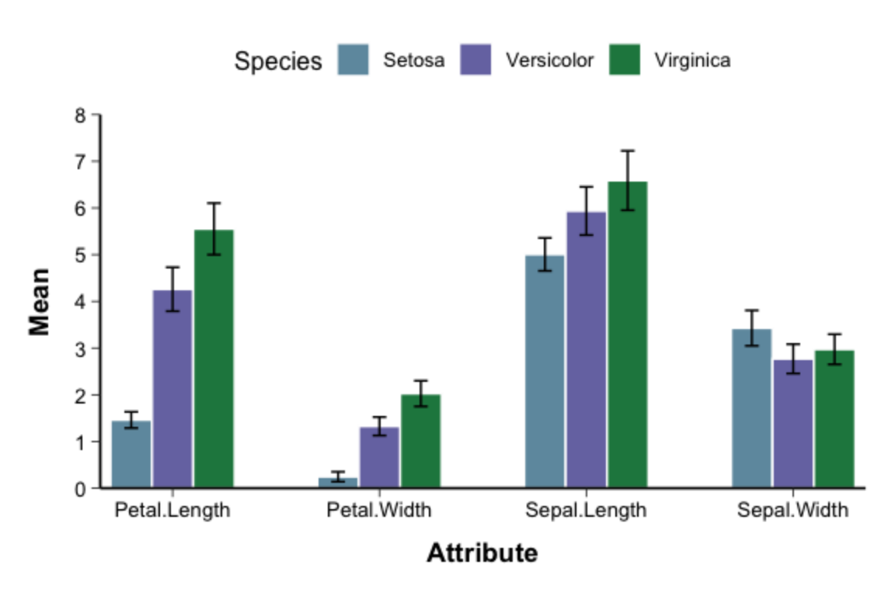
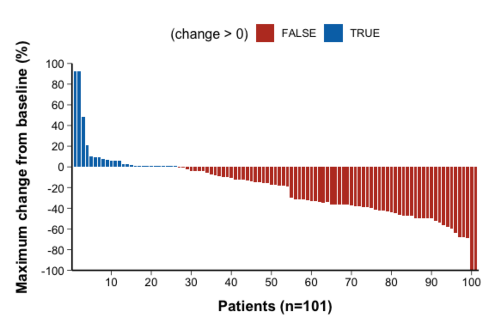

# Bar Charts

## 1. Scope and Definition

Bar charts compare counts, proportions, rates, means, or other defined summaries across discrete categories. Bar length or height represents the magnitude of the displayed statistic.

Use bar charts for category-level comparisons. When the distribution of individual continuous observations is clinically important, use dot, box, violin, or raincloud plots rather than a mean bar alone.

## 2. Selection Guide

| Statistical objective | Recommended variant | Main interpretation |
|---|---|---|
| Compare one summary across categories | Basic Bar Plot | Magnitude difference between categories |
| Compare subgroups within each category | Grouped Bar Plot | Side-by-side subgroup difference |
| Compare totals and internal composition | Stacked Bar Plot | Group total and component contribution |
| Compare relative composition only | 100% Stacked Bar Plot | Percentage composition within each group |
| Show a central estimate with variability or uncertainty | Bar Plot with Error Bars | Estimate with SD, SE, or confidence interval |
| Show patient-level change from baseline | Oncology Waterfall Plot | Direction and magnitude of individual response |
| Arrange many categories circularly | Polar Bar Plot | Overall pattern across categories |

Choose the simplest variant that directly answers the clinical or statistical question.

## 3. Required Data Structure

Bar charts may use aggregated data directly or individual-level data after an explicit summarization step.

**Aggregated data**

```text
category | subgroup/component | value | lower | upper | n
```

- `category`: main discrete or ordered variable
- `subgroup/component`: optional subgroup or composition variable
- `value`: count, proportion, rate, mean, or another summary
- `lower`, `upper`: optional interval limits
- `n`: optional sample size or denominator

**Individual-level data**

```text
id | category | subgroup | outcome
```

Individual-level data should be summarized before plotting counts, proportions, rates, or means. In an oncology waterfall plot, each row instead represents one patient's change from baseline.

## 4. Common Statistical Principles

- Define the statistic represented by bar height and, for proportions or rates, define the denominator.
- Start the quantitative axis at zero when magnitude is encoded by bar length or height.
- Order categories by clinical sequence, dose, severity, time, or another prespecified rule.
- A visible difference between bars is descriptive and does not establish statistical significance or interaction.
- Define all error bars explicitly according to their statistical meaning.

## 5. Common Visual Rules

- Use a clean background, consistent bar width, and restrained colors.
- Place the title and legend at the top and center them.
- Do not add a gridline background.
- Unless specifically requested, do not add subtitles or explanatory text outside the plot.
- Add value labels only when they improve interpretation without crowding the figure.
- For many categories or long labels, prefer a horizontal Cartesian layout.

## 6. Variants

### 6.1 Basic Bar Plot


- Code Reference: source script `\StatsVisual-Skill\assets\templates\bar\Basic Bar Plot.R`

**Statistical Features**

- Each category is represented by one count, proportion, rate, mean, or other summary.
- The main comparison is the magnitude of that summary across categories.
- When bars represent means, within-group distribution and outliers are not shown.

**Visual Features**

- Separate rectangular bars rise from a common baseline.
- Each bar corresponds to one category and its height directly represents the summary value.

**Code Features**

- Map the category to `x` and the pre-computed summary to `y`.
- Use `geom_bar(stat = "identity")` and set factor levels when category order is meaningful.

---

### 6.2 Grouped Bar Plot


- Code Reference: source script `\StatsVisual-Skill\assets\templates\bar\Stratified Bar Plot.R`

**Statistical Features**

- Compares the same summary across subgroups within each main category.
- Supports both within-category subgroup comparison and cross-category comparison of the same subgroup.
- Apparent changes in subgroup differences do not by themselves demonstrate statistical interaction.

**Visual Features**

- Subgroup bars are placed side by side within each main category.
- Color or fill distinguishes subgroups while all bars retain a common baseline.

**Code Features**

- Map the main category to `x`, the summary to `y`, and the subgroup to `fill`.
- Use `position_dodge()`; numerical labels or error bars must use a compatible dodge width.

---

### 6.3 Stacked and 100% Stacked Bar Plot


- Code Reference: source script `\StatsVisual-Skill\assets\templates\bar\Stacked Bar Plot.R`

**Statistical Features**

- A stacked bar displays the total value and the contribution of each component.
- A 100% stacked bar standardizes each group to 100% and displays relative composition only.
- Absolute totals cannot be compared from a 100% stacked bar.

**Visual Features**

- Each bar is divided into colored segments representing component categories.
- In a standard stacked bar, total bar height varies; in a 100% stacked bar, all bars have equal height.

**Code Features**

- Map the main group to `x` and the component variable to `fill`.
- Use `position = "stack"` for totals and `position = "fill"` for within-group proportions; factor levels determine segment order.

---

### 6.4 Bar Plot with Error Bars



- Code Reference: source script `\StatsVisual-Skill\assets\templates\bar\Bar Plot with Error Bars.R`

**Statistical Features**

- The bar represents a central estimate, usually a mean.
- The error bar represents variability or estimation uncertainty and must be identified as `SD`, `SE`, `95% CI`, or another defined interval.
- These error measures are not interchangeable and do not replace formal statistical testing.

**Visual Features**

- A vertical line with terminal caps extends above and/or below each bar.
- The bar shows the central value, while the error-line length shows the reported interval around it.

**Code Features**

- Provide a central estimate and corresponding lower and upper limits.
- Add `geom_errorbar(aes(ymin = ..., ymax = ...))`; in grouped plots, use a dodge position compatible with the bars.

---

### 6.5 Waterfall Plot



- Code Reference: source script `\StatsVisual-Skill\assets\templates\bar\Waterfall Plot.R`

**Statistical Features**

- Each bar represents one patient and usually shows percentage change in tumor burden from baseline.
- The plot displays the direction, magnitude, and heterogeneity of individual responses.
- It does not describe response duration, survival benefit, or treatment causality.

**Visual Features**

- Patients are arranged as a sequence of narrow bars ordered by change value.
- Bars extend above or below the zero line to show increase or decrease from baseline.
- Fill may distinguish positive and negative change or clinically defined response groups.

**Code Features**

- Sort the change variable and generate the plotting order before drawing.
- Map patient order to `x`, change from baseline to `y`, and optionally map change direction or response category to `fill`.

---

### 6.6 Polar Bar Plot


- Code Reference: source script `\StatsVisual-Skill\assets\templates\bar\Polar Bar Plot.R`

**Statistical Features**

- Displays the same counts, rates, proportions, or other summaries as a Cartesian bar chart.
- It is mainly used to present an overall pattern across many categories rather than precise pairwise comparison.

**Visual Features**

- Bars are arranged radially around a circle instead of along a straight Cartesian axis.
- Category labels follow the circular layout, and the quantitative scale is read in the radial direction.
- Grouped bars can appear as adjacent radial bars within each category.

**Code Features**

- Build the bar chart with the usual `x`, `y`, and `fill` mappings, then apply `coord_polar()`.
- Use auxiliary label data to control text position and rotation around the circle.

## 7. QA Checklist

- Is the displayed statistic, unit, and denominator clearly defined?
- Does the quantitative axis start at zero where bar length represents magnitude?
- Are category, subgroup, and stacking orders clinically or analytically justified?
- Is the selected variant aligned with the intended comparison: magnitude, subgroup, composition, uncertainty, or patient-level change?
- Are error bars identified as `SD`, `SE`, `95% CI`, or another defined interval?
- Are visual differences described without implying untested significance or interaction?
- For oncology waterfall plots, are patients sorted and clinically defined thresholds used correctly?
- For polar bars, is the circular layout justified and are labels readable?
