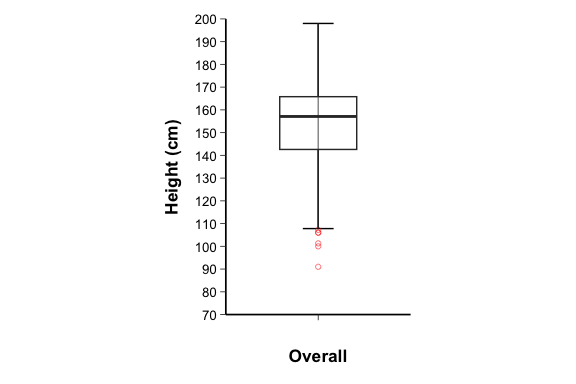
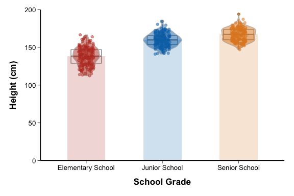
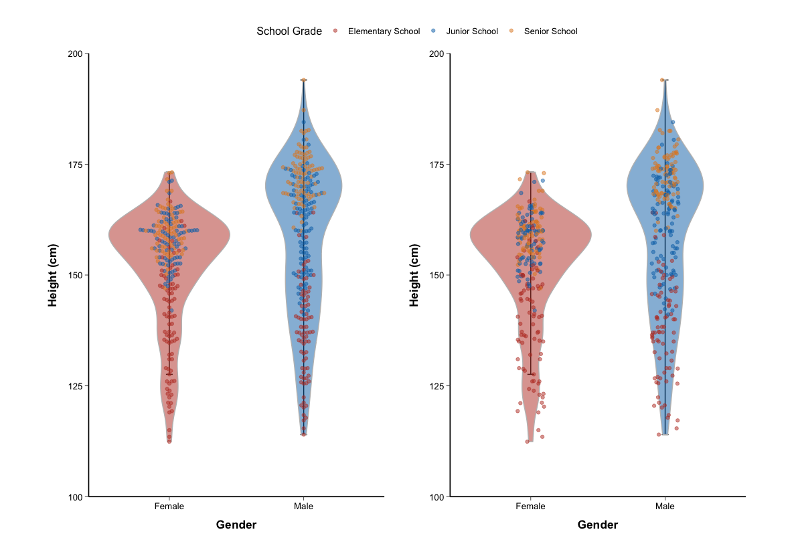

# Box Plot

## 1. Scope and Definition

Box plots summarize a continuous distribution using the median, first and third quartiles (`Q1`, `Q3`), and interquartile range (`IQR = Q3 - Q1`). Under the common Tukey rule, whiskers extend to the most extreme observations within `1.5 × IQR` of the box; observations beyond the whiskers are flagged as potential outliers, not automatically as data errors.

Boxenplots, violin plots, beeswarm plots, pirate plots, and raincloud plots extend the basic box plot by showing additional tail structure, density shape, or raw observations.

## 2. Selection Guide

| Analytical purpose | Recommended chart |
|---|---|
| Summarize one continuous distribution | Box Plot |
| Compare distributions across one or two grouping variables | Stratified Box Plot |
| Compare medians with an approximate notch interval | Notched Box Plot |
| Show detailed tail quantiles in large samples | Boxenplot(enhanced box plot) |
| Display one prespecified side of a distribution | Pagoda Plot |
| Show smoothed distribution shape together with quartiles | Violin Plot |
| Show individual observations without excessive overlap | Beeswarm Plot |
| Combine density, raw observations, and a central summary | Pirate Plot |
| Combine half-density, box summary, and raw observations | Raincloud Plot |
| Compare subgroup distributions within each main group | Grouped Raincloud Plot |

## 3. Required Data Structure

- Standard box, violin, and beeswarm plots require individual-level observations with one continuous outcome and an optional categorical grouping variable.
- Stratified and grouped raincloud plots additionally require a main group and a subgroup; repeated observations should retain a subject identifier so dependence is not mistaken for independent sampling.
- Boxenplots require sufficiently large group sizes to estimate deeper quantiles reliably. Notched plots require adequate observations within each group.
- Pagoda plots require an explicitly defined one-sided transformation. Pirate and raincloud plots require raw observations plus any group-level summaries used in additional layers.

## 4. Common Statistical Principles

- The box shows the median and middle 50% of observations; it does not show the mean, sample size, multimodality, or confidence interval unless these are added explicitly.
- Tukey outliers are observations beyond a graphical rule, not confirmed errors. Investigate data quality and clinical plausibility before excluding them.
- Compare groups descriptively with medians, `IQR`, tails, and raw observations. Visual separation alone does not establish statistical significance.
- For skewed outcomes, report median and `IQR` or use a justified transformation. Use the same scale and units across groups intended for direct comparison.
- Notches provide an approximate interval around the median. Their overlap is only a visual guide and should not replace a prespecified inferential analysis.

## 5. Common Visual Rules

- Place the title and legend at the top and center them.
- Do not add a gridline background.
- Unless specifically requested, do not add subtitles or explanatory text outside the plot.
- Add value labels only when they improve interpretation without crowding the figure.
- Keep group order, color meaning, axis limits, and measurement units consistent across related panels.
- Show raw observations for small or moderate samples when feasible; control point size, transparency, and outlier display in large samples.

## 6. Variants

### Box Plot

**Statistical Features**

- Summarizes one continuous distribution by the median, `Q1`, `Q3`, `IQR`, whiskers, and potential outliers.
- Whisker endpoints are the most extreme observed values within the selected Tukey limits, not necessarily the minimum and maximum.

**Visual Features**

- A rectangular box contains the middle 50% of observations, with a line marking the median.
- Whiskers extend from the box and observations beyond them appear as separate points.

**Code Features**

- Map the continuous outcome to `y` and use a single `x` level for an overall distribution.
- Draw whisker caps with `stat_boxplot(geom = "errorbar")` and the summary with `geom_boxplot()`; control outlier appearance separately.

- code reference:source script `\StatsVisual-Skill\assets\templates\box_plot\Box Plot.R`

### Stratified Box Plot

**Statistical Features**

- Compares the location, spread, skewness, and potential outliers of a continuous outcome across predefined groups.
- With two grouping variables, side-by-side boxes show subgroup distributions but do not by themselves test interaction.

**Visual Features**

- Each group has a separate box on a shared numerical axis.
- A subgroup variable may create adjacent colored boxes within each main category; multiple panels can separate one-factor and two-factor comparisons.

**Code Features**

- Map the main grouping variable to `x`, the continuous outcome to `y`, and the subgroup to `fill` or `color`.
- Use `geom_boxplot()` with consistent dodge and scales; combine related panels with `plot_grid()` or `patchwork`.

- code reference:source script `\StatsVisual-Skill\assets\templates\box_plot\Stratified Box Plot.R`

### Notched Box Plot

**Statistical Features**

- Adds an approximate uncertainty interval around each group median.
- Non-overlapping notches suggest a difference in medians, but notch overlap is not a formal hypothesis test and is sensitive to sample size and distribution shape.

**Visual Features**

- The box narrows around the median, producing a waist-like notch.
- Notch width differs across groups according to the estimated uncertainty of the median.

**Code Features**

- Use the standard box-plot mappings and set `notch = TRUE` in `geom_boxplot()`.
- Control the horizontal notch shape with `notchwidth`; retain sufficient y-axis range so the notch is not visually distorted.

- code reference:source script `\StatsVisual-Skill\assets\templates\box_plot\Notched Box Plot.R`

### Boxenplot(enhanced box plot)

**Statistical Features**

- Extends the box plot with progressively deeper letter-value quantiles, providing more information about both tails in large samples.
- It is more stable than displaying numerous isolated outlier points when group sizes are large, but deep quantiles remain unreliable in small groups.
- Letter-value boxes must be computed from individual-level continuous observations within each plotted group; do not compute them from pre-aggregated summaries.
- Choose `k` according to group sample size and the intended tail depth. For general use, let `lvplot::stat_lv()` determine `k` from `conf`/`percent`, or document an explicit `k`. Large fixed values such as `k = 9` should be used only when every group has enough observations for stable tail quantiles and the figure needs tail detail.
- If outliers are shown separately, define the outlier rule before calculating letter values, usually Tukey `1.5 * IQR` fences within each group. Exclude those flagged observations from the letter-value quantile calculation and plot them as separate points using the same y-axis scale. State this rule in the figure explanation or caption.
- If outliers are not separated, the outer letter-value bands include tail observations by design; do not also add ordinary boxplot outlier points, because that double-counts the tails visually.

**Visual Features**

- Draw letter-value bands as non-overlapping quantile intervals, not as full nested rectangles that cover the same vertical range repeatedly.
- For `k` levels, the display contains lower-tail bands, upper-tail bands, and a central median reference from the letter-value algorithm; it should not include ordinary Tukey whiskers unless explicitly labeled as an added layer.
- Band widths should narrow toward the tails. When manually reproducing `geom_lv()`, draw narrower tail bands first and wider central bands later, or otherwise ensure borders are not hidden in a way that reverses the visual hierarchy.
- Fill intensity may distinguish successive letter-value levels, but group color identity should remain stable across all bands and any separated outlier points.

**Code Features**

- Map group to `x` and the continuous outcome to `y`, then draw with `lvplot::geom_lv()` when it is compatible with the active `ggplot2` version.
- Map `after_stat(LV)` to `fill`; use `k`, `conf`, or `percent` deliberately to control the number of letter-value layers supported by the sample size.
- Do not layer `geom_boxplot()` whiskers, `stat_boxplot()` caps, or separate median crossbars on top of `geom_lv()` unless the figure is intentionally a composite and the added summaries are explained.
- If manually implementing a letter-value plot, compute quantiles with the same depth logic as `lvplot` and render the upper and lower letter-value intervals as separate non-overlapping rectangles. Validate that the number of visible bands matches the selected `k` rule and that separated outliers are not included in the quantile input.

- code reference:source script `\StatsVisual-Skill\assets\templates\box_plot\Letter-value Box Plot.R`

### Pagoda Plot

**Statistical Features**

- Displays only one prespecified side of a distribution after compressing or truncating the opposite side.
- Because the full distribution is no longer retained, it should be used only when the directional tail is the explicit analytical focus.

**Visual Features**

- Successive letter-value boxes taper in one direction from a common central boundary, creating a pagoda-like silhouette.
- The omitted or compressed half is not visually represented.

**Code Features**

- Create a transformed outcome that preserves the selected side and sets observations on the opposite side to the chosen center or boundary.
- Draw the transformed variable with `geom_lv()` and map the letter-value level to `fill`; document the transformation explicitly.

- code reference:source script `\StatsVisual-Skill\assets\templates\box_plot\Pagoda Plot.R`

### Violin Plot

**Statistical Features**

- Shows a kernel-density estimate of a continuous outcome across groups and can reveal skewness or multimodality hidden by quartile summaries.
- Density shape depends on bandwidth and group sample size; violin width is not a direct count unless explicitly scaled to sample size.

**Visual Features**

- A symmetric density envelope widens where observations are concentrated and narrows where they are sparse.
- A narrow internal box plot can add the median, quartiles, whiskers, and potential outliers.

**Code Features**

- Draw the density with `geom_violin()` and optionally overlay a narrow `geom_boxplot()` and `stat_boxplot()`.
- Keep bandwidth, trimming, and scale settings comparable across groups when shapes are interpreted jointly.

- code reference:source script `\StatsVisual-Skill\assets\templates\box_plot\Violin Plot.R`

### Beeswarm Plot

**Statistical Features**

- Displays individual observations while reducing overlap, allowing direct assessment of sample size, clusters, gaps, and extreme values.
- It is most informative for small or moderate samples; very large datasets may require sampling or more compact summaries.

**Visual Features**

- Points spread laterally around each group while retaining their exact vertical outcome values.
- A violin or box layer may provide a distribution summary behind the observations.

**Code Features**

- Add raw observations with `geom_beeswarm()` for structured non-overlap or `geom_jitter()` for random displacement.
- Map the outcome to `y`, group to `x`, and an optional subgroup to point color; use restrained transparency.

- code reference:source script `\StatsVisual-Skill\assets\templates\box_plot\Beeswarm Plot.R`

### Pirate Plot

**Statistical Features**

- Combines raw observations, distribution shape, and a central summary for a small number of groups.
- The central layer must be defined explicitly as a mean, median, or interval so that readers do not infer the wrong summary.

**Visual Features**

- A violin-shaped distribution, jittered observations, a compact box, and a central band are superimposed in one group profile.
- The layered silhouette emphasizes both individual variability and the group center.

**Code Features**

- Combine `geom_violin()`, `geom_jitter()`, and `geom_boxplot()` on the same grouped outcome.
- Calculate the selected central statistic before plotting and add it in a separate layer with an encoding that does not obscure the raw data.

- code reference:source script `\StatsVisual-Skill\assets\templates\box_plot\Pirate Plot.R`

### Raincloud Plot

**Statistical Features**

- Displays smoothed density, quartile summary, and individual observations simultaneously.
- It supports descriptive group comparison without hiding distributional features, but formal inference must be reported separately.

**Visual Features**

- A half-density forms the cloud, a compact box represents the summary, and stacked dots form the rain.
- Horizontal orientation commonly separates the three layers and improves comparison across groups.

**Code Features**

- Draw the half-density with `ggdist::stat_halfeye()`, add `geom_boxplot()`, and display observations with `stat_dots()`.
- Match `adjust`, interval width, and dot `binwidth` to the data scale; use `coord_flip()` when a horizontal layout is required.

- code reference:source script `\StatsVisual-Skill\assets\templates\box_plot\Raincloud Plot.R`

### Grouped Raincloud Plot

**Statistical Features**

- Compares continuous distributions across a main group and subgroup while retaining density, quartiles, and individual observations.
- Subgroup sample sizes and repeated-measure structure should be considered before interpreting apparent distribution differences.

**Visual Features**

- Within each main group, offset half-violins, compact boxes, and jittered points form parallel subgroup rainclouds.
- Color distinguishes subgroups while positional nudging keeps the composite layers separate.

**Code Features**

- Draw half-violins with `geom_flat_violin()` or the project custom function, raw points with jitter, and summaries with `geom_boxplot()`.
- Map subgroup to `fill` and `color`, and coordinate `position_nudge()` and jitter widths so corresponding layers remain aligned.

- code reference:source script `\StatsVisual-Skill\assets\templates\box_plot\Grouped Raincloud Plot.R`

## 7. QA Checklist

- Verify the outcome is continuous and each observation is assigned to the correct group.
- State the whisker and outlier rule whenever outliers are interpreted; do not remove flagged observations without investigation.
- Check group sample sizes before using notches, deep letter-value layers, or density estimates.
- Confirm whether displayed centers are medians or means and whether raw points represent independent observations.
- Use consistent scales and transformations, and avoid clipping tails or outliers with restrictive axis limits.
- For Pagoda, Pirate, and grouped raincloud plots, document all preprocessing and composite-layer meanings.
