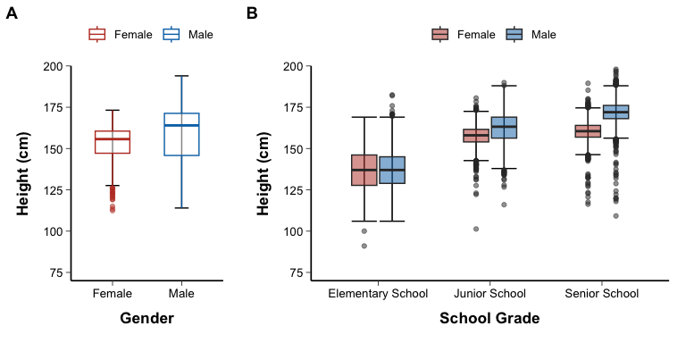
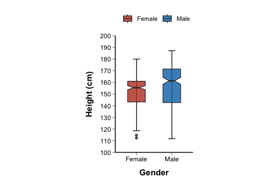
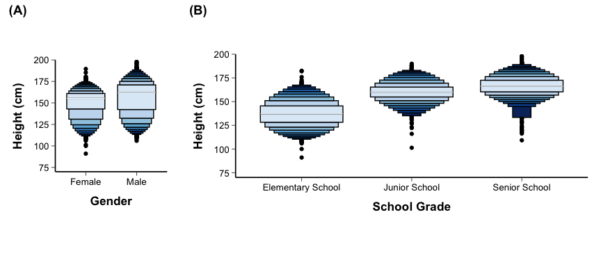
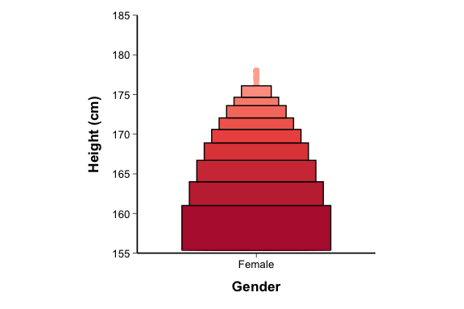
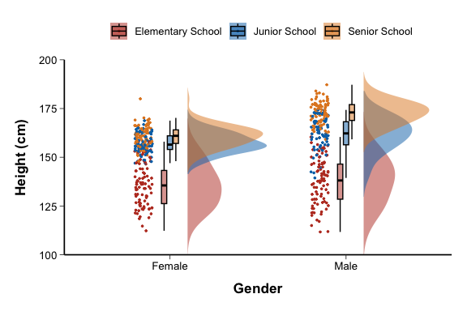

# Box Plot

## Use For

Use box plots to compare continuous distributions across groups. The box summarizes median and IQR; whiskers and outliers depend on rule, commonly 1.5 IQR.

## Variants

- Basic box plot.
- Grouped box plot.
- Violin plot for distribution shape.
- Beeswarm/jitter overlay for raw observations.
- Raincloud plot combining half-violin, box, and points.
- Mean point plus CI overlay when mean is clinically relevant.

## Core Mapping Logic

### Box Plot

**Applicable Data**

- The population distribution of a single continuous variable.
- Or a categorical variable corresponds to a continuous variable, but when only displaying the population, `x` is set to a single group.

**Mapping Logic**

- `x`: Single group or categorical variable.
- `y`: continuous variable.
- Use `stat_boxplot(geom = "errorbar")` to draw the box-whisker endpoints.
- Use `geom_boxplot()` to draw bins, median lines, and outliers.
- Cabinets are built based on `Q1`, `median`, `Q3`; must generally extend to the extremes of the `1.5 × IQR` range.

**Additional Requirements**

- If the overall sample size is extremely large, there may be too many outlier points, and the outlier style should be controlled to avoid blackening the screen.
- If the purpose is to compare population distributions rather than between groups, a single `x` level is usually sufficient.
- There need to be short horizontal lines on both sides of the box plot indicating the upper and lower limits (upper limit: Q3+1.5IQR; lower limit: Q1-1.5IQR)
- Place both the title and legend at the top and center them.
- Do not add a gridline background.
- Unless specifically requested, do not add subtitles or explanatory text outside the plot.

### Stratified Box Plot

**Applicable Data**

- Comparison of the distribution of a continuous variable between different groups.
- It can be a single-level grouping or a two-factor grouping, such as gender × educational system.

**Mapping Logic**

- `x`: Main grouping variable.
- `y`: continuous variable.
- `fill` or `color`: subgroup variable.
- Use `geom_boxplot()` to draw multiple groups of boxes.
- When grouping in a single layer, press `x = group` directly.
- `x = school_grade` and `fill = gender` are often used for double-layer grouping, and intra-group comparison is displayed through dodge.
- When comparing multiple panels, you can use `plot_grid()` or `patchwork` for splicing.

**Additional Requirements**

- If you display single-factor and dual-factor results at the same time, it is recommended to use the `A / B` panel label.
- There need to be short horizontal lines on both sides of the box plot indicating the upper and lower limits (upper limit: Q3+1.5IQR; lower limit: Q1-1.5IQR)
- Place both the title and legend at the top and center them.
- Do not add a gridline background.
- Unless specifically requested, do not add subtitles or explanatory text outside the plot.

### Notched Box Plot

**Applicable Data**

- Continuous variable data need to be compared between different group medians and their uncertainties.
- Often used to compare medians between two or a small number of groups.

**Mapping Logic**

- Same as regular boxplot, but adds `notch = TRUE` to `geom_boxplot()`.
- `notchwidth` is used to control the groove width.
- `x`: Group variable.
- `y`: continuous variable.
- `fill`: group variable or stratification variable.

**Additional Requirements**

- Notches are used to represent the 95% confidence interval of the median, which can often be approximated as an aid in comparison between groups.
- The vertical axis range should not be cut excessively, otherwise the visual effect of the groove will be distorted.
- There need to be short horizontal lines on both sides of the box plot indicating the upper and lower limits (upper limit: Q3+1.5IQR; lower limit: Q1-1.5IQR)
- Place both the title and legend at the top and center them.
- Do not add a gridline background.
- Unless specifically requested, do not add subtitles or explanatory text outside the plot.
- code reference:source script `\StatsVisual-Skill\assets\templates\Notched Box Plot.R`

### Boxenplot(enhanced box plot)

**Applicable Data**

- Large sample continuous data.
- It is necessary to show more detailed tail distribution and outlier structure beyond quartiles.

**Mapping Logic**

- `x`: Categorical variable.
- `y`: continuous variable.
- Use `lvplot::geom_lv()`.
- `fill = after_stat(LV)` represents different letter-value levels.
- `k` controls the depth of quantile layers.

**Additional Requirements**

- This chart is suitable for replacing traditional box plots when the sample size is large, showing a more detailed tail distribution.
- Darker, narrower layers in the figure represent closer to extreme quantiles.
- Starting from the median (M), extend to both ends, using darker colors and narrower boxes at 1/4 (F), 1/8 (E), 1/16 (D), 1/32 (C), 1/64 (B), 1/128 (A), 1/256 (Z), 1/512 (Y) from both ends, until the preset threshold is reached.
- Place both the title and legend at the top and center them.
- Do not add a gridline background.
- Unless specifically requested, do not add subtitles or explanatory text outside the plot.
- code reference:source script `\StatsVisual-Skill\assets\templates\boxenplot(enhanced box plot).R`

### Pagoda Plot

**Applicable Data**

- When the data has the characteristics that the upper and lower directions can be ignored, an enhanced box plot can be used to display the data distribution, that is, only the distribution on one side of the data median is displayed, similar to the Big Wild Goose Pagoda, a landmark building in Xi'an.
- Commonly used in the upper and tail display of single group or single gender data.

**Mapping Logic**

- First perform unilateral truncation or folding on the original continuous variables:
  - Press the side below the center to the center;
  - Or just keep the distribution above the median.
- `x`: Categorical variable.
- `y`: Value after unilateral processing.
- Use `geom_lv()` to generate a one-sided boosted boxplot.
- `fill = ..LV..` or `after_stat(LV)` maps the quantile level.

**Additional Requirements**

- The wild goose pagoda relies on preprocessing, and it must be clearly stated in the code what kind of one-sided preservation or compression is done to the data.
- This figure is suitable for the situation where "only one side of the tail structure is concerned" and is not suitable for complete distribution comparison.
- Chromatography is usually performed using either a divergent or a continuous scheme, but saturation still needs to be kept low.
- Place both the title and legend at the top and center them.
- Do not add a gridline background.
- Unless specifically requested, do not add subtitles or explanatory text outside the plot.
- code reference:source script `\StatsVisual-Skill\assets\templates\Pagoda Plot.R`

### Violin Plot

**Applicable Data**

- Comparison of distributions of continuous variables across multiple groups.
- Want to show both box and line summary and kernel density morphology.
- Commonly used for omics expression, clinical indicator distribution differences, etc.

**Mapping Logic**

- `x`: Group variable.
- `y`: continuous variable.
- Use `geom_violin()` to draw the kernel density contour.
- `geom_boxplot()` and `stat_boxplot()` can be stacked to display quartiles and whiskers.
- `fill` / `color`: group variable.

**Additional Requirements**

- Kernel density distribution + traditional box plot, but the box width must be significantly smaller than the violin width.
- When the number of groups is large, the violin diagram is easily crowded, and the width of the diagram should be controlled.
- If the kernel density is too smooth, the multimodal structure will be obscured, and the bandwidth needs to be moderate.
- Place both the title and legend at the top and center them.
- Do not add a gridline background.
- Unless specifically requested, do not add subtitles or explanatory text outside the plot.

### Beeswarm Plot

**Applicable Data**

- The original points need to be overlaid on a boxplot or violin plot.
- The sample size is medium, and we hope to observe the dense area and dispersion of points.

**Mapping Logic**

- The body is usually `geom_violin()` or `geom_boxplot()`.
- Original point layer:
  - Bee colony diagram uses `geom_beeswarm()`;
  - Fly charts use `geom_jitter()`.
- `x`: Group variable.
- `y`: continuous variable.
- `color`: Additional stratification variable, such as `school_grade`.

**Additional Requirements**

- The transparency of the dot layer should be moderate to avoid completely covering the cabinet or violin layer.
- If coloring is superimposed on a second categorical variable, the legend must be clear.
- Place both the title and legend at the top and center them.
- Do not add a gridline background.
- Unless specifically requested, do not add subtitles or explanatory text outside the plot.
- code reference:source script `\StatsVisual-Skill\assets\templates\Beeswarm Plot.R`

### Pirate Plot

**Applicable Data**

- I hope to display the distribution shape, original point and central trend in one picture.
- Suitable for comprehensive comparisons between a small number of groups.

**Mapping Logic**

- Often the following layers are combined:
  - `geom_violin()`: Display distribution shape;
  - `geom_jitter()`: Display the original point;
  - `geom_boxplot()`: Display quartiles;
  - `geom_bar(stat = "identity")` or other center layer: Displays median or mean "swim lanes".
- `x`: grouping variable.
- `y`: continuous variable.
- `fill`/`color`: grouping variables.

**Additional Requirements**

- The pirate chart needs to combine the characteristics of the bee colony chart, violin chart, and bar chart to make it more visually impactful.
- Place both the title and legend at the top and center them.
- Do not add a gridline background.
- Unless specifically requested, do not add subtitles or explanatory text outside the plot.
- code reference:source script `\StatsVisual-Skill\assets\templates\Pirate Plot.R`

### Raincloud Plot

**Applicable Data**

- The distribution, center position and origin point need to be shown simultaneously.
- Typically used for comparisons of continuous variables between a small number of groups.

**Mapping Logic**

- Use `ggdist::stat_halfeye()` to draw a half violin/half eye density layer.
- Use `geom_boxplot()` to stack the cabinets.
- Use `stat_dots()` to draw the point column layer.
- Often combined with `coord_flip()` to form a horizontal structure of "clouds above and rain below".
- `x`: Group variable.
- `y`: continuous variable.
- `fill`: Group variable.

**Additional Requirements**

- A cloud and rain chart is a composite chart that organically combines a half-violin chart (clouds) and a jittered scatter chart (rain).
- `binwidth` of `stat_dots()` need to match the data scale.
- When displaying horizontally, the axis title and layout must be adjusted simultaneously.
- Place both the title and legend at the top and center them.
- Do not add a gridline background.
- Unless specifically requested, do not add subtitles or explanatory text outside the plot.
- code reference:source script `\StatsVisual-Skill\assets\templates\Raincloud Plot.R`

### Grouped Raincloud Plot

**Applicable Data**

- A main grouping variable + a subgroup variable + a continuous variable.
- The distribution of multiple subgroups needs to be compared simultaneously within the same main group.

**Mapping Logic**

- Half violin layer uses `geom_flat_violin()` or project custom function.
- The original point uses `geom_point(position = position_jitter(...))`.
- Use `geom_boxplot()` for the cabinet layer.
- `x`: Main group variable.
- `y`: continuous variable.
- `fill`/`color`: Subgroup variable.
- The relative arrangement of half violins, points and cabinets is often controlled by position fine-tuning `position_nudge()`.

**Additional Requirements**

- The stacked cloud and rain chart is a composite chart that organically integrates the half-violin chart (cloud) + box chart (umbrella) + jittered scatter chart (rain). The layout should meet 
- Place both the title and legend at the top and center them.
- Do not add a gridline background.
- Unless specifically requested, do not add subtitles or explanatory text outside the plot.
- code reference:source script `\StatsVisual-Skill\assets\templates\Grouped Raincloud Plot.R`

## QA

- State the outlier rule if outliers are discussed.
- Do not hide raw data for small samples.
- For skewed data, consider log scale, median/IQR, or robust summaries.
- Avoid interpreting box width as sample size unless intentionally encoded.