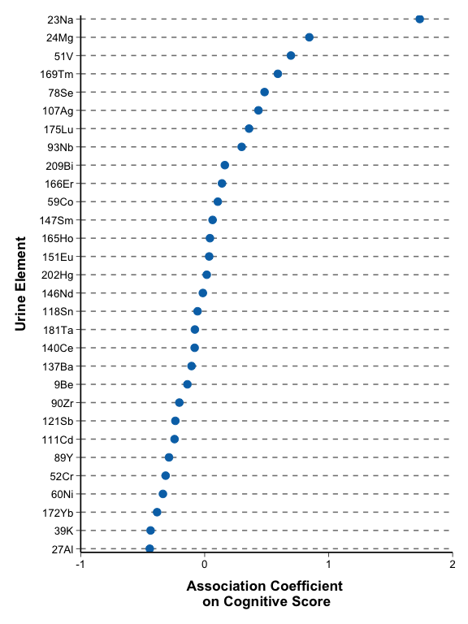
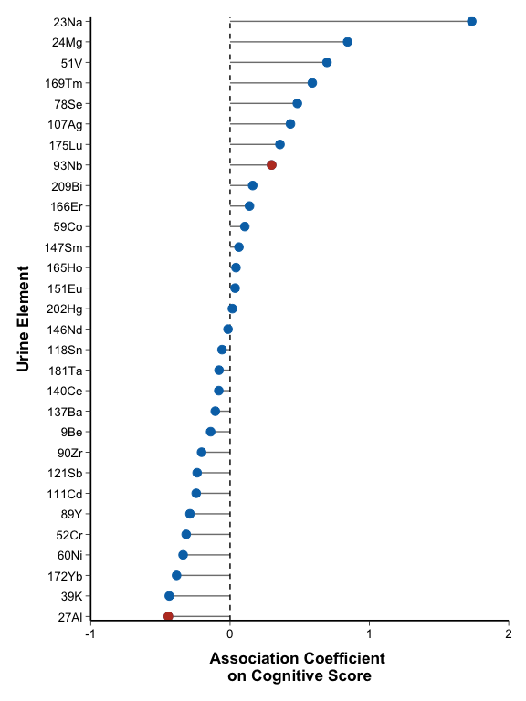
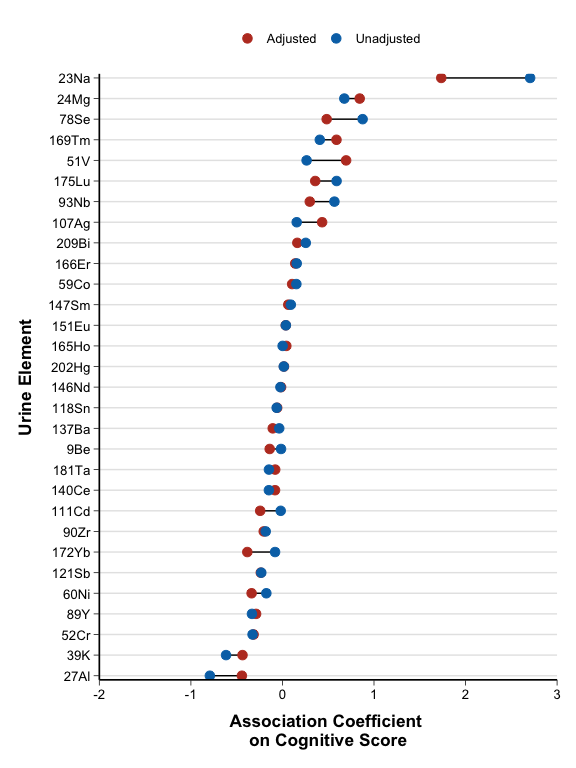
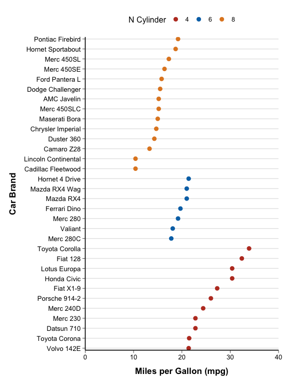
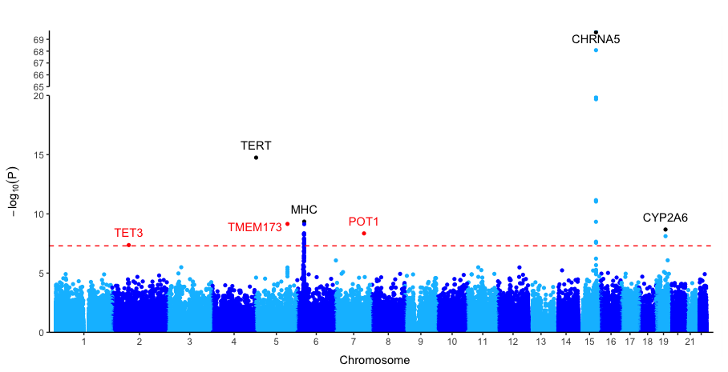
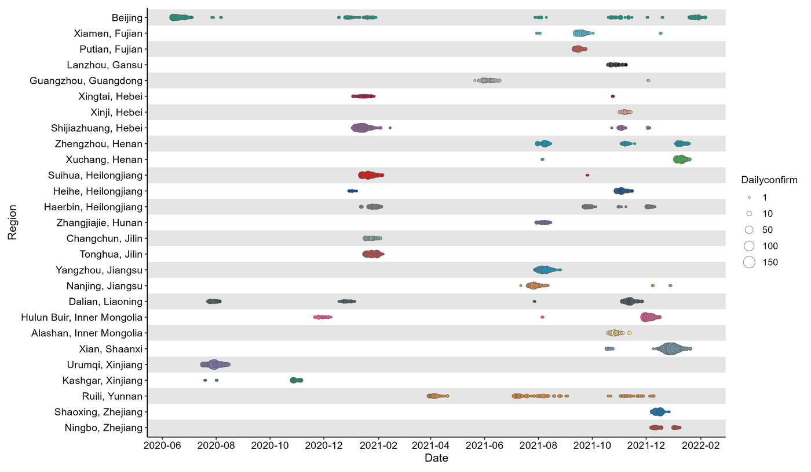

# Cleveland Dot Plot

## 1. Scope and Definition

Cleveland dot plots display category-level numerical estimates by position on a common scale. They are well suited to ranked means, rates, regression coefficients, effect estimates, variability measures, and importance scores, especially when many categories make bars or pies difficult to compare.

Related variants use line segments, paired points, interaction links, genomic position, or point size to encode additional structure. These additions change the analytical emphasis and should be interpreted according to the specific variant.

## 2. Selection Guide

| Analytical purpose | Recommended chart |
|---|---|
| Compare one estimate across many categories | Cleveland's Dot Plot |
| Emphasize distance and direction from a meaningful baseline | Lollipop Plot |
| Display main estimates together with selected pairwise interactions | Lollipop Plot with Interaction Effect |
| Compare two paired estimates for each category | Dumbbell Plot |
| Compare category-level values across a limited number of strata | Stratified Dot Plot |
| Compare two related metrics across the same categories | Dual-metric Stratified Dot Plot |
| Display genome-wide association results | Manhattan Plot |
| Show event timing and magnitude across multiple regions | Epidemic Trend Dot Plot |

## 3. Required Data Structure

- Standard dot and lollipop plots require one row per category and one numerical estimate; optional fields may define group, significance status, or a reference threshold.
- Dumbbell plots require two paired values for each category, preferably in long format with `item`, `variable`, and `value`.
- Interaction lollipop plots require a main estimate table and a separate interaction-pair table. Dual-metric plots require two comparable indicators for every category.
- Manhattan plots require marker identifier, chromosome, genomic position, and valid `P` value. Epidemic trend plots require date, region, and event magnitude.

## 4. Common Statistical Principles

- Order categories by value or by a prespecified clinical, biological, or administrative sequence; avoid arbitrary alphabetical order when it obscures the comparison.
- Use a reference line only when it has a defined meaning, such as no association at 0 or a clinical standard. A point’s distance from the line does not by itself indicate statistical significance.
- When displaying model estimates, distinguish point estimates from uncertainty. Use confidence intervals or a forest/dot-whisker plot when inference is central.
- Define any color, shape, or size encoding explicitly. If significance is highlighted, state the threshold and any multiple-testing adjustment.
- Transform highly skewed values only when justified, and report the transformed scale clearly.

## 5. Common Visual Rules

- Place the title and legend at the top and center them.
- Do not add a gridline background.
- Unless specifically requested, do not add subtitles or explanatory text outside the plot.
- Add value labels only when they improve interpretation without crowding the figure.
- Use a horizontal layout for long category labels and retain light reference guides only when they support accurate reading.
- Keep color, shape, and reference-line meanings consistent across related figures.

## 6. Variants

### Cleveland's Dot Plot

**Statistical Features**

- Compares one numerical estimate across multiple categories using position on a common axis.
- Appropriate for descriptive estimates or regression coefficients; a point alone does not show precision or statistical uncertainty.

**Visual Features**

- Each category is represented by one dot aligned with its label.
- Categories are commonly sorted by value, making rank and positive–negative direction easy to read.

**Code Features**

- Map the estimate to `x` and the category to `y`, then draw with `geom_point()`.
- Use `reorder()` or explicit factor levels to control order, and add a zero reference line when the estimate can be positive or negative.

- code reference:source script `\StatsVisual-Skill\assets\templates\cleveland_dot_plot\Cleveland's Dot Plot.R`

### Lollipop Plot

**Statistical Features**

- Displays category-level estimates while emphasizing their distance and direction from a meaningful baseline.
- If points are highlighted by significance, the criterion and multiplicity adjustment must be stated separately from effect magnitude.

**Visual Features**

- A thin segment runs from the baseline to each terminal point, producing a bar-like profile with less visual mass.
- Positive and negative estimates extend to opposite sides of the reference line.

**Code Features**

- Use `geom_segment()` from the baseline to each estimate, followed by `geom_point()` at the endpoint.
- Add `geom_vline(xintercept = 0)` or another prespecified reference and use a separate data subset only for justified highlighting.

- code reference:source script `\StatsVisual-Skill\assets\templates\cleveland_dot_plot\Lollipop Plot.R`

### Lollipop Plot with Interaction Effect

**Statistical Features**

- Combines one main estimate per category with selected pairwise interaction relationships.
- Main-effect magnitude, effect direction, and interaction evidence are distinct quantities and must not be inferred from one another.

**Visual Features**

- Vertical stems and terminal points show the category-level estimates, while curved links connect interacting category pairs.
- Point color may encode estimate direction, and a separate curve color identifies interaction links.

**Code Features**

- Keep the main estimate data and interaction-link data in separate objects and layers.
- Draw stems and points with `geom_segment()` and `geom_point()`, then add selected links with `geom_bezier()` using explicit endpoints and control points.

- code reference:source script `\StatsVisual-Skill\assets\templates\cleveland_dot_plot\Lollipop Plot with Interaction Effect.R`

### Dumbbell Plot

**Statistical Features**

- Compares two paired estimates for each category, such as adjusted versus unadjusted coefficients or pre- versus post-treatment values.
- The connecting distance shows within-category change, but does not provide uncertainty or establish a statistically significant difference.

**Visual Features**

- Two differently encoded points share one category row and are connected by a horizontal segment.
- The direction and length of the connector show how the paired estimates differ.

**Code Features**

- Reshape paired columns into long format with one row per category–estimate type.
- Map value to `x`, category to `y`, connect observations by category, and map estimate type to point color.

- code reference:source script `\StatsVisual-Skill\assets\templates\cleveland_dot_plot\Dumbbell Plot.R`

### Stratified Dot Plot

**Statistical Features**

- Displays one numerical value per category while identifying membership in a limited number of predefined strata.
- It supports comparison across categories and strata but does not estimate within-stratum distributions from a single value per item.

**Visual Features**

- Each category has one point, with color or shape distinguishing the stratum.
- Sorting and horizontal orientation make long labels and rank patterns easier to compare.

**Code Features**

- Map category and value to the axes and map the stratifying variable to `color` or `group`.
- Use `ggdotchart()` or `geom_point()`, and control category order explicitly before applying `coord_flip()` or rotation.

- code reference: source script `\StatsVisual-Skill\assets\templates\cleveland_dot_plot\Stratified Dot Plot.R`

### Dual-metric Stratified Dot Plot

**Statistical Features**

- Compares two related indicators across the same categories, such as annual mean `PM2.5` and `PM10`.
- Indicators should share compatible units and interpretation; otherwise use separate panels or standardized values.

**Visual Features**

- Each category contains two distinguishable points, often using different shapes and color scales.
- Indicator-specific reference lines can show clinical, environmental, or regulatory thresholds.

**Code Features**

- Draw each metric in a separate `geom_point()` layer and use `ggnewscale::new_scale_color()` when independent color scales are required.
- Add indicator-specific `geom_hline()` thresholds and preserve accurate legend titles for both metrics.

- code reference:source script `\StatsVisual-Skill\assets\templates\cleveland_dot_plot\Stratified Dot Plot.R`

#### Manhattan Plot

**Statistical Features**

- Displays genome-wide association results, with each point representing a variant and height equal to `-log10(P)`.
- Genome-wide significance thresholds must reflect the prespecified multiple-testing criterion; high points indicate stronger evidence, not larger biological effect.

**Visual Features**

- Variants form chromosome-specific vertical clusters resembling a skyline.
- Alternating chromosome colors separate genomic regions, while selected significant loci may be labeled.

**Code Features**

- Validate chromosome, position, and positive numeric `P` values, then compute or supply cumulative genomic position and `-log10(P)`.
- Add the significance line with `geom_hline()`, label only selected loci with `geom_text_repel()`, and mark any y-axis break explicitly.

- code reference:source script `\StatsVisual-Skill\assets\templates\cleveland_dot_plot\Manhattan Plot.R`

#### Epidemic Trend Dot Plot

**Statistical Features**

- Displays when outbreaks or events occurred across regions and encodes their observed magnitude by point size.
- It supports comparison of timing and relative burden, but dense overlap may obscure small events and does not model transmission dynamics.

**Visual Features**

- Dates form the horizontal axis, regions form rows, and larger circles represent larger event counts.
- Alternating row bands may guide reading across long time ranges without encoding data.

**Code Features**

- Parse dates explicitly, fix the region order, and map event count to `size` in `geom_point()`.
- Use `scale_x_date()` for the study period, provide a readable size legend, and add light row bands with `geom_rect()` when needed.

- code reference:source script `\StatsVisual-Skill\assets\templates\cleveland_dot_plot\Epidemic Trend Dot Plot.R`

## 7. QA Checklist

- Confirm that each category–estimate pair is unique and categories are ordered intentionally.
- Verify the meaning of the baseline, thresholds, colors, shapes, and point sizes.
- Distinguish effect magnitude from statistical significance and include uncertainty when inference is central.
- Confirm that paired values and interaction links refer to the correct categories.
- For Manhattan plots, verify genome build, chromosome order, valid `P` values, and the multiple-testing threshold.
- For epidemic trend plots, verify date parsing, region order, event units, and the point-size scale.
