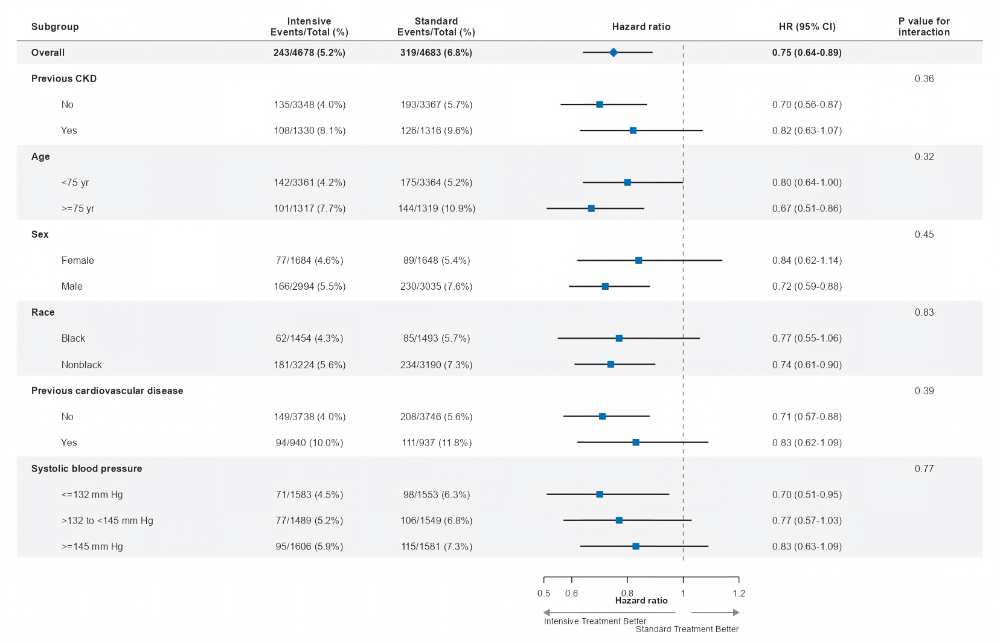

# Forest Plot

## Purpose

Create a publication-ready forest plot for effect estimates with confidence intervals, such as odds ratios, hazard ratios, risk ratios, beta coefficients, or mean differences.



## Prerequisites

- Each row must have an effect estimate and uncertainty interval, or these must be computable from a declared model.
- Do not force a forest plot from raw groups, counts, or percentages without an effect estimate.
- Label the effect measure explicitly (`HR`, `OR`, `RR`, `risk difference`, `mean difference`, `SMD`, etc.) instead of hard-coding a single label.

## Universal Rules

The following rules apply to all styles.

### Layout

- **Integrated table-and-forest**: Use one shared row coordinate system. Descriptor columns on the left, the estimate axis near the middle, numeric estimate/statistical columns on the right.
- **Self-contained forest axis**: Ticks and tick labels must remain within the forest-axis column. They must not extend horizontally into the subgroup label column or event-count columns.
- **Column choice from analysis**: Choose columns from the actual analysis (subgroup/level, counts, study weights, estimate with CI, P value, P for interaction). Do not add unused columns just to mimic a reference image.
- Keep the null-effect line, CI marks, axis ticks, favour labels, and CI text aligned to the same row coordinate system.

### Markers & Lines

- Use a vertical dashed line to mark the null-effect value. Typical null-effect values:

| Effect type | Null-effect value |
|---|---:|
| Odds ratio | 1 |
| Risk ratio | 1 |
| Hazard ratio | 1 |
| Mean difference | 0 |
| Regression coefficient / beta | 0 |

### Hierarchy & Text

- Subgroup hierarchy is expressed through bold labels, indentation, and vertical spacing.
- Keep column headers the same font size as body category labels; use bold weight for headers.
- Place P-value and P-for-interaction columns at the far right of the table.
- Include `P for interaction` only for subgroup interaction analyses; ordinary rows may need no P-value column.

### Rejection Checklist

Reject forest plots with:
- Missing CI definitions or unclear reference group
- Unreadable table text
- Disconnected table and forest panels that only appear aligned by eye
- Heavy boxed grids or heavy table-wide rules

## Style-Specific Rules

### General

- Light row bands or subtle group shading are permitted only when they improve row tracking in dense tables.

### Nature

- Keep figures compact, column-aligned, and evidence-first. Avoid oversized titles or explanatory text inside the plot.
- Use thin CI lines, modest square or point markers, and a pale or absent grid.
- Use blue or muted journal palette colours only when colour carries meaning.
- Use shallow row bands or fine column guides sparingly; they should not dominate the CI marks.
- Place favour labels and axis ticks close to the forest axis.
- Reject figures that are too wide, rely on a detached legend, use heavy table rules, or rasterize editable text.

### Lancet

- **Plain white table body**: Alternating row bands, shaded subgroup backgrounds, boxed grids, or any background fill are prohibited.
- **Single header rule**: Only one horizontal rule is permitted — the header rule below the column headers. No additional separator lines, borders, or grids.
- **Default black-and-white**: CI lines and the null-effect reference line shall be black. Point-estimate symbols shall be solid black squares (■) or white squares with black outlines (□). Colour only when it carries explicit scientific meaning.
- **Square markers**: The default point-estimate symbol is a square.
- **Midline decimal point**: All numeric text (axis labels, CI text, P values, in-table numbers) shall use the midline decimal point (·).
- **Subgroup hierarchy by typography only**: Bold labels, indentation, and vertical spacing. No background shading or colour blocks.

### NEJM

- **Shallow alternating row bands**: Light-gray row bands are permitted for dense subgroup tables. Keep bands light enough that CI marks and text remain dominant.
- **Subtle divider**: Do not draw a heavy table-wide rule above the column headers. Use a subtle local divider if a separator is needed.
- **Default blue-and-black**: CI lines and null-effect reference line shall be black. Point-estimate symbols shall be theme-blue or black squares (■).
- **Square markers**: The default point-estimate symbol is a square.
- **Ordinary decimal point**: Do not use Lancet-style midline decimal points.
- Add favour labels with directional arrows only when they clarify interpretation.

### JAMA

- White table body, aligned text columns, restrained black or palette-colour CI marks, and a clear null-effect reference line.
- Use whitespace, indentation, and at most subtle row spacing or very light bands for dense subgroup displays.
- Avoid boxed grids and heavy table-wide rules.
- Reject figures with unclear effect-measure labels, detached table/forest alignment, or visually overemphasized P values.

### BMJ

- Plain labels, explicit denominators, restrained colours, and a white table body.
- Use subtle row spacing only when it improves tracking in dense displays.
- Avoid P-value-only emphasis; the estimate direction, CI width, denominator, and clinical meaning should remain easy to read.
- Reject figures with unclear denominators, heavy boxed grids, or P values that visually dominate the effect estimates.

## Column Structure Example

```
| Subgroup / level | Treatment | Comparator | HR (95% CI)       | HR (95% CI)      | P interaction |
|------------------|-----------|------------|--------------------|------------------|---------------|
| Age              |           |            |                    |                  | 0.48          |
|   <65 years      | 86/742    | 112/736    | ───■────           | 0.76 (0.58-0.99) |               |
|   ≥65 years      | 74/658    | 89/662     | ─────■──           | 0.84 (0.62-1.13) |               |
| Sex              |           |            |                    |                  | 0.71          |
|   Male           | 96/812    | 121/806    | ───■────           | 0.79 (0.61-1.02) |               |
|   Female         | 64/588    | 80/592     | ─────■──           | 0.81 (0.58-1.12) |               |
|                  |           |            | └──0.5──1.0──2.0──┘ |                  |               |
```

## Template Starter

Use `assets/templates/forest/subgroup_forest.R` as the starter template for subgroup forest plots with table-aligned effect estimates, confidence intervals, sample-size columns, and optional interaction P values. Copy it into `<project_dir>/R/` and adapt the subgroup, level, estimate, CI, sample-size, and interaction columns before running.