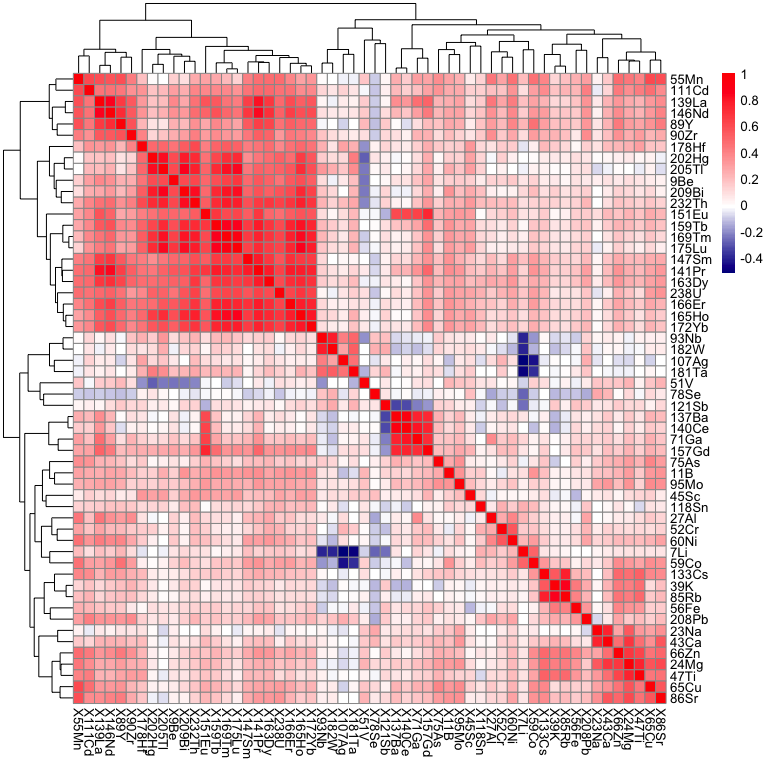
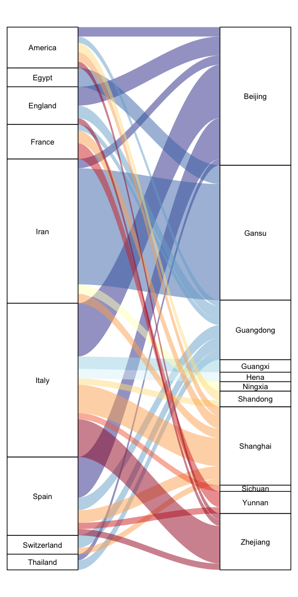
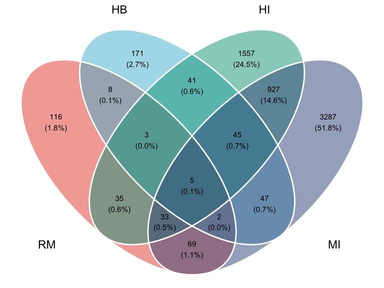
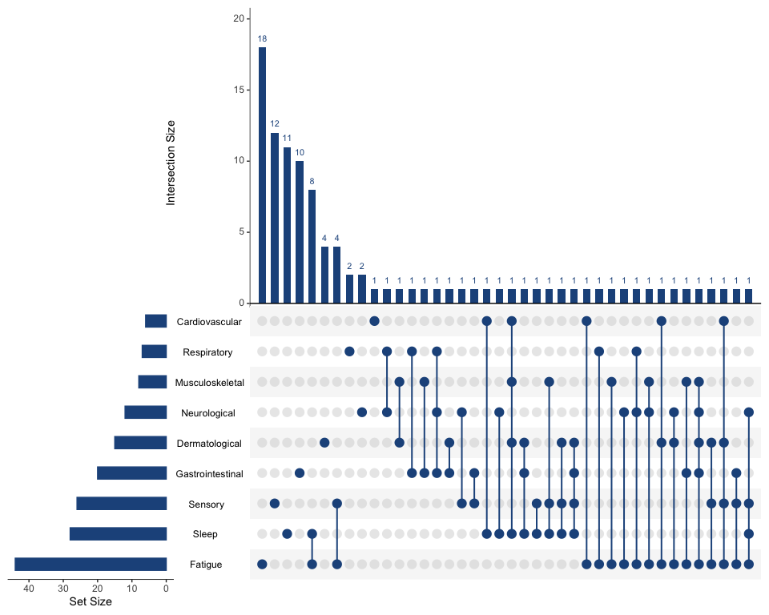

# Heatmap

## 1. Scope and Definition

Heatmaps display values in a two-dimensional matrix using color. They are widely used for correlation matrices, omics abundance or expression data, quality-control summaries, and other sample-by-feature or variable-by-variable structures.

This chapter also includes related relationship plots. Contour plots display a continuous surface, Sankey plots display flows, Venn and UpSet plots display set intersections, and calendar charts display daily values in a calendar layout. Their statistical meanings differ from those of a conventional heatmap.

## 2. Selection Guide

| Analytical purpose | Recommended chart |
|---|---|
| Display values in a numeric matrix | Basic Heatmap |
| Show linkage disequilibrium among ordered genetic markers | Linkage Disequilibrium Heatmap |
| Reveal similarity-based row or column structure | Clustered Heatmap |
| Show two-dimensional density or a continuous surface with isolines | Contour Line Plot |
| Show density or intensity intervals as filled regions | Contour with Filled Areas |
| Display flow between source and destination categories | Sankey Plot |
| Display intersections among a small number of sets | Venn Plot |
| Display intersections among many sets | UpSet Plot |
| Display daily values in a monthly calendar layout | Calendar Chart |

## 3. Required Data Structure

- Basic and clustered heatmaps require a numeric matrix or long table with row variable, column variable, and cell value. Correlation matrices should be square and use the same variables on both axes.
- Linkage Disequilibrium Heatmap requires genotype or LD data together with markers ordered by genomic position.
- Contour plots require paired continuous coordinates and either estimated density or a gridded `z` value.
- Sankey Plot requires source, destination, and non-negative flow magnitude. Venn and UpSet plots require valid set membership data.
- Calendar Chart requires one observation per date, plus correctly derived month, weekday, and week-within-month fields.

## 4. Common Statistical Principles

- State whether cell values are raw, centered, scaled, standardized, transformed, or model-derived; color has no interpretable meaning without a defined scale.
- Use a sequential palette for one-directional magnitude and a diverging palette only when a meaningful center exists, such as correlation `0` or standardized value `0`.
- Row and column order must follow the research question or a stated clustering method. Clustering reveals similarity under the chosen distance and linkage, not confirmed biological subtypes.
- Distinguish missing values from true zeros. In temporal or abundance data, replacing missing values with zero can create false patterns.
- These plots are descriptive. Apparent clusters, flows, intersections, or hot spots do not by themselves establish statistical significance or causality.

## 5. Common Visual Rules

- Do not add a gridline background.
- Unless specifically requested, do not add subtitles or explanatory text outside the plot.
- Add value labels only when they improve interpretation without crowding the figure.
- Use restrained, perceptually ordered color scales and keep scale limits consistent across figures intended for comparison.
- Reduce, rotate, group, or selectively label rows and columns when the matrix is too large for readable text.

## 6. Variants

### Basic Heatmap

**Statistical Features**

- Displays one numeric value for each row–column combination, such as abundance, expression, or correlation.
- For correlation matrices, values should lie on the stated coefficient scale and use `0` as the neutral center.

**Visual Features**

- Equal-sized rectangular tiles form a matrix, and color intensity represents cell magnitude.
- Symmetric matrices often show matching row and column labels and a visually prominent diagonal.

**Code Features**

- Map column variable to `x`, row variable to `y`, and the matrix value to `fill`, then draw with `geom_tile()`.
- Use `scale_fill_gradient2()` for centered data and `coord_fixed()` when square cells are required.

- code reference:source script `\StatsVisual-Skill\assets\templates\heatmap\Basic Heatmap.R`

### Linkage Disequilibrium Heatmap

**Statistical Features**

- Displays pairwise linkage disequilibrium among SNPs or nearby genetic markers ordered along a genomic region.
- The legend must state whether color represents `D'`, `r²`, or another LD statistic because these measures have different interpretations.

**Visual Features**

- Pairwise LD values form a triangular matrix beneath or above the diagonal.
- A genomic-position track may run parallel to the matrix, with selected SNP names placed along the physical map.

**Code Features**

- Supply ordered genotype or LD data and marker positions to `LDheatmap::LDheatmap()`.
- Use `genetic.distances` to preserve physical spacing and `SNP.name` only for selected markers that need annotation.

### Clustered Heatmap

**Statistical Features**

- Reorders rows and columns according to similarity, allowing correlated variables, samples, or abundance profiles to appear together.
- Results depend on preprocessing, distance measure, and linkage method; cluster branches are exploratory rather than inferential groups.

**Visual Features**

- The colored matrix is accompanied by row and/or column dendrograms.
- Similar profiles appear as adjacent blocks, producing visible clusters of related cells.

**Code Features**

- Provide a numeric matrix to `pheatmap()` and specify row and column clustering as required.
- Define the color breaks and add `annotation_row` or `annotation_col` only when metadata are available and correctly aligned.

- code reference:source script `\StatsVisual-Skill\assets\templates\heatmap\Clustered Heatmap.R`

### Contour Line Plot

**Statistical Features**

- Represents levels of a two-dimensional density estimate or continuous surface across two numerical variables.
- With `stat_density2d()`, contours describe estimated observation density and depend on kernel and bandwidth choices.
- For measured response surfaces with a known `z` value, build or supply a regular `x-y-z` grid first, then draw isolines with `geom_contour()`.
- For sparse experimental grids, such as 6 by 6 dose-response matrices, state whether the surface uses raw grid values, interpolation, LOESS, GAM, or another smoothing method. The contours are descriptive, not statistical evidence of synergy or significance.

**Visual Features**

- Curved isolines connect locations with equal estimated density or equal `z` value.
- Raw observations may remain visible beneath the contour lines.
- Keep raw measured points visible when the surface is smoothed or interpolated, so readers can see the data support behind the curves.
- Increase contour density only enough to reveal shape; overly dense lines can imply precision that the source grid does not support.

**Code Features**

- Map the two continuous variables to `x` and `y` and use `stat_density2d()` for kernel-density contours.
- Map `after_stat(level)` to line color and add `geom_point()` when the source observations should remain visible.
- For gridded response data, map `x`, `y`, and `z` to `geom_contour()`. Use a dense prediction grid when a smooth surface is requested, but keep axis tick labels tied to the original measurement scale.

- code reference:source script `\StatsVisual-Skill\assets\templates\heatmap\Contour Line Plot.R`

### Contour with Filled Areas

**Statistical Features**

- Displays intervals of a continuous surface or estimated density using filled contour bands.
- The number and boundaries of contour levels determine the apparent hot spots and should be chosen deliberately.
- `geom_contour_filled()` produces discrete filled bands by design. Use it when interval classes are desired and the legend should report ranges.
- If the user asks for a continuous response surface or continuous color scale, use a dense gridded/smoothed `z` surface with `geom_raster(interpolate = TRUE)` or `geom_tile()` plus `geom_contour()` for isolines, rather than forcing a discrete filled-contour legend.

**Visual Features**

- Adjacent colored regions represent ranges of `z`, separated by contour boundaries.
- The filled surface emphasizes broad high- and low-intensity regions more strongly than contour lines alone.
- For continuous response surfaces, use a continuous colorbar and overlay thin contour lines; optionally add raw measured points on top.
- Do not hide sparse source data behind a highly smooth surface. Keep smoothing/interpolation choices explicit in the script and final explanation.

**Code Features**

- Supply gridded `x`, `y`, and `z` values and draw with `geom_contour_filled()`.
- Limit the number of contour bands and use an ordered palette whose legend clearly reports the interval scale.
- For continuous color response surfaces, create a dense prediction grid, draw `geom_raster(aes(fill = z), interpolate = TRUE)`, add `geom_contour(aes(z = z))`, and use `scale_fill_gradientn()` or another continuous scale.
- For dose matrices containing zero concentrations, avoid log-transforming axes unless zero is handled explicitly. Prefer ordered dose levels with labels showing the original concentrations.

- code reference:source script `\StatsVisual-Skill\assets\templates\heatmap\Contour with Filled Areas.R`

### Sankey Plot

**Statistical Features**

- Displays non-negative flow or count between source and destination categories.
- Flow width represents magnitude; direction indicates the specified pathway but does not by itself establish causal transmission.

**Visual Features**

- Rectangular strata represent categories and curved ribbons connect sources to destinations.
- Ribbon thickness changes in proportion to the flow assigned to each connection.

**Code Features**

- Map source and destination to `axis1` and `axis2`, flow magnitude to `y`, and draw ribbons with `geom_alluvium()`.
- Add category blocks with `geom_stratum()` and labels with `geom_text(stat = "stratum")`.

- code reference:source script `\StatsVisual-Skill\assets\templates\heatmap\Sankey Plot.R`

### Venn Plot

**Statistical Features**

- Displays membership and overlap among a small number of sets.
- Intersection counts are the primary quantities; circle area and overlap area are not necessarily proportional unless the method explicitly supports area scaling.

**Visual Features**

- Each set is represented by a circle, and overlapping regions represent shared members.
- Counts or percentages appear within the corresponding exclusive and intersecting regions.

**Code Features**

- Store set members in a named list and draw with `ggvenn()`.
- Use `show_percentage` only when the denominator is defined clearly and keep the number of sets limited.

- code reference:source script `\StatsVisual-Skill\assets\templates\heatmap\Venn Plot.R`

### UpSet Plot

**Statistical Features**

- Displays exact intersection sizes across multiple sets and is preferable to a Venn diagram when the number of sets is large.
- Set size and intersection size are different quantities and must not be confused.

**Visual Features**

- Horizontal bars show total set sizes, while a dot-and-line matrix identifies each intersection combination.
- Vertical bars above the matrix show the size of the corresponding intersection.

**Code Features**

- Supply a binary membership table to `UpSetR::upset()`.
- Control the number and ordering of displayed sets and intersections using `nsets`, `nintersects`, and `order.by`.

- code reference:source script `\StatsVisual-Skill\assets\templates\heatmap\UpSet Plot.R`

### Calendar Chart

**Statistical Features**

- Displays a daily count or measurement in its calendar context and supports detection of temporal clusters, peaks, and gaps.
- Missing dates must remain distinct from zero-event days.

**Visual Features**

- Each day is a colored tile positioned by weekday and week within the month.
- Monthly facets reproduce the familiar calendar structure, with darker or warmer tiles indicating larger values.

**Code Features**

- Derive ordered month, weekday, day number, and week-within-month variables from a valid date field.
- Draw with `geom_tile()`, add day numbers with `geom_text()`, facet by month, and use `scale_y_reverse()` for conventional calendar orientation.

- code reference:source script `\StatsVisual-Skill\assets\templates\heatmap\Calendar Chart.R`

## 7. QA Checklist

- Verify matrix dimensions, row–column labels, and alignment of annotations or metadata.
- Confirm the value scale, transformation, center, color limits, and treatment of missing values.
- For clustered heatmaps, report preprocessing, distance, linkage, and whether rows, columns, or both were clustered.
- For LD heatmaps, confirm marker order, genome position, and the LD statistic shown.
- For Sankey, Venn, and UpSet plots, verify flow totals or set memberships and ensure displayed counts reconcile with the source data.
- For contour and calendar plots, verify bandwidth or grid definition, date derivation, and the distinction between zero and missing values.
