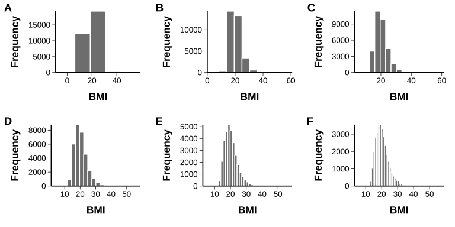
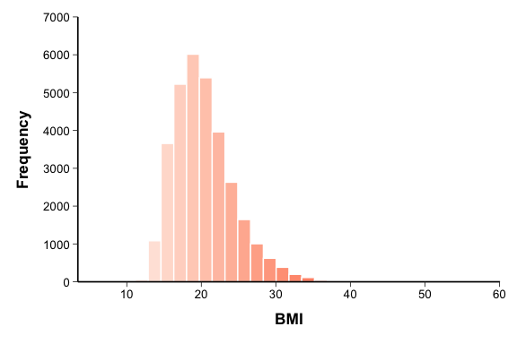
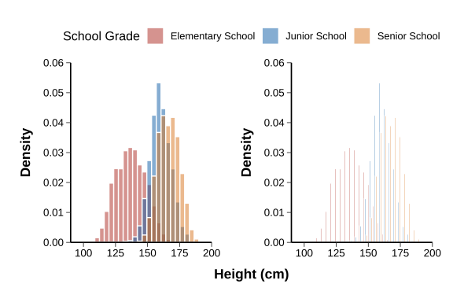
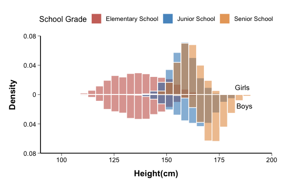
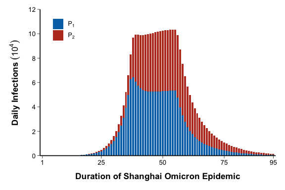
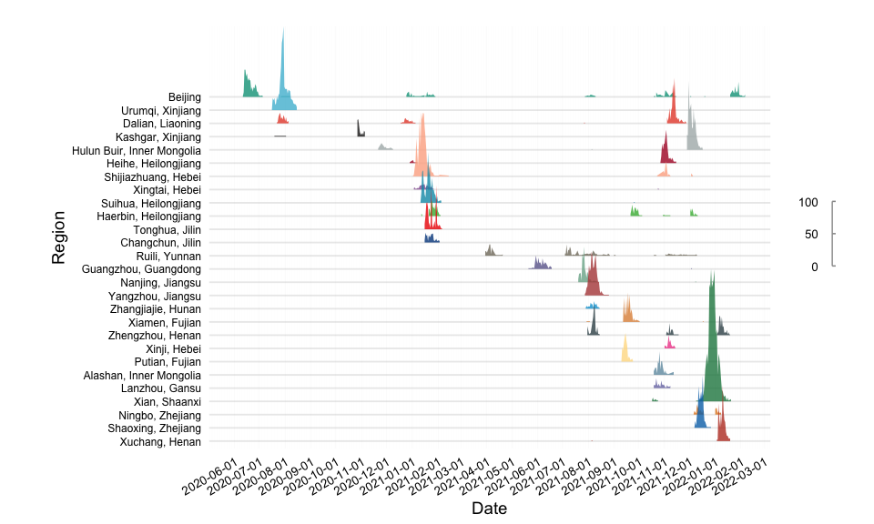

# Histogram

## 1. Scope and Definition

Histograms display the empirical distribution of a continuous variable by dividing its range into adjacent intervals and counting observations within each interval. They are used to assess distribution shape, central tendency, spread, skewness, modality, and potential outliers.

Several variants in this family are related distribution displays rather than classical histograms. Population pyramids are mirrored bar charts, ridgeline plots are density or identity-based profiles, and spiral histograms are polar time-series displays. Their distinct statistical meanings are specified below.

## 2. Selection Guide

| Analytical purpose | Recommended chart |
|---|---|
| Describe the distribution of one continuous variable | Basic Histogram |
| Assess how binning changes the apparent distribution | Histogram with Different Bin Width |
| Add ordered color emphasis across bins | Gradient-colored Histogram |
| Compare the distribution of one continuous variable across groups | Grouped Histogram |
| Compare two major groups with mirrored distributions | Symmetric Histogram |
| Display additive components at each ordered time or sequence point | Stacked Histogram |
| Compare age structure between two population groups | Population Pyramid |
| Compare smooth distributions across several groups | Ridgeline Plot |
| Compare epidemic curves across multiple regions or outbreaks | Epidemic Ridgeline Plot |
| Display long periodic time series in a compact circular layout | Spiral Histogram |

## 3. Required Data Structure

- Classical histograms require individual-level observations for one continuous variable. Grouped variants additionally require a categorical grouping variable.
- Bin width or number of bins must be defined from the measurement scale and sample size; all groups being compared should use the same bin boundaries.
- Stacked Histogram requires pre-aggregated additive components at each ordered time or sequence point. Population Pyramid requires age group, group or sex, and count or proportion.
- Ridgeline Plot requires one continuous variable and one grouping variable. Epidemic Ridgeline Plot requires date, region or event, and observed height. Spiral Histogram requires ordered dates plus derived radial-position variables.

## 4. Common Statistical Principles

- Bin choice affects the apparent shape. Evaluate whether conclusions about skewness, modality, and tails are stable across reasonable bin widths.
- Use counts when absolute sample size is relevant and density or proportion when comparing groups with unequal sample sizes. State the y-axis scale explicitly.
- A histogram describes the observed distribution; it does not establish normality, identify outliers formally, or replace a statistical test.
- Small samples may produce unstable or sparse bins. Dot plots, strip plots, box plots, or empirical cumulative distribution plots may be more informative.
- Apply identical measurement units, bin boundaries, transformations, and coordinate ranges when distributions are compared across groups or panels.

## 5. Common Visual Rules

- Place the title and legend at the top and center them.
- Do not add a gridline background.
- Unless specifically requested, do not add subtitles or explanatory text outside the plot.
- Add value labels only when they improve interpretation without crowding the figure.
- Use adjacent bins with restrained borders so that the distribution remains continuous while bin boundaries remain visible.
- Keep axes, units, bin definitions, and group colors consistent across related panels.

## 6. Variants

### Basic Histogram

**Statistical Features**

- Displays the frequency, proportion, or density of one continuous variable across adjacent intervals.
- Suitable for describing overall distribution shape, including skewness, spread, modality, and extreme observations.

**Visual Features**

- Rectangles are adjacent because neighboring bins represent contiguous intervals of the same continuous scale.
- Bar height represents the selected y-axis statistic, while bar width represents the bin interval.

**Code Features**

- Map the continuous variable to `x` and draw with `geom_histogram()`.
- Specify `bins` or `binwidth` explicitly; use the default count scale or map to `after_stat(density)` when density is required.

- code reference: source script `\StatsVisual-Skill\assets\templates\histogram\Basic Histogram.R`

### Histogram with Different Bin Width

**Statistical Features**

- Demonstrates how binning changes the apparent smoothness, modality, and tail structure of the same underlying data.
- Used as a sensitivity check rather than as separate analyses of different outcomes.

**Visual Features**

- Multiple aligned panels show the same variable with progressively wider or narrower bins.
- Coarse bins emphasize broad structure; narrow bins reveal local detail but may produce irregular noise.

**Code Features**

- Generate each panel with the same `x` variable while varying only `bins` or `binwidth`.
- Combine panels with `plot_grid()` or `patchwork`, using common scales and ordered panel labels.

- code reference: source script `\StatsVisual-Skill\assets\templates\histogram\Histogram with Different Bin Width.R`

### Gradient-colored Histogram

**Statistical Features**

- Represents the same distribution as a basic histogram; the gradient does not add a new statistical variable unless color is explicitly mapped to one.
- Most appropriate when color encodes ordered bin position or a clinically defined threshold.

**Visual Features**

- Adjacent bins change gradually in color across the measurement range.
- The gradient emphasizes progression from lower to higher values while retaining the histogram silhouette.

**Code Features**

- Draw the distribution with `geom_histogram()` and generate a color vector whose length matches the number of bins.
- Use a clinically meaningful continuous scale or midpoint when color represents a threshold; avoid treating decorative color as additional evidence.

- Code Reference: source script `\StatsVisual-Skill\assets\templates\histogram\Gradient-colored Histogram.R`

### Grouped Histogram

**Statistical Features**

- Compares the location, spread, skewness, and modality of one continuous variable across predefined groups.
- Density scaling is preferred when group sample sizes differ; raw counts are appropriate only when absolute group size is part of the comparison.

**Visual Features**

- Groups appear as translucent overlapping histograms or as adjacent bars within common bins.
- Overlap emphasizes distribution shape, while side-by-side bars emphasize within-bin group differences.

**Code Features**

- Map the continuous variable to `x`, group to `fill`, and use identical `bins`, `binwidth`, and bin boundaries for all groups.
- Use `position = "identity"` with `alpha` for overlap or `position = "dodge"` for side-by-side display; map `y = after_stat(density)` when comparing unequal groups.

- Code Reference: source script `\StatsVisual-Skill\assets\templates\histogram\Grouped Histogram.R`

### Symmetric Histogram

**Statistical Features**

- Compares the distribution of the same continuous variable between two major groups using a shared measurement scale.
- Negative plotting values are a graphical transformation only and do not indicate negative density, risk, or effect.

**Visual Features**

- One distribution extends above the central axis and the other below it, producing a butterfly-like profile.
- Matched bins allow direct comparison of distribution shape at corresponding values.

**Code Features**

- Draw two `geom_histogram()` layers with identical bins; map one group to `after_stat(density)` and the other to `-after_stat(density)`.
- Format the mirrored axis with `labels = abs` and annotate the two groups clearly.

- Code Reference: source script `\StatsVisual-Skill\assets\templates\histogram\Symmetric Histogram.R`

### Stacked Histogram

**Statistical Features**

- Displays an additive total and its component structure across ordered time or sequence points.
- Despite its name, this is a stacked bar display of aggregated values rather than a classical histogram of raw continuous observations.

**Visual Features**

- Each vertical bar is divided into stacked components, and total height represents the combined value at that point.
- Changes in both total height and component thickness show temporal or sequential composition.

**Code Features**

- Use pre-aggregated component values with `geom_bar(stat = "identity")` rather than automatic histogram binning.
- Map the ordered variable to `x`, component value to `y`, and component category to `fill`; ensure components are additive.

- Code Reference: source script `\StatsVisual-Skill\assets\templates\histogram\Stacked Histogram.R`

### Population Pyramid

**Statistical Features**

- Compares the age distribution of two population groups, commonly males and females, using counts or within-group proportions.
- The two sides should use the same denominator definition and age-group intervals.

**Visual Features**

- Age groups form the central vertical sequence, with one group extending left and the other right from a shared zero line.
- The overall silhouette reveals age structure, population concentration, and between-group imbalance.

**Code Features**

- Convert age to an ordered factor and assign negative values to one group and positive values to the other.
- Draw with `geom_bar(stat = "identity")`, use `scale_y_continuous(labels = abs)`, and apply `coord_flip()`.

- Code Reference: source script `\StatsVisual-Skill\assets\templates\histogram\Population Pyramid.R`

### Ridgeline Plot

**Statistical Features**

- Compares smoothed distributions of one continuous variable across multiple ordered or clinically defined groups.
- It is based on density estimation rather than histogram bins; apparent peaks depend on the smoothing bandwidth.

**Visual Features**

- Each group appears as a partially overlapping density ridge arranged along the vertical axis.
- Ridge position identifies the group, while peak location, width, and shape describe its distribution.

**Code Features**

- Map the continuous variable to `x` and the grouping variable to `y`, then use `stat_density_ridges()` or `geom_density_ridges()`.
- Use a common bandwidth and scale across groups; optional gradient fill may use `after_stat(ecdf)`.

- code reference:source script `\StatsVisual-Skill\assets\templates\histogram\Ridgeline Plot.R`

### Epidemic Ridgeline Plot

**Statistical Features**

- Compares observed epidemic curves across regions or outbreak episodes using daily or periodic case counts.
- This is an identity-based time profile, not a kernel density estimate; ridge height represents the supplied observed value.

**Visual Features**

- Each region forms a separate wave-like ridge along a shared date axis.
- The arrangement reveals differences in outbreak timing, duration, peak magnitude, and recurrence.

**Code Features**

- Map date to `x`, region to `y`, observed cases to `height`, and use `geom_density_ridges(stat = "identity")`.
- Preserve the true date sequence and explicitly control date breaks, group order, and ridge scale.

- code reference:source script `\StatsVisual-Skill\assets\templates\histogram\Epidemic Ridgeline Plot.R`

### Spiral Histogram

**Statistical Features**

- Displays a long periodic time series while preserving within-cycle position and between-cycle progression.
- It is suited to seasonal pattern recognition and threshold exceedance, but not to precise comparison of distant time points.

**Visual Features**

- Successive periods form concentric or spiral rings, and each observation extends radially from its local baseline.
- Position around the circle represents time within the cycle, while ring position distinguishes successive years or periods.

**Code Features**

- Derive ordered position and radial baseline variables such as `DateNum`, `Asst`, and `Valueht` before plotting.
- Draw radial bars with `geom_linerange()`, add inner and outer boundary lines, and convert with `coord_polar(theta = "x")`.

- code reference:source script `\StatsVisual-Skill\assets\templates\histogram\Spiral Histogram.R`

## 7. QA Checklist

- Confirm that classical histograms use raw continuous observations rather than pre-aggregated category counts.
- Verify bin width, bin origin, y-axis scale, and measurement units; check whether conclusions change under reasonable alternative bins.
- Use identical bin boundaries and density definitions when comparing groups.
- Confirm that mirrored values are graphical transformations, stacked components are additive, and ridgeline heights represent either density or observed values as stated.
- Check age-group order, date parsing, group labels, and any transformations or threshold-based colors before export.

