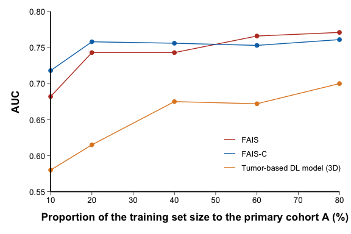
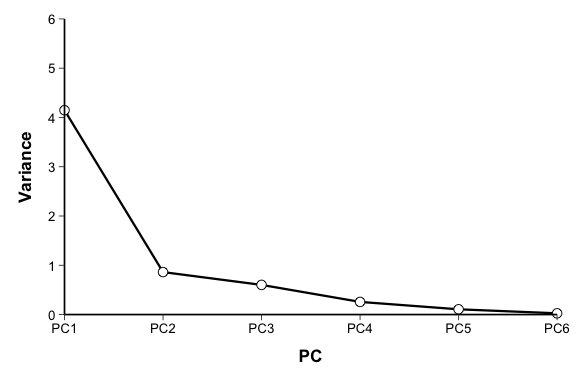
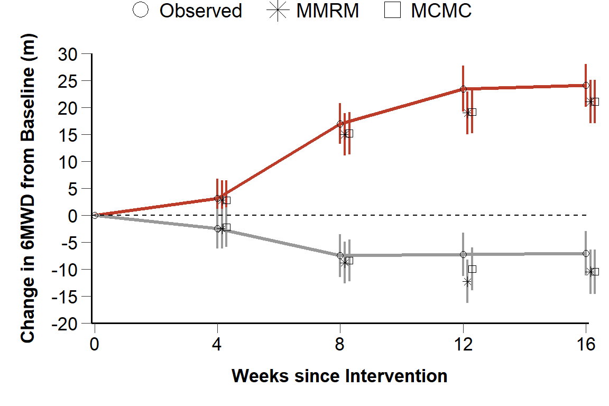
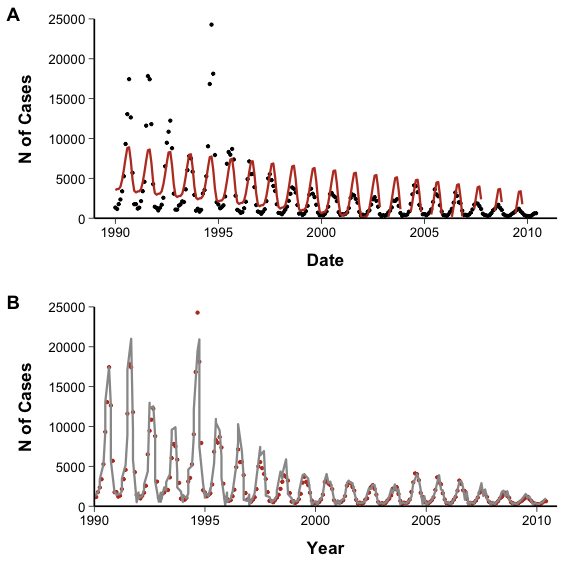
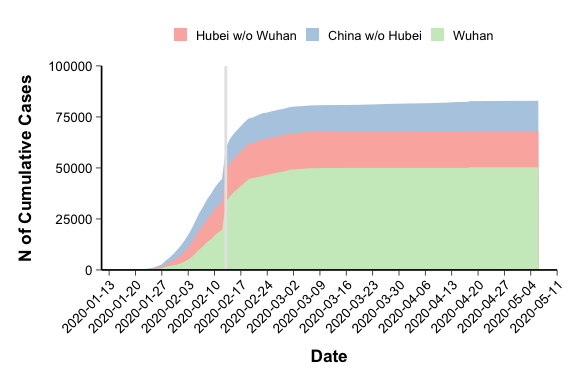
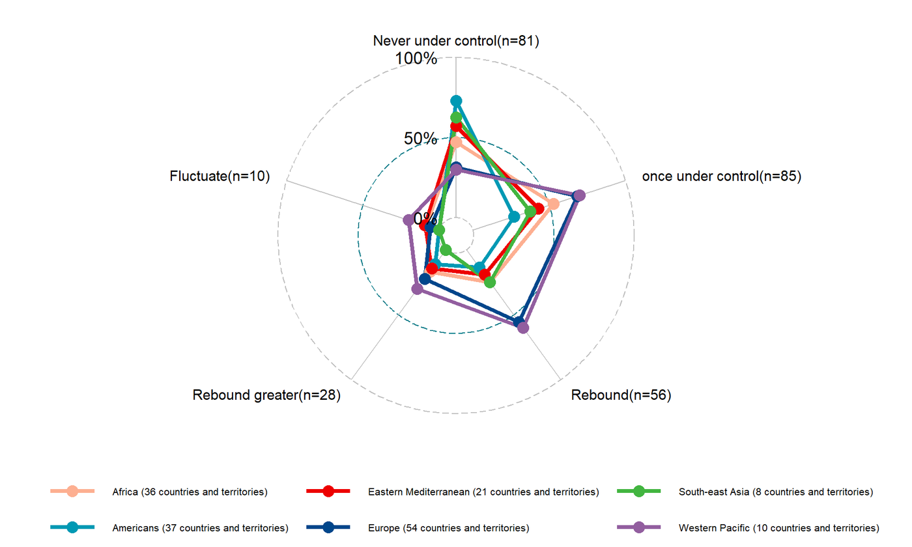

# Line Chart

## 1. Scope and Definition

Line charts display change across an ordered variable such as time, dose, sequence, or another continuous or ordinal scale. Connecting observations emphasizes their order and trend; it does not by itself imply continuous measurement, causality, or statistical significance.

Area, stacked area, stream, and step charts are related extensions of line charts. Radar plots use connected lines in polar coordinates to compare multivariable profiles rather than temporal trends.

## 2. Selection Guide

| Analytical purpose | Recommended chart |
|---|---|
| Show observed values across ordered measurement points | Line Plot with Point |
| Display eigenvalues or explained variance across principal components | Scree Plot |
| Show estimates with variability or uncertainty | Line Plot with Errorbar |
| Examine trend, seasonality, or temporal change | Time Series Plot |
| Compare observed data with a fitted or smoothed trend | Smooth Line Plot |
| Emphasize magnitude relative to a baseline across an ordered axis | Area Graph |
| Show an additive total and its changing composition | Stacked Area Graph |
| Summarize the dynamics of many concurrent series | Stream Graph |
| Show cumulative or piecewise-constant change at discrete events | Stepper Line Chart |
| Compare standardized multivariable profiles across groups | Radar Plot |

## 3. Required Data Structure

- Standard line data should contain an ordered `x` variable, a numeric `y` variable, and an optional `group` identifier; longitudinal individual-level data should also retain `subject_id`.
- Error-bar data require a point estimate and either explicit lower and upper limits or a clearly defined error measure. Time-series data require valid dates and a known observation frequency.
- Stacked area and stream data require one row per time–component combination. Radar data require comparable or standardized indicators for each group.
- Scree plots may start from a multivariable matrix, but plotting data must contain correctly ordered component labels and their eigenvalues or explained variance.

## 4. Common Statistical Principles

- Connect only observations with a meaningful order. Do not join nominal categories or unrelated subjects.
- Distinguish individual trajectories, group summaries, and model-fitted values; each answers a different clinical or epidemiological question.
- Account for repeated measurements, temporal dependence, irregular intervals, missing observations, and changes in measurement frequency when interpreting trends.
- Define every interval as `SD`, `SE`, `95% CI`, or another prespecified measure. Interval overlap is not a substitute for formal inference.
- State any transformation, smoothing, or differencing because it changes the scale and interpretation of the displayed outcome.

## 5. Common Visual Rules

- Use a true ordered axis with clinically meaningful breaks and units. Keep the same scale when panels or groups are intended for direct comparison.
- Preserve gaps caused by missing periods unless interpolation is explicitly justified. Sort observations by `x` within each group before connecting them.
- Use consistent color, line type, and point shape for the same group or estimation method across the figure.
- The y-axis need not start at zero, but its range should not exaggerate small changes; add a clinically meaningful reference line when appropriate.
- Limit the number of overlapping series. Use faceting or direct labels when multiple lines cannot be distinguished reliably.
- Place the title and legend at the top and center them.
- Do not add a gridline background.
- Unless specifically requested, do not add subtitles or explanatory text outside the plot.

## 6. Variants

### Line Plot with Point

**Statistical Features**

- Displays observed values or summary estimates across ordered measurement points and supports comparison of trends between groups.
- Points identify the actual measurement locations; the connecting line represents ordered change rather than unobserved intermediate data.

**Visual Features**

- Markers show individual measurement points, while straight segments connect adjacent points.
- Multiple groups appear as separate point–line sequences with matched color or line encoding.

**Code Features**

- Map the ordered variable to `x`, the numeric outcome to `y`, and the grouping variable to `color` or `group`.
- Combine `geom_point()` with `geom_line()` and ensure observations are ordered within each group.
- Code Reference: source script `\StatsVisual-Skill\assets\templates\line\Line Plot with Point.R`

### Scree Plot

**Statistical Features**

- Summarizes the eigenvalue or explained variance of each ordered principal component or factor.
- The decline and possible elbow support dimension selection, but retention should also consider cumulative variance and prespecified analytical criteria.

**Visual Features**

- Components are arranged from the first to the last, with a point at each component joined by a descending line.
- A steep initial decline followed by a flatter tail forms the characteristic scree pattern.

**Code Features**

- When raw variables are supplied, first perform PCA or factor analysis and derive eigenvalues or explained variance.
- Keep component labels in numeric order; use `group = 1` when a discrete component axis is connected by `geom_line()`.
- code reference:source script `\StatsVisual-Skill\assets\templates\line\Scree Plot.R`

### Line Plot with Errorbar

**Statistical Features**

- Displays estimates over ordered time or dose together with variability or estimation uncertainty.
- In longitudinal studies, observed and model-based estimates may be shown together, but the interval definition and missing-data method must be stated.

**Visual Features**

- Each estimate is represented by a point and vertical interval, with adjacent estimates optionally connected by a line.
- Different estimation methods can appear as distinct point shapes with slight horizontal separation; a zero line can indicate no change from baseline.

**Code Features**

- Draw intervals with `geom_errorbar()` using explicit `ymin` and `ymax`, then add the corresponding points and lines.
- Separate estimates at the same time point by a small x-offset or compatible dodge, and add `geom_hline(yintercept = 0)` when zero has clinical meaning.
- code reference:source script `\StatsVisual-Skill\assets\templates\line\Line Plot with Errorbar.R`

### Time Series Plot

**Statistical Features**

- Describes temporal trend, seasonality, abrupt change, and unusual observations in regularly or irregularly spaced measurements.
- Log transformation and ordinary or seasonal differencing may support time-series diagnosis, but each produces a different outcome scale.

**Visual Features**

- Observations follow a calendar axis, making peaks, troughs, cycles, and change points visible.
- Diagnostic displays may use aligned panels for the original, transformed, and differenced series.

**Code Features**

- Convert the time variable to a valid date class and control calendar breaks with `scale_x_date()`.
- For diagnostic panels, construct the series with its correct frequency, apply `log()` or `diff()` as required, realign dates, and combine panels consistently.
- code reference:source script `\StatsVisual-Skill\assets\templates\line\Time Series Plot.R`

### Smooth Line Plot

**Statistical Features**

- Displays a model-estimated or smoothed trend over observed measurements, such as harmonic or ARIMA fitted values.
- The fitted curve reflects model assumptions and should remain distinguishable from the observed data.

**Visual Features**

- Raw observations appear as points or a thin line, with a smoother fitted line superimposed.
- Alternative models may be shown in separate aligned panels to compare fitted patterns without excessive overlap.

**Code Features**

- Fit the selected model first, extract fitted values, and align them with the original observation times.
- Plot observations with `geom_point()` and fitted values with `geom_line()` using comparable axes across models.
- code reference:source script `\StatsVisual-Skill\assets\templates\line\Smooth Line Plot.R`

### Area Graph

**Statistical Features**

- Emphasizes how the magnitude of a continuous outcome changes relative to a baseline across time or another ordered variable.
- Overlapping series remain separate quantities; they should not be interpreted as additive unless a part-to-whole relationship is defined.

**Visual Features**

- The region between the line and baseline is filled, giving greater visual weight to magnitude than a line alone.
- Multiple series may form overlapping translucent areas rather than stacked bands.

**Code Features**

- Use `geom_area()` with the ordered variable on `x`, the value on `y`, and the series mapped to `fill`.
- For overlapping areas, control transparency with `alpha`; display proportions on a consistent percentage scale.
- code reference:source script `\StatsVisual-Skill\assets\templates\line\Area Graph.R`

### Stacked Area Graph

**Statistical Features**

- Shows an additive total and the contribution of each component at every time point.
- It is appropriate for overall composition change, but less suitable for precise comparison of components that do not share the baseline.

**Visual Features**

- Components form contiguous colored bands; band thickness represents the component value and the upper boundary represents the total.
- Changes in both total height and relative band width reveal overall growth and composition shifts.

**Code Features**

- Use long-format data with `geom_area(aes(fill = group), position = "stack")`; factor levels control stacking and legend order.
- Add event markers with `geom_vline()` only when the corresponding date has a defined clinical or surveillance meaning.
- code reference:source script `\StatsVisual-Skill\assets\templates\line\Stacked Area Graph.R`

### Stream Graph

**Statistical Features**

- Summarizes the relative prominence and temporal dynamics of many concurrent series.
- It is intended for pattern recognition rather than precise estimation or direct comparison of absolute values.

**Visual Features**

- Smooth stacked bands flow around a central or moving baseline, producing a river-like form.
- Band thickness reflects the relative magnitude of each group over time.

**Code Features**

- Map time to `x`, magnitude to `y`, and category to both `group` and `fill`, then draw with `geom_stream()`.
- When the display is centered around zero, a reference line and absolute-value axis labels may be used to preserve readable magnitudes.
- code reference:source script `\StatsVisual-Skill\assets\templates\line\Stream Graph.R`

### Stepper Line Chart

**Statistical Features**

- Represents cumulative counts, states, or other piecewise-constant processes that change only when an event occurs.
- It emphasizes the timing and magnitude of each update rather than continuous change between observations.

**Visual Features**

- Horizontal plateaus show periods without change, and vertical segments show discrete jumps.
- Multiple outcomes appear as separate staircase trajectories on the same ordered axis.

**Code Features**

- Use `geom_step()` with a continuous or date variable on `x` and the cumulative or state value on `y`.
- Map the outcome name to `color` when several step series are displayed together.
- code reference:source script `\StatsVisual-Skill\assets\templates\line\Stepper Line Chart.R`

### Radar Plot

**Statistical Features**

- Compares multivariable profiles across groups using indicators measured on a common or standardized scale.
- Polygon shape is descriptive and depends on axis order; it should not be interpreted as a time trend or formal multivariate test.

**Visual Features**

- Each indicator forms a radial axis, and values from the same group are joined into a closed polygon.
- Differences between groups appear as contrasting profile shapes and radial distances from the center.

**Code Features**

- Arrange data with one row per group and one column per comparable indicator, retaining the group identifier as the first column.
- Use `ggradar()` after scaling variables to a common range, then specify group colors, points, labels, and legend placement.
- code reference:source script `\StatsVisual-Skill\assets\templates\line\Radar Plot.R`

## 7. QA Checklist

- Confirm that `x` is ordered, correctly parsed, and sorted within each group.
- Verify that lines do not connect unrelated subjects or bridge unjustified missing intervals.
- Identify whether each series represents raw observations, individual trajectories, group summaries, or fitted estimates.
- Define all error bars, transformations, smoothing methods, and reference lines.
- Confirm additivity before using a stacked area graph and scale comparability before using a radar plot.
- Check that units, date frequency, group encoding, and panel scales remain consistent.
