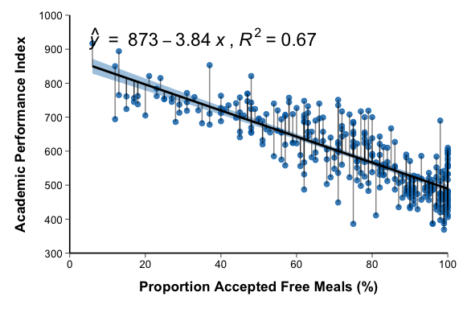
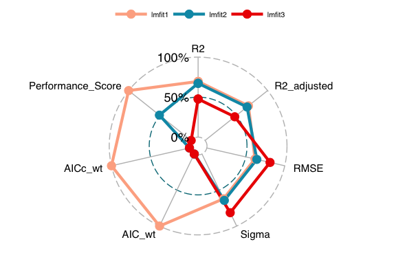

# Linear Regression

## 1. Scope and Definition

Linear regression models the conditional mean of a continuous outcome as a linear function of one or more predictors. Regression graphics should show the observed data, the fitted mean relationship, and—when relevant—the uncertainty of the fitted mean or prediction for an individual observation.

A fitted line describes association conditional on the specified model. It does not establish causality, prove linearity, or guarantee valid inference unless the study design and model assumptions are appropriate.

## 2. Selection Guide

| Analytical purpose | Recommended chart |
|---|---|
| Show a simple linear relationship and its fitted conditional mean | Linear Regression Plot |
| Distinguish uncertainty in the mean response from uncertainty for an individual response | Linear Regression with Confidence and Tolerance Bands |
| Describe the joint reference region of two correlated continuous variables | Bivariate Ellipse Interval |
| Show observation-level residuals from a fitted line | Regression with Deviations |
| Display a two-predictor linear model in three dimensions | Linear Regression Response Surface |
| Compare several fitted models across multiple performance metrics | Regression Performance Radar Plot |

## 3. Required Data Structure

- Simple regression requires one row per independent observational unit, a continuous outcome, and one continuous predictor. Retain clinically relevant covariates, cluster or subject identifiers, and the analysis sample indicator.
- Grouped, repeated, or clustered observations require methods that account for dependence; ordinary `lm()` standard errors are not valid when independence is violated.
- Response-surface data require one continuous outcome and two predictors with adequate joint coverage. Sparse predictor combinations should not be treated as well-supported regions.
- Model-performance comparison requires models fitted to the same outcome and preferably the same observations. Metrics with different directions or scales must be harmonized before joint display.
- Record missing-data handling, transformations, units, and any exclusions. Complete-case analysis can change the target population and should not be treated as a neutral preprocessing step.

## 4. Common Statistical Principles

- Check linearity of the conditional mean, independence, constant residual variance, residual distribution for interval estimation, and influential observations. When assumptions fail, consider transformation, robust standard errors, splines, generalized models, or mixed models.
- Interpret the slope as the expected change in the outcome per unit change in the predictor, conditional on variables included in the model. Do not equate association with causation.
- Distinguish a confidence band for the conditional mean from a prediction interval for a new individual. A formal tolerance interval is a different estimand and requires a dedicated method.
- Report coefficients with confidence intervals, analysis sample size, covariates, and the exact model specification. `R²` describes explained variation and is not a measure of causal validity or calibration.
- Potential outliers and influential observations require verification and sensitivity analysis. Do not delete observations solely because they fall outside a graphical band.

## 5. Common Visual Rules

- Do not add a gridline background.
- Unless specifically requested, do not add subtitles or explanatory text outside the plot.
- Add value labels only when they improve interpretation without crowding the figure.
- Keep raw observations visible when they are needed to assess linearity, spread, and influential points.
- Label bands and reference regions by their statistical meaning; do not use “confidence,” “prediction,” “tolerance,” or “reference” interchangeably.

## 6. Variants

### Linear Regression Plot

**Statistical Methods and Features**

- Fits a simple linear model for the conditional mean, `E(Y | X) = β0 + β1X`, and displays the estimated regression line.
- The shaded band represents uncertainty in the estimated conditional mean when generated with `conf.int = TRUE` or `geom_smooth(se = TRUE)`; it is not the expected range of individual outcomes.
- Marginal box plots may summarize the separate distributions of `X` and `Y`, but they do not diagnose residual assumptions.

**Code Features**

- Fit or draw the model with `ggscatter(..., add = "reg.line")` or `geom_smooth(method = "lm", formula = y ~ x)`.
- Add the fitted equation and `R²` with `stat_poly_eq()` only when they remain readable and correspond to the displayed model.
- Use `ggMarginal()` after constructing the main plot when marginal distributions are required.

- code reference: source script `\StatsVisual-Skill\assets\templates\linear_regression\Linear Regression Plot.R`

### Linear Regression with Confidence and Tolerance Bands

**Statistical Methods and Features**

- Displays the fitted conditional mean, its confidence band, and a wider interval for an individual outcome at a given predictor value.
- The manuscript code uses `predict(..., interval = "prediction")`, which produces a prediction interval rather than a formal population tolerance interval.
- Observations outside the prediction interval are unusual under the fitted model but are not automatically erroneous or clinically abnormal.

**Code Features**

- Fit the model with `lm(y ~ x)` and generate individual prediction limits using `predict(lmfit, newdata = ..., interval = "prediction", level = 0.95)`.
- Draw the regression line and mean confidence band separately from the lower and upper prediction limits.
- Sort the prediction data by `x` before drawing interval lines; use a dedicated tolerance-interval procedure when a formal tolerance band is required.

### Bivariate Ellipse Interval

**Statistical Methods and Features**

- Summarizes the joint location, dispersion, and correlation structure of two continuous variables in two-dimensional space.
- The ellipse is not a confidence interval for the regression line or mean vector. Interpreting it as a reference region requires an appropriate distributional model, usually an approximately elliptical or bivariate normal population.
- Points outside the ellipse are potential multivariate outliers and require clinical and data-quality review.

**Code Features**

- Map the two variables to `x` and `y`, retain the observations with `geom_point()`, and add `stat_ellipse(geom = "polygon", level = 0.95)`.
- Add `geom_smooth(method = "lm")` and `stat_poly_eq()` only when the linear association is part of the intended interpretation.
- Specify the ellipse type explicitly when the default is not appropriate for the assumed population model.

- code reference: source script `\StatsVisual-Skill\assets\templates\linear_regression\Bivariate Ellipse Interval.R`

### Regression with Deviations

**Statistical Methods and Features**

- Displays each residual as the vertical difference between the observed outcome and its fitted conditional mean.
- Residual sign indicates whether an observation lies above or below the fitted line; residual magnitude reflects lack of fit on the outcome scale.
- Residuals should be interpreted together with leverage and influence diagnostics because a small residual can still be influential.

**Code Features**

- Draw the fitted model with `ggscatter()` or `geom_smooth(method = "lm")`.
- Add observation-level deviations using `stat_fit_deviations(formula = y ~ x)`.
- Use transparency for dense residual segments and retain the same model formula for the line, equation, and deviation layer.

- code reference: source script `\StatsVisual-Skill\assets\templates\linear_regression\Regression with Deviations.R`

### Linear Regression Response Surface

**Statistical Methods and Features**

- Displays predicted values from a two-predictor linear model, typically `E(Y | X1, X2) = β0 + β1X1 + β2X2`.
- Without an interaction or nonlinear term, the fitted response is a plane. The surface shows conditional association, not an independent causal contribution of each predictor.
- Predictions in sparsely observed predictor combinations are weakly supported even when they lie inside the marginal ranges of both predictors.

**Code Features**

- Fit `lm(y ~ x1 + x2)` and create a regular prediction grid with `expand.grid()`.
- Calculate predictions with `predict.lm(newdata = grid)`, reshape them to a matrix with `acast()` or an equivalent method, and combine `scatter3d` points with a `surface` trace in `plot_ly()`.
- Use moderate grid resolution and add interaction or nonlinear terms to the formula only when they are part of the fitted model.

- code reference: source script `\StatsVisual-Skill\assets\templates\linear_regression\Linear Regression Response Surface.R`

### Regression Performance Radar Plot

**Statistical Methods and Features**

- Compares several fitted models across multiple measures such as `R²`, adjusted `R²`, RMSE, residual sigma, and information-criterion weights.
- Raw metrics cannot be compared directly on one radial scale because they have different units and directions: larger is better for some metrics, whereas smaller is better for AIC, RMSE, and sigma.
- AIC-based comparison is valid only for models fitted to the same outcome and data under comparable likelihoods; radar area has no formal statistical interpretation.

**Code Features**

- Fit the candidate models and obtain a performance table with `compare_performance(..., metrics = "all", rank = TRUE)`.
- Before calling `ggradar()`, convert metrics to a common direction and scale using validated ranking or normalization; do not use arbitrary division solely to make values fit the chart.
- Preserve the model identifier as the first column and verify that every radial axis has an interpretable common scale.

- code reference: source script `\StatsVisual-Skill\assets\templates\linear_regression\Regression Performance Radar Plot.R`

## 7. QA Checklist

- Confirm the outcome, predictors, units, analysis sample, missing-data handling, and exact model formula.
- Inspect scatter and residual patterns for nonlinearity, heteroscedasticity, dependence, and influential observations.
- Verify that the equation, `R²`, coefficients, confidence intervals, and displayed line all come from the same fitted model.
- Label confidence bands, prediction intervals, tolerance intervals, and bivariate reference regions correctly.
- For response surfaces, check joint predictor coverage and avoid unsupported extrapolation.
- For model comparisons, use the same outcome and analysis set, harmonize metric direction and scale, and avoid selecting a model from the radar shape alone.
