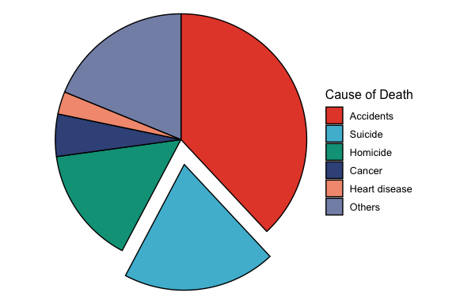
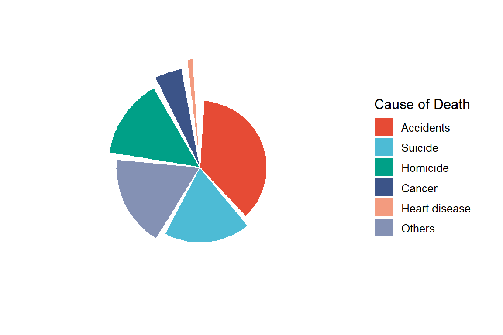
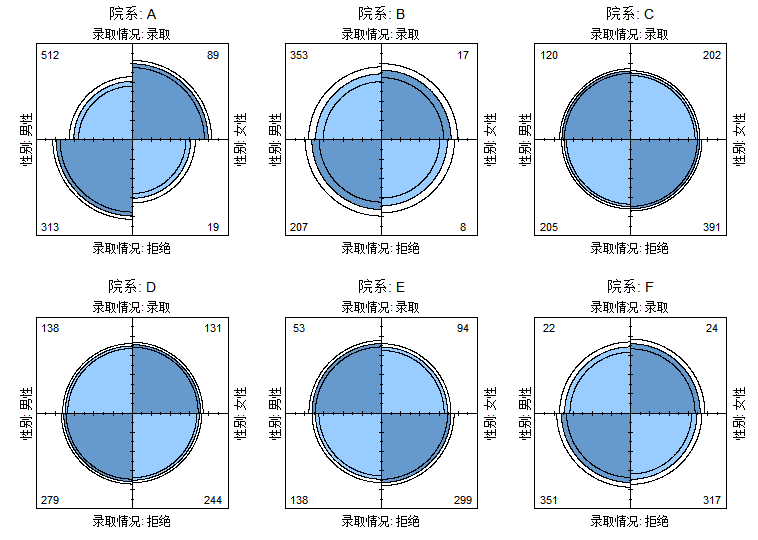

# Pie Chart

## 1. Scope and Definition

Pie charts display how mutually exclusive categories contribute to one clearly defined whole at a single time point or within one population. Sector angle and area encode composition; they do not represent incidence, prevalence, mortality, risk, or other rates unless those values themselves form a valid partition of the same denominator.

Doughnut and exploded pies retain the same part-to-whole logic. Nightingale rose charts, nested pies, circular polar heatmaps, and fourfold plots use different statistical encodings and should be selected according to their specific analytical purpose.

## 2. Selection Guide

| Analytical purpose | Recommended chart |
|---|---|
| Show a small number of categories forming one whole | Pie Plot |
| Keep category and percentage labels outside crowded sectors | Pie Plot with External Labels |
| Display the same composition with a central opening | Doughnut Plot |
| Emphasize one prespecified category | Pie Plot with Exploded Slice |
| Visually separate all sectors | Exploding Pie Plot |
| Compare category magnitudes in polar coordinates | Nightingale Rose Chart |
| Manage labels when rose-chart values vary widely | Rose Chart with Tiered Label Strategy |
| Show parent–child composition across hierarchical levels | Nested Pie Plot |
| Display a continuous metric across two discrete dimensions in a circular layout | Circular Polar Heatmap |
| Display the frequency and association structure of a `2 × 2` or `2 × 2 × k` table | Fourfold Plot |

## 3. Required Data Structure

- Standard pie and doughnut charts require one row per mutually exclusive category, with a non-negative count or proportion and a clearly defined common denominator.
- Exploded charts additionally require a prespecified displacement variable. Rose charts require one category and one magnitude; their values need not sum to 100%.
- Nested pies require a valid node–parent hierarchy and node values. Circular polar heatmaps require two discrete dimensions and one continuous measure.
- Fourfold plots require a `2 × 2` contingency table or a stratified `2 × 2 × k` array; individual-level binary data must first be tabulated.

## 4. Common Statistical Principles

- Use pie-based charts only for composition. Categories must be mutually exclusive and collectively represent the stated whole; report the denominator, population, and time frame.
- Distinguish counts, proportions, and rates. A set of independently calculated incidence or mortality rates is not a valid pie because the values do not share one additive denominator.
- Keep the number of categories small. When categories are numerous, values are similar, or exact comparison is important, prefer a bar chart or dot plot.
- Treat missing, unknown, and residual categories explicitly. Do not remove them if doing so changes the denominator or makes displayed percentages sum to a misleading 100%.
- Pie charts are descriptive and do not display sampling uncertainty or statistical significance. Provide counts and inferential results separately when required.

## 5. Common Visual Rules

- Place the title and legend at the top and center them.
- Do not add a gridline background.
- Unless specifically requested, do not add subtitles or explanatory text outside the plot.
- Add value labels only when they improve interpretation without crowding the figure.
- Use a restrained categorical palette and keep category colors consistent across related figures.
- Order sectors intentionally, usually by magnitude or a clinically meaningful sequence; avoid 3D effects and decorative gradients.

## 6. Variants

### Pie Plot

**Statistical Features**

- Displays the composition of one population or total across a small number of mutually exclusive categories.
- Sector percentages should be calculated from the same denominator and should sum to 100% apart from rounding.

**Visual Features**

- Each category appears as a sector of one circle; sector angle and area increase with its share of the whole.
- Labels may be placed inside large sectors, while a legend identifies categories when direct labels are not used.

**Code Features**

- Create a single stacked bar with `geom_bar(stat = "identity")` or `geom_col()`, map category to `fill`, and convert it with `coord_polar(theta = "y")`.
- Set factor levels before plotting to control sector order; use `position_stack(vjust = 0.5)` for internal percentage labels.

- Code Reference: source script `\StatsVisual-Skill\assets\templates\pie\Pie Plot.R`

### Pie Plot with External Labels

**Statistical Features**

- Uses the same part-to-whole data as a conventional pie chart but supports more or longer category labels.
- External labeling improves identification but does not overcome the limited precision of angle and area comparisons.

**Visual Features**

- Category names and percentages sit outside the circle and connect to their sectors with leader lines.
- Sector boundaries remain visible while the central pie is kept free of crowded text.

**Code Features**

- Calculate each sector midpoint from cumulative values before plotting.
- Add labels with `geom_label_repel()` or `geom_text_repel()`; remove a redundant legend when labels already identify every sector.

### Doughnut Plot

**Statistical Features**

- Represents the same composition as a pie chart; the central opening does not change the denominator or statistical interpretation.
- The center may display a total sample size, study population, or time point without encoding an additional variable.

**Visual Features**

- Categories form colored arcs around a hollow center rather than solid sectors meeting at one point.
- Arc length and area represent each category share, while the opening creates visual space for a concise central annotation.

**Code Features**

- Build the chart as a stacked bar and apply `coord_polar(theta = "y")`.
- Use a constant radial `x` value and `xlim()` to create the opening; place labels at the midpoint of each ring segment.

- Code Reference: source script `\StatsVisual-Skill\assets\templates\pie\Doughnut Plot.R`

### Pie Plot with Exploded Slice

**Statistical Features**

- Retains the standard composition denominator while drawing attention to one prespecified category.
- Displacement is an emphasis device only and must not imply a larger proportion, stronger effect, or statistical significance.

**Visual Features**

- One sector is shifted outward from the remaining circle, creating a visible gap around the highlighted category.
- All other sectors retain the original circular arrangement and relative sizes.

**Code Features**

- Use `ggforce::geom_arc_bar(stat = "pie")` with `amount` for category values and `fill` for categories.
- Supply a restrained `explode` value through a focus variable; set `r0 = 0` for a solid pie or `r0 > 0` for a ring form.

- Code Reference: source script `\StatsVisual-Skill\assets\templates\pie\Pie Plot with Exploded Slice.R`

### Exploding Pie Plot

**Statistical Features**

- Displays the same part-to-whole composition as a conventional pie while separating every category.
- Because separation adds visual prominence, it should be used only when sector boundaries are central to the presentation.

**Visual Features**

- All sectors are displaced from the center, producing separated wedge-like pieces.
- Sector size still represents composition, while radial spacing distinguishes adjacent categories.

**Code Features**

- Compute category fractions and cumulative `ymin` and `ymax` limits before plotting.
- Draw sector bases with `geom_rect()` and map them into polar coordinates; control each sector’s displacement through `xmin` and `xmax`.

- Code Reference: source script `\StatsVisual-Skill\assets\templates\pie\Exploding Pie Plot.R`

### Nightingale Rose Chart

**Statistical Features**

- Compares category magnitudes by radial length in equal-angle sectors; values do not need to form a 100% composition.
- Because sector area increases with the square of the radius, interpret the encoded quantity according to the implementation and state clearly whether radius or area represents the value.

**Visual Features**

- Equal-width sectors extend outward by different radii, forming a flower-like circular profile.
- Large values create long petals and dominate the outer circumference; category labels are arranged around the circle.

**Code Features**

- Map ordered categories to `x`, magnitude to `y`, and category or value to `fill`, then apply `coord_polar()`.
- Set factor order explicitly and precompute label angles and alignment when labels follow the circular axis.

- Code Reference: source script `\StatsVisual-Skill\assets\templates\pie\Nightingale Rose Chart.R`

### Rose Chart with Tiered Label Strategy

**Statistical Features**

- Uses the same radial magnitude encoding as the Nightingale rose chart when category values span a wide range.
- Label tiers communicate category identity only and must not introduce new statistical groupings.

**Visual Features**

- Large sectors carry internal labels, medium sectors place labels near their outer edge, and small sectors use external rotated labels.
- The layered label arrangement preserves the circular profile while reducing overlap around short sectors.

**Code Features**

- Draw the main chart with `geom_col()` and `coord_polar()`.
- Precompute label angle and divide categories by value thresholds into separate `geom_text()` layers for internal, edge, and external placement.

### Nested Pie Plot

**Statistical Features**

- Displays hierarchical composition in which each child category belongs to a defined parent.
- Parent and child values must be internally consistent; with total-based branching, child values should reconcile with the parent total.

**Visual Features**

- Concentric rings represent successive hierarchy levels, with child sectors aligned beneath their parent sector.
- Moving outward from the center reveals increasingly detailed subgroup composition.

**Code Features**

- Provide node names, parent names, and values to `plotly::plot_ly(type = "sunburst")`.
- Use `branchvalues = "total"` only when parent values represent totals that include their descendants.

- code reference:source script `\StatsVisual-Skill\assets\templates\pie\Nested Pie Plot.R`

### Circular Polar Heatmap

**Statistical Features**

- Displays a continuous measure across the combinations of two discrete dimensions, such as disease by year.
- It is a circular heatmap rather than a composition chart; color represents magnitude and values do not need to sum to a whole.

**Visual Features**

- One discrete dimension forms angular sectors and the other forms concentric rings.
- Each tile is colored according to the measured value, creating a circular matrix of temporal or subgroup patterns.

**Code Features**

- Draw the rectangular matrix with `geom_tile()`, mapping the two discrete variables to `x` and `y` and the continuous measure to `fill`.
- Convert the matrix with `coord_polar(theta = "x")` and add radial or angular annotations when default axes are insufficient.

### Fourfold Plot

**Statistical Features**

- Displays the cell frequencies and association structure of two binary variables in a `2 × 2` table; stratified arrays allow comparison across levels.
- Opposing quadrants correspond to the cross-products underlying the odds ratio, while confidence rings, when shown, support visual assessment of departure from independence.

**Visual Features**

- Four quarter-circle sectors form a symmetric four-petal display; sector area reflects cell frequency.
- Stratified `2 × 2 × k` data appear as repeated four-petal panels for direct comparison across strata.

**Code Features**

- Use `xtabs()` to convert individual-level binary data into a `2 × 2` table, or supply an existing `2 × 2 × k` array.
- Draw the display with `fourfoldplot()` and use a multi-panel layout when stratification levels are present.

- code reference:source script `\StatsVisual-Skill\assets\templates\pie\Fourfold Plot.R`

## 7. QA Checklist

- Confirm that standard pie, doughnut, and exploded-pie categories are mutually exclusive and sum to the stated whole.
- Verify the denominator, time point, population, units, and handling of missing or residual categories.
- Check that rates have not been misrepresented as composition and that percentage labels agree with the source counts.
- Confirm that rose-chart values, nested hierarchy, circular-heatmap scales, and fourfold-table dimensions match their distinct statistical encodings.
- Ensure sector order, labels, colors, and legends remain consistent and readable without implying unsupported importance or significance.
