# Probability And Statistical Distribution Plot

## Use For

Use distribution plots to explain or compare theoretical distributions, empirical density, probability mass, cumulative probability, or parameter effects.

## Variants

- Normal, standard normal, log-normal.
- Binomial, Poisson, negative binomial.
- t, chi-square, F distributions.
- Empirical CDF.
- Parameter comparison overlays.

### Core Mapping Logic

#### Normal Distribution

**Applicable Data**

- Theoretical normal distribution presentation task.
- The focus is to compare the influence of the position parameter `μ` and the morphological parameter `σ` on the distribution curve.
- Generally, it does not rely on external data files, and the `x` sequence and `dnorm()` density value are often directly generated by the code.

**Mapping Logic**

- `x`: Continuous independent variable, usually an equidistant sequence.
- `y`: Density value obtained by `dnorm(x, mean = μ, sd = σ)`.
- `color = group`: Distribution curves of different parameter combinations.
- Use `geom_line()` to plot the density curve.
- If comparing different means, `geom_vline()` can be superimposed to mark the mean position.
- "Change Mean" and "Change Standard Deviation" are often split into two panels.

**Additional Requirements**

- Place both the title and legend at the top and center them.
- Do not add a gridline background.
- Unless specifically requested, do not add subtitles or explanatory text outside the plot.
- Use the shared book-derived plotting theme defined in `design-rules.md`.

## Code Reference
- Original development note: source example `Normal Distribution.txt` is not included in the public skill.

#### Log-normal Distribution

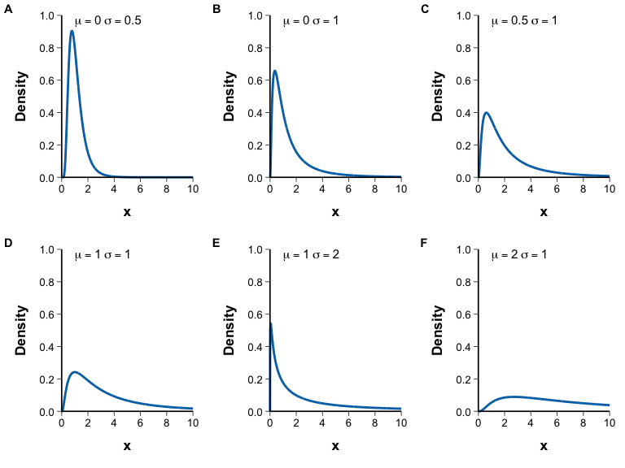

**Applicable Data**

- Theoretical lognormal distribution presentation task.
- It focuses on showing the impact of different `μ` and `σ` parameters on the skewed distribution shape.

**Mapping Logic**

- `x`: non-negative continuous sequence.
- `y`: `dlnorm(x, meanlog = μ, sdlog = σ)`.
- Use `geom_line()` to plot the density curve.
- Usually, multiple subgraphs are generated using multiple parameter combinations, and then spliced ​​using `plot_grid()` or `patchwork`.

**Additional Requirements**

- It is recommended that parameter labels be marked directly on each subgraph, such as `mu == 0`, `sigma == 1`.
- The theme, coordinate labels and label positions should be unified in multiple panels.
- Place both the title and legend at the top and center them.
- Do not add a gridline background.
- Unless specifically requested, do not add subtitles or explanatory text outside the plot.
- Use the shared book-derived plotting theme defined in `design-rules.md`.

## Code Reference
- Original development note: source example `Log-normal Distribution.txt` is not included in the public skill.

#### Multivariate Normal Distribution

**Applicable Data**

- Theoretical joint density presentation of bivariate or multivariate normal distributions.

**Mapping Logic**

- `x1`, `x2`: two continuous independent variable grids.
- `z`: Joint density value calculated based on mean vector, variance and correlation coefficient.
- The manuscript uses `outer()` to generate a two-dimensional density matrix, and then uses `plotly::add_surface()` to draw a 3D surface.
- `color`: Continuous ribbon corresponding to high and low density.
- `contours` can be retained to assist in understanding surface horizontal changes.

**Additional Requirements**

- Place both the title and legend at the top and center them.
- Do not add a gridline background.
- Unless specifically requested, do not add subtitles or explanatory text outside the plot.
- Use the shared book-derived plotting theme defined in `design-rules.md`.

## Code Reference
- Original development note: source example `Multivariate Normal Distribution.txt` is not included in the public skill.

#### Student's t Distribution

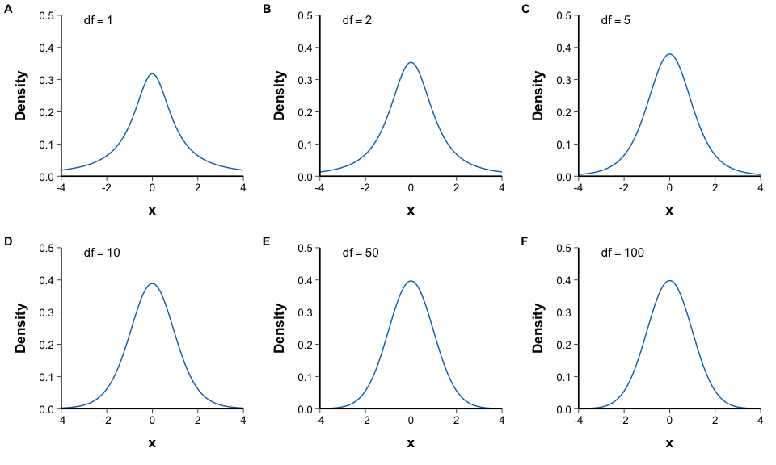

**Applicable Data**

- Theoretical t-distribution comparison task.
- It focuses on showing how the curve shape gradually approaches the standard normal under different degrees of freedom `df`.

**Mapping Logic**

- `x`: continuous sequence, often symmetrical interval.
- `y`：`dt(x, df)`。
- Use `geom_line()`.
- Multiple subgraphs are often generated by encapsulating different `df` through functions.
- `annotate()` can be written internally to `df` directly in each subgraph.

**Additional Requirements**

- Place both the title and legend at the top and center them.
- Do not add a gridline background.
- Unless specifically requested, do not add subtitles or explanatory text outside the plot.
- Use the shared book-derived plotting theme defined in `design-rules.md`.

## Code Reference
- Original development note: source example `Student’s t Distribution.txt` is not included in the public skill.

#### F Distribution

**Applicable Data**

- Theoretical F-distribution presentation task.
- Focus on showing the influence of the two degree of freedom parameters `df1` and `df2` on the curve.

**Mapping Logic**

- `x`: non-negative continuous sequence.
- `y`：`df(x, df1, df2)`。
- Draw using `geom_line()`.
- Each parameter combination is plotted separately and arranged in multiple panels.

**Additional Requirements**

- The F distribution is asymmetric, with the horizontal axis starting at 0.
- Parameter annotation should write `df1` and `df2` at the same time.
- Place both the title and legend at the top and center them.
- Do not add a gridline background.
- Unless specifically requested, do not add subtitles or explanatory text outside the plot.
- Use the shared book-derived plotting theme defined in `design-rules.md`.

## Code Reference
- Original development note: source example `F Distribution.txt` is not included in the public skill.

#### Chi-square Distribution

**Applicable Data**

- Theoretical chi-square distribution comparison task.
- Focus on showing the change from skew to gradually approaching normality under different degrees of freedom.

**Mapping Logic**

- `x`: non-negative continuous sequence.
- `y`：`dchisq(x, df)`。
- Use `geom_line()`.
- Multiple `df` are often split into multiple sub-pictures for comparison.

**Additional Requirements**

- Parameter annotation should also write `df`.
- Place both the title and legend at the top and center them.
- Do not add a gridline background.
- Unless specifically requested, do not add subtitles or explanatory text outside the plot.
- Use the shared book-derived plotting theme defined in `design-rules.md`.

## Code Reference
- Original development note: source example `Chi-square Distribution.txt` is not included in the public skill.

#### Beta Distribution

**Applicable Data**

- A continuous proportional theoretical distribution with values ​​at `(0, 1)`.
- Focus on showing how different `a`, `b` parameters form U-shaped, uniform, unimodal skewness or spike distribution.

**Mapping Logic**

- `x`: Usually a continuous sequence within `(0,1)`.
- `y`：`dbeta(x, shape1 = a, shape2 = b)`。
- Use `geom_line()`.
- Multi-parameter combinations are displayed using multiple panels.

**Additional Requirements**

- Parameter annotation should write `a` and `b` at the same time.
- Place both the title and legend at the top and center them.
- Do not add a gridline background.
- Unless specifically requested, do not add subtitles or explanatory text outside the plot.
- Use the shared book-derived plotting theme defined in `design-rules.md`.

## Code Reference
- Original development note: source example `Beta Distribution.txt` is not included in the public skill.

#### Uniform Distribution

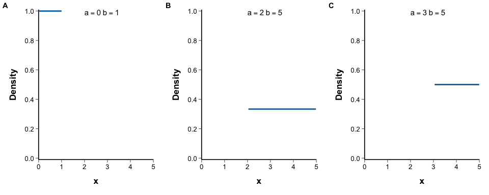

**Applicable Data**

- Demonstration of continuous uniform distribution theory.
- Focus on showing the impact of changes in the interval `[a, b]` on the rectangular density function.

**Mapping Logic**

- `x`: Continuous values ​​generated within `[a, b]`.
- `y`：`dunif(x, min = a, max = b)`。
- Draw using `geom_line()`.
- Different interval parameters are often compared in multiple subgraphs.

**Additional Requirements**

- Parameter annotation should write `a` and `b` at the same time.
- Place both the title and legend at the top and center them.
- Do not add a gridline background.
- Unless specifically requested, do not add subtitles or explanatory text outside the plot.
- Use the shared book-derived plotting theme defined in `design-rules.md`.

## Code Reference
- Original development note: source example `Uniform Distribution.txt` is not included in the public skill.

#### Discrete Uniform Distribution

**Applicable Data**

- The value is a discrete distribution with a finite set of integers and equal probability for each point.
- The focus is on discrete uniform probability mass functions under different integer ranges.

**Mapping Logic**

- `x`: discrete integer value.
- `y`: Equiprobability constant `1 / (n2 - n1 + 1)`.
- Use `geom_linerange()` or equivalent discrete PMF drawing method to express the probability mass of each value.
- A continuous curve should not be used to mislead a distribution into a continuous one.

**Additional Requirements**

- Parameter annotation should write `n1` and `n2` at the same time.
- Place both the title and legend at the top and center them.
- Do not add a gridline background.
- Unless specifically requested, do not add subtitles or explanatory text outside the plot.
- Use the shared book-derived plotting theme defined in `design-rules.md`.

## Code Reference
- Original development note: source example `Discrete Uniform Distribution.txt` is not included in the public skill.

#### Gamma Distribution

**Applicable Data**

- Theoretical distribution of nonnegative continuous variables.
- It focuses on the influence of the shape parameter `a` and the scale parameter `b` on the right-skewed distribution shape.

**Mapping Logic**

- `x`: non-negative continuous sequence.
- `y`: `dgamma(x, shape = a, scale = b)` or the corresponding parameterization method of the book manuscript.
- Use `geom_line()`.
- Multi-parameter combinations are displayed using multiple panels.

**Additional Requirements**

- Parameter annotation should write `a` and `b` at the same time.
- Place both the title and legend at the top and center them.
- Do not add a gridline background.
- Unless specifically requested, do not add subtitles or explanatory text outside the plot.
- Use the shared book-derived plotting theme defined in `design-rules.md`.

## Code Reference
- Original development note: source example `Gamma Distribution.txt` is not included in the public skill.

#### Exponential Distribution

**Applicable Data**

- Theoretical distribution of nonnegative continuous variables.
- It focuses on showing the memoryless distribution pattern under different `lambda`.

**Mapping Logic**

- `x`: non-negative continuous sequence.
- `y`：`dexp(x, rate = lambda)`。
- Use `geom_line()`.
- Multiple `lambda` combinations are displayed using multi-panels.

**Additional Requirements**

- The parameter annotation should be written `lambda`.
- Place both the title and legend at the top and center them.
- Do not add a gridline background.
- Unless specifically requested, do not add subtitles or explanatory text outside the plot.
- Use the shared book-derived plotting theme defined in `design-rules.md`.

## Code Reference
- Original development note: source example `Exponential Distribution.txt` is not included in the public skill.

#### Inverse Gamma Distribution

**Applicable Data**

- Display of the theoretical distribution of positive continuous variables.
- Focus on showing the skewed morphology under different parameters.

**Mapping Logic**

- The manuscript constructs the inverse Gamma density through `dgamma(1/x, a, b)/(x*x)`.
- `x`: continuous sequence of positive values.
- `y`: Inverse Gamma density value.
- Use `geom_line()`.
- Multi-parameter combination and multi-panel display.

**Additional Requirements**
- Parameter annotation should write `a` and `b` at the same time.
- Place both the title and legend at the top and center them.
- Do not add a gridline background.
- Unless specifically requested, do not add subtitles or explanatory text outside the plot.
- Use the shared book-derived plotting theme defined in `design-rules.md`.

## Code Reference
- Original development note: source example `Inverse Gamma Distribution.txt` is not included in the public skill.

#### Bernoulli Distribution

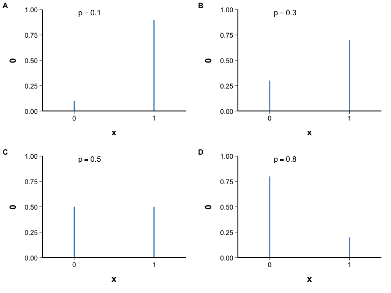

**Applicable Data**

- A two-point discrete distribution with only values ​​0 and 1.
- It focuses on showing the changes of two quality points under different success probabilities `p`.

**Mapping Logic**

- `x`: `0` and `1`.
- `y`: Corresponds to probability mass `p` and `1-p`.
- Use `geom_linerange()` or the vertical bar representation of the discrete PMF.
- Continuous curves should not be used.

**Additional Requirements**

- The parameter label should be written `p`.
- Place both the title and legend at the top and center them.
- Do not add a gridline background.
- Unless specifically requested, do not add subtitles or explanatory text outside the plot.
- Use the shared book-derived plotting theme defined in `design-rules.md`.

## Code Reference
- Original development note: source example `Bernoulli Distribution.txt` is not included in the public skill.

#### Binomial Distribution

**Applicable Data**

- A discrete count distribution with a fixed number of trials `n` and a single success probability `π`.
- It focuses on showing the change in the shape of the probability mass function after the change of `n` and `π`.

**Mapping Logic**

- `x`: Discrete count of `0:n`.
- `y`：`dbinom(x, n, π)`。
- Use `geom_bar(stat = "identity")` or equivalent discrete column plot.
- Multiple parameter combinations are commonly used to form a 2×3 panel comparison.

**Additional Requirements**

- Parameter annotation should write `n` and `π` at the same time.
- Place both the title and legend at the top and center them.
- Do not add a gridline background.
- Unless specifically requested, do not add subtitles or explanatory text outside the plot.
- Use the shared book-derived plotting theme defined in `design-rules.md`.

## Code Reference
- Original development note: source example `Binomial Distribution.txt` is not included in the public skill.

#### Poisson Distribution

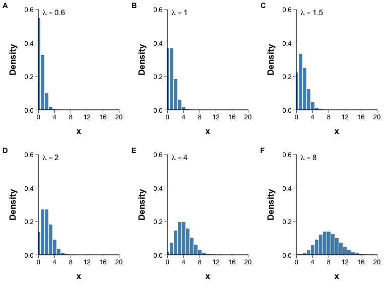

**Applicable Data**

- Discrete theoretical distribution of rare event counts.
- Focus on showing the changes of probability mass function under different `lambda`.

**Mapping Logic**

- `x`: discrete count value.
- `y`：`dpois(x, lambda)`。
- Use `geom_bar(stat = "identity")`.
- Usually multiple `lambda` are used to form a multi-panel comparison.

**Additional Requirements**

- The parameter label should be written `lambda`.
- Place both the title and legend at the top and center them.
- Do not add a gridline background.
- Unless specifically requested, do not add subtitles or explanatory text outside the plot.
- Use the shared book-derived plotting theme defined in `design-rules.md`.

## Code Reference
- Original development note: source example `Poisson Distribution.txt` is not included in the public skill.

#### Beta-binomial Distribution

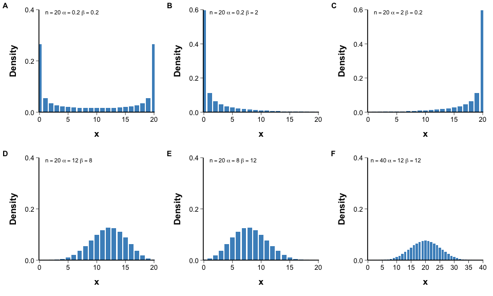

**Applicable Data**

- Discrete count distribution, often used in binomial scenarios with overdispersion or as a conjugate extension of the binomial distribution.
- Focus on showing the impact of `n`, `alpha`, `beta` parameters on PMF.

**Mapping Logic**

- `x`: `0:n` discrete count.
- `y`: Beta-Binomial PMF.
- The manuscript uses `dbb()` to calculate the quality function, and then uses `geom_bar(stat = "identity")` to draw it.
- Multi-parameter combination multi-panel comparison.

**Additional Requirements**

- Parameter annotation should also write `n`, `α`, `β`.
- Place both the title and legend at the top and center them.
- Do not add a gridline background.
- Unless specifically requested, do not add subtitles or explanatory text outside the plot.
- Use the shared book-derived plotting theme defined in `design-rules.md`.

## Code Reference
- Original development note: source example `Beta-binomial Distribution.txt` is not included in the public skill.

#### Multinomial Distribution

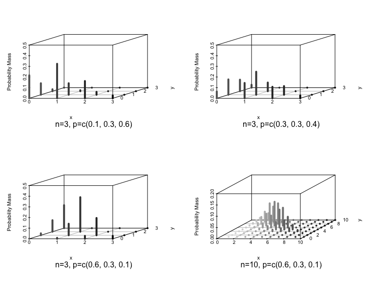

**Applicable Data**

- Discrete joint distribution of multi-category count assignments.

**Mapping Logic**

- Generally, the probability mass matrix of the multinomial distribution is generated first.
- Then organize it into three columns suitable for `scatterplot3d()`:
  - `columns`
  - `rows`
  - `value`
- `x / y`: Category count combination.
- `z`: Corresponds to joint probability mass.
- The manuscript adopts 3D prismatic vertical bar chart `type = "h"`.

**Additional Requirements**

- This is a discrete joint distribution and should not be mistakenly drawn as a continuous surface.
- 3D images place more emphasis on structure and should not be overlaid with too many decorations.
- Parameter annotation should also write `n` and `p`.
- Place both the title and legend at the top and center them.
- Do not add a gridline background.
- Unless specifically requested, do not add subtitles or explanatory text outside the plot.
- Use the shared book-derived plotting theme defined in `design-rules.md`.

## Code Reference
- Original development note: source example `Multinomial Distribution.txt` is not included in the public skill.

#### Geometric Distribution

**Applicable Data**

- A theoretical distribution of the discrete waiting time type, representing the number of failures experienced before the first success, or equivalently a discrete count of the number of trials required to achieve the first success.
- It focuses on showing the decay speed and central tendency change of the probability mass function after the single success probability `π` changes.
- You can use `dgeom()` to calculate the probability mass under different `π` parameters and compare them as a multi-panel histogram.

**Mapping Logic**

- `x`: A sequence of non-negative discrete integers, usually representing the number of failures before the first success.
- `y`: Probability mass corresponding to `dgeom(x, prob = π)`.
- Use `geom_bar(stat = "identity")` to draw a discrete probability mass histogram.
- A 2×3 multi-panel comparison chart is often formed by combining multiple `π` parameters.

**Additional Requirements**

- The parameter label should be written `π`.
- Place both the title and legend at the top and center them.
- Do not add a gridline background.
- Unless specifically requested, do not add subtitles or explanatory text outside the plot.
- Use the shared book-derived plotting theme defined in `design-rules.md`.

## Code Reference
- Original development note: source example `Geometric Distribution.txt` is not included in the public skill.

#### Hypergeometric Distribution

**Applicable Data**

- Discrete count distributions sampled from a finite population without replacement.
- It focuses on showing the impact of changes in population size, number of successes in the population, and sampling size on PMF.

**Mapping Logic**

- `x`: Discrete success count.
- `y`: `dhyper()` corresponds to probability mass.
- Use `geom_bar(stat = "identity")`.
- Multi-parameter combinations are usually displayed in multiple panels.

**Additional Requirements**

- Parameter annotation should also write `n`, `N`, `M`.
- Place both the title and legend at the top and center them.
- Do not add a gridline background.
- Unless specifically requested, do not add subtitles or explanatory text outside the plot.
- Use the shared book-derived plotting theme defined in `design-rules.md`.

## Code Reference
- Original development note: source example `Hypergeometric Distribution.txt` is not included in the public skill.

#### Negative Binomial Distribution

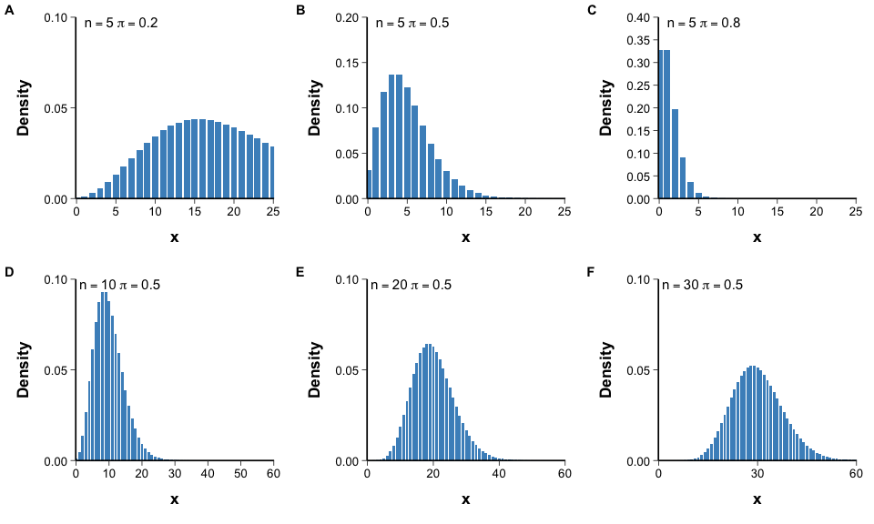

**Applicable Data**

- Discrete count theory distribution.
- Focus on showing the distribution of the number of successes before reaching a predetermined number of non-successes, or the theoretical background of overdispersion count modeling.

**Mapping Logic**

- `x`: discrete count.
- `y`：`dnbinom(x, size = n, prob = π)`。
- Use `geom_bar(stat = "identity")`.
- Multiple panels compare different parameter combinations.

**Additional Requirements**

- Parameter annotation should also write `n` and `π`.
- Place both the title and legend at the top and center them.
- Do not add a gridline background.
- Unless specifically requested, do not add subtitles or explanatory text outside the plot.
- Use the shared book-derived plotting theme defined in `design-rules.md`.

## Code Reference
- Original development note: source example `Negative Binomial Distribution.txt` is not included in the public skill.

#### Dirichlet Distribution

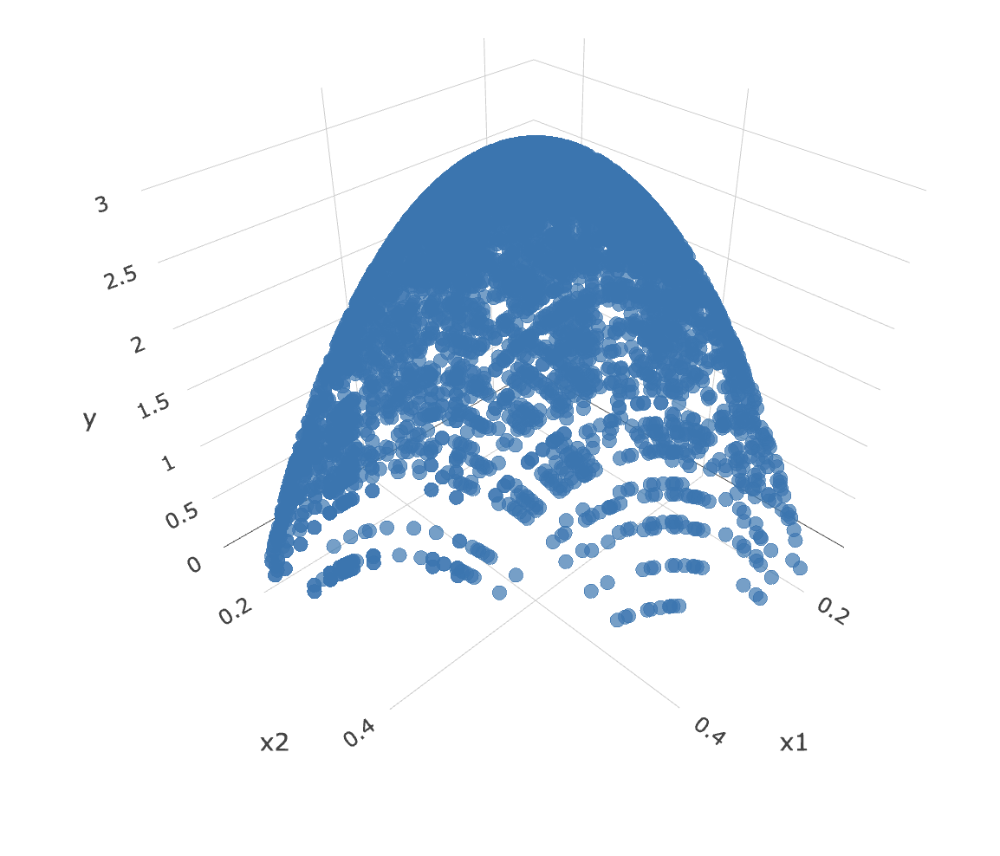

**Applicable Data**

- A probability vector distribution where multiple components are positive and sum to 1.
- It focuses on showing the impact of `α` vector changes on the three-component joint density structure.

**Mapping Logic**

- First generate Gamma random numbers and standardize them into three component ratios:
  - `ry1`
  - `ry2`
  - `ry3`
- Then calculate the corresponding density value `dy`.
- Use `plotly` to make 3D point cloud or 3D display:
  - `x = ry1`
  - `y = ry2`
  - `z = dy`
- Essentially a representation of the density distribution on a probability simplex.

**Additional Requirements**

- The Dirichlet distribution is not an ordinary ternary graph, but a continuous distribution defined on a probability vector. .
- Place both the title and legend at the top and center them.
- Do not add a gridline background.
- Unless specifically requested, do not add subtitles or explanatory text outside the plot.
- Use the shared book-derived plotting theme defined in `design-rules.md`.

## Code Reference
- Original development note: source example `Dirichlet Distribution.txt` is not included in the public skill.

#### Cauchy Distribution

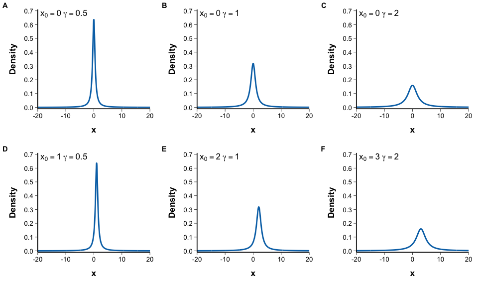

**Applicable Data**

- Demonstration of theoretical continuous distributions.
- Focus on showing the typical distribution shape with heavy tails, no mean and no variance.

**Mapping Logic**

- `x`: continuous sequence.
- `y`：`dcauchy(x, location, scale)`。
- Use `geom_line()`.
- Multi-parameter combination and multi-panel display.

**Additional Requirements**

- Parameter annotation should also write `x0` and `γ`.
- Place both the title and legend at the top and center them.
- Do not add a gridline background.
- Unless specifically requested, do not add subtitles or explanatory text outside the plot.
- Use the shared book-derived plotting theme defined in `design-rules.md`.

## Code Reference
- Original development note: source example `Cauchy Distribution.txt` is not included in the public skill.

#### Weibull Distribution

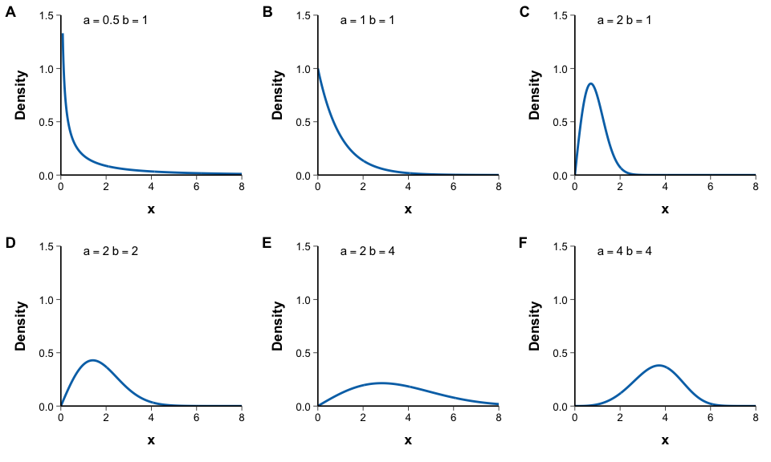

**Applicable Data**

- Theoretical distribution of nonnegative continuous variables.
- It is often used to display the theoretical background of life data and survival time.
- Focus on showing the role of shape parameter `a` and scale parameter `b`.

**Mapping Logic**

- `x`: non-negative continuous sequence.
- `y`：`dweibull(x, shape = a, scale = b)`。
- Use `geom_line()`.
- Multi-parameter combination and multi-panel display.

**Additional Requirements**

- Parameter annotation should also write `a` and `b`.
- Place both the title and legend at the top and center them.
- Do not add a gridline background.
- Unless specifically requested, do not add subtitles or explanatory text outside the plot.
- Use the shared book-derived plotting theme defined in `design-rules.md`.

## Code Reference
- Original development note: source example `Weibull Distribution.txt` is not included in the public skill.

#### Logistic Distribution

**Applicable Data**

- Continuous symmetry type theoretical distribution.
- Focus on showing the influence of position parameter `mu` and scale parameter `s` on the curve shape.

**Mapping Logic**

- `x`: continuous sequence.
- `y`：`dlogis(x, location = mu, scale = s)`。
- Use `geom_line()`.
- Multi-parameter combinations are displayed in multiple panels.

**Additional Requirements**

- Parameter annotation should also write `μ` and `s`.
- Place both the title and legend at the top and center them.
- Do not add a gridline background.
- Unless specifically requested, do not add subtitles or explanatory text outside the plot.
- Use the shared book-derived plotting theme defined in `design-rules.md`.

## Code Reference
- Original development note: source script `1000-normal-distribution-finished.rmd` is not included in the public skill.

## QA

- Label parameters clearly.
- Do not mix density, probability, and cumulative probability without clear y-axis labels.
- Use facets when overlays become hard to read.