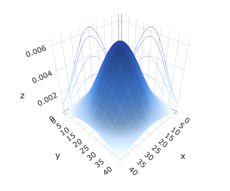
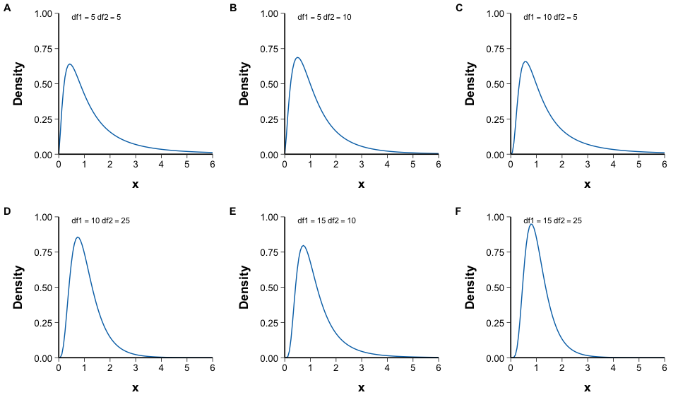
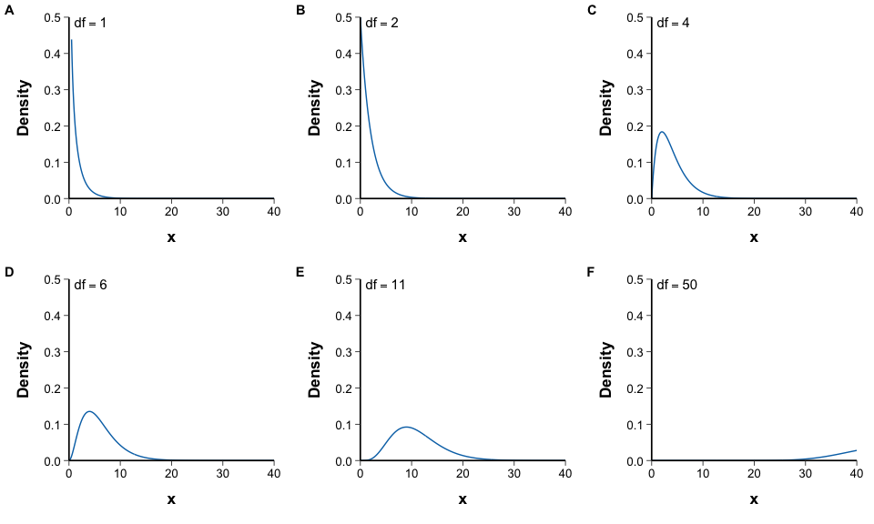
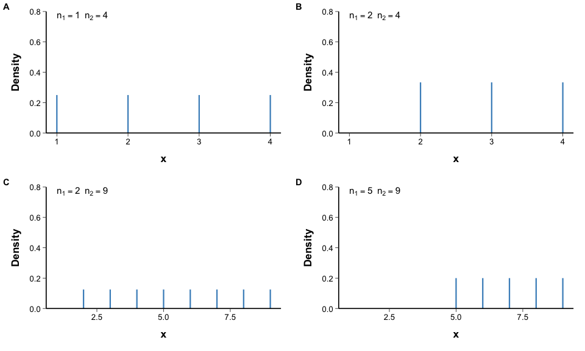
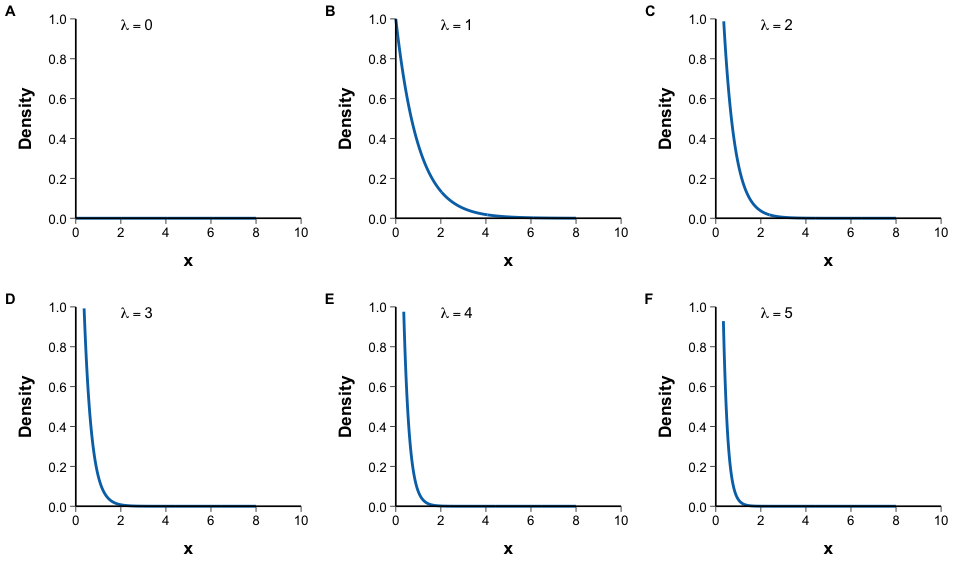
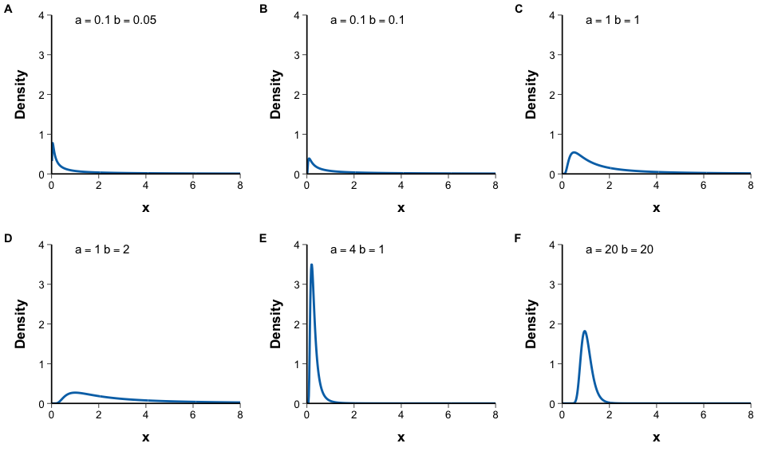
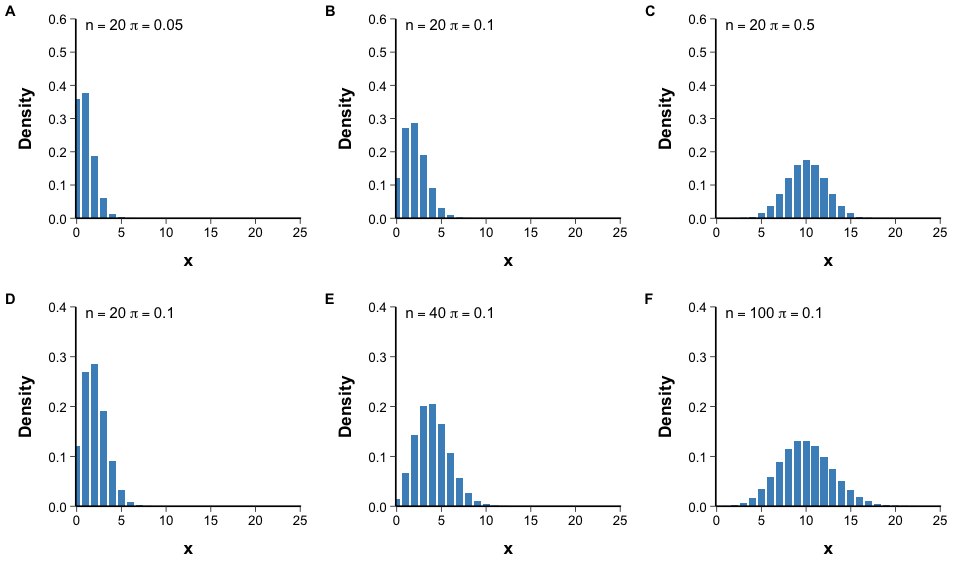
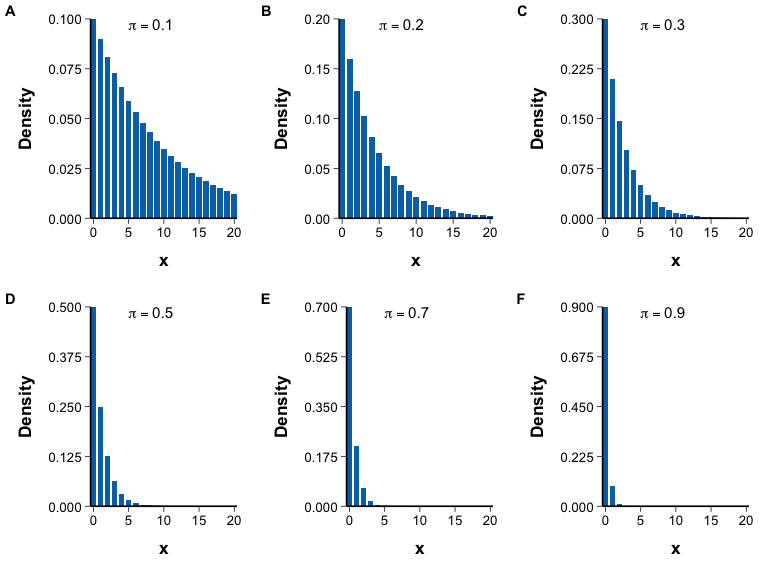
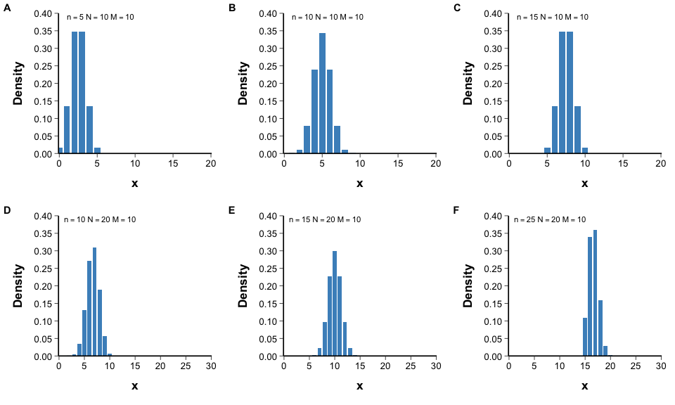
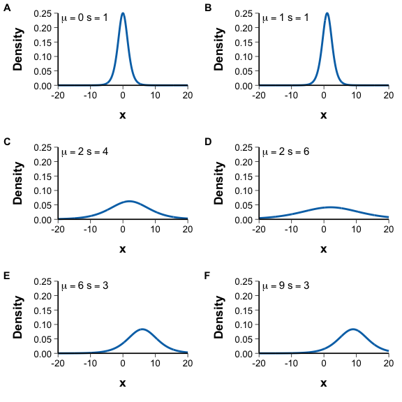

# Probability And Statistical Distribution Plot

## 1. Scope and Definition

Probability-distribution plots show the theoretical probability density, probability mass, or joint distribution implied by specified parameters. They are used to explain distributional assumptions, compare parameter effects, and support selection of statistical models for continuous, binary, count, survival, and compositional outcomes.

The plots in this chapter are primarily generated from distribution functions rather than fitted directly to observed data. Agreement between empirical data and a theoretical distribution must be assessed separately with diagnostic plots and model checks.

## 2. Selection Guide

| Statistical context | Recommended distribution |
|---|---|
| Symmetric continuous measurements or sampling distributions | Normal Distribution; Student's t Distribution; Logistic Distribution |
| Heavy-tailed symmetric measurements | Cauchy Distribution |
| Positive, right-skewed biomarkers, costs, times, or rates | Log-normal Distribution; Gamma Distribution; Weibull Distribution |
| Constant-hazard waiting time | Exponential Distribution |
| Positive variance-like parameters | Inverse Gamma Distribution |
| Ratios or sums of squared normal variables | F Distribution; Chi-square Distribution |
| Continuous proportions in `(0, 1)` | Beta Distribution |
| Equal probability across a bounded interval or finite set | Uniform Distribution; Discrete Uniform Distribution |
| One binary outcome or successes in fixed trials | Bernoulli Distribution; Binomial Distribution |
| Overdispersed binomial counts | Beta-binomial Distribution |
| Event counts over a defined exposure | Poisson Distribution; Negative Binomial Distribution |
| Waiting for the first success | Geometric Distribution |
| Sampling without replacement from a finite population | Hypergeometric Distribution |
| Counts across several mutually exclusive categories | Multinomial Distribution |
| Random compositional probability vectors | Dirichlet Distribution |
| Joint continuous outcomes under a Gaussian model | Multivariate Normal Distribution |

## 3. Required Data Structure

- Theoretical plots require a valid support grid and all distribution parameters; the manuscript examples are generated directly in code and do not require external observations.
- Continuous distributions use an ordered numerical grid and probability density values. Discrete distributions use the complete feasible integer support and probability mass values.
- Multivariate Normal Distribution requires a mean vector and positive-definite covariance matrix. Multinomial Distribution requires category probabilities summing to `1`, and Dirichlet Distribution requires positive concentration parameters.
- When parameters are estimated from medical data, retain the estimation method, units, exposure definition, and uncertainty; do not present fitted parameters as known constants.

## 4. Common Statistical Principles

- Distinguish probability density, probability mass, cumulative probability, and observed frequency. Density values may exceed `1`, but their integral must equal `1`; discrete probabilities must sum to `1`.
- Respect each distribution’s support and parameterization. Use named R arguments for `shape`, `rate`, `scale`, `size`, and `prob` to avoid clinically important misinterpretation.
- Select a distribution from the outcome-generating mechanism and study design, not from visual resemblance alone. Check independence, constant probability or rate, exposure time, overdispersion, censoring, and compositional constraints as applicable.
- Parameter changes alter location, scale, skewness, tail weight, or dispersion. Use identical parameter definitions and comparable axes when distributions are compared.
- A theoretical curve illustrates assumptions; it does not demonstrate that observed data follow the distribution. Use Q-Q plots, residual diagnostics, or formal model checks separately.

## 5. Common Visual Rules

- Do not add a gridline background.
- Unless specifically requested, do not add subtitles or explanatory text outside the plot.
- Add value labels only when they improve interpretation without crowding the figure.
- Use lines for continuous densities and stems or bars for discrete probability masses; label the y-axis explicitly as `Density` or `Probability`.
- For parameter comparisons, keep panel layout, axis meaning, and parameter annotation consistent.

## 6. Variants

### Normal Distribution

**Statistical Methods and Features**

- Models a symmetric continuous variable with location `μ` and standard deviation `σ`; changing `μ` shifts the distribution, whereas changing `σ` changes dispersion without altering symmetry.
- Normality is an assumption about the outcome or model residuals, not a requirement for every medical variable or for large-sample inference in general.

**Code Features**

- Generate an ordered `x` grid and calculate density with `dnorm(x, mean = μ, sd = σ)`.
- Draw parameter-specific curves with `geom_line()` and use `geom_vline()` only when the mean locations need explicit emphasis.

**Code Reference**
- `assets/templates/probability_distribution/Normal Distribution.R`

### Log-normal Distribution

**Statistical Methods and Features**

- Applies to a positive variable whose logarithm is normally distributed; it is commonly considered for right-skewed concentrations, costs, and duration measures.
- `meanlog` and `sdlog` describe the logarithmic scale and are not the arithmetic mean and standard deviation on the original scale.

**Code Features**

- Use a strictly positive `x` grid and calculate density with `dlnorm(x, meanlog = μ, sdlog = σ)`.
- Generate parameter combinations separately and combine them with `plot_grid()` or `patchwork` using comparable axes.

**Code Reference**
- `assets/templates/probability_distribution/Log-normal Distribution.R`

### Multivariate Normal Distribution

**Statistical Methods and Features**

- Describes the joint distribution of several continuous variables through a mean vector and covariance matrix.
- In the bivariate case, variances control marginal spread and correlation controls the orientation and elongation of the density surface.

**Code Features**

- Create two coordinate grids, calculate the joint density on every grid combination, and assemble the result with `outer()`.
- Display the density matrix with `plotly::add_surface()` and retain projected contours only when they clarify the covariance structure.

**Code Reference**
- `assets/templates/probability_distribution/Multivariate Normal Distribution.R`

### Student's t Distribution

**Statistical Methods and Features**

- Is symmetric around zero but has heavier tails than the standard normal distribution; tail weight is controlled by degrees of freedom `df`.
- It underlies inference for standardized mean-related statistics when variance is estimated under the relevant normal-model assumptions.

**Code Features**

- Generate a symmetric `x` grid and calculate density with `dt(x, df = df)`.
- Use one panel per selected `df` or overlay only a small number of curves; label the degrees of freedom explicitly.

**Code Reference**
- `assets/templates/probability_distribution/Student's t Distribution.R`

### F Distribution

**Statistical Methods and Features**

- Is a positive, right-skewed distribution formed from a ratio of independent scaled chi-square variables.
- The ordered numerator and denominator degrees of freedom, `df1` and `df2`, determine its shape and are central to variance-ratio tests and analysis of variance.

**Code Features**

- Use a non-negative `x` grid and calculate density with `df(x, df1 = df1, df2 = df2)`.
- Display parameter combinations in separate panels and annotate both degrees of freedom.

**Code Reference**
- `assets/templates/probability_distribution/F Distribution.R`

### Chi-square Distribution

**Statistical Methods and Features**

- Represents the sum of squared independent standard normal variables and has support on non-negative values.
- Degrees of freedom determine skewness and spread; the distribution is used in variance inference and several categorical-data test statistics.

**Code Features**

- Generate a non-negative grid and calculate density with `dchisq(x, df = df)`.
- Use multiple panels for different degrees of freedom and avoid truncating the right tail without clear indication.

**Code Reference**
- `assets/templates/probability_distribution/Chi-square Distribution.R`

### Beta Distribution

**Statistical Methods and Features**

- Models a continuous proportion in `(0, 1)` using positive shape parameters `α` and `β`.
- It can represent symmetric, skewed, U-shaped, or near-uniform distributions and is the conjugate prior for a Bernoulli or binomial probability.

**Code Features**

- Use an `x` grid strictly inside `(0, 1)` and calculate density with `dbeta(x, shape1 = α, shape2 = β)`.
- Plot each parameter pair in a separate panel and label both shape parameters.

**Code Reference**
- `assets/templates/probability_distribution/Beta Distribution.R`

### Uniform Distribution

**Statistical Methods and Features**

- Assigns constant density to all values in a bounded interval `[a, b]` and zero density outside it.
- It is appropriate only when equal probability per unit interval is a meaningful assumption.

**Code Features**

- Use a deterministic ordered grid spanning and extending slightly beyond `[a, b]`, then calculate `dunif(x, min = a, max = b)`.
- Do not use unsorted `runif()` samples to draw the theoretical density curve.

**Code Reference**
- `assets/templates/probability_distribution/Uniform Distribution.R`

### Discrete Uniform Distribution

**Statistical Methods and Features**

- Assigns equal probability to each integer in a finite set.
- It is a probability-mass distribution and should not be represented as a continuous density.

**Code Features**

- Generate the complete integer support from `n1` to `n2` and set each mass to `1 / (n2 - n1 + 1)`.
- Draw vertical masses with `geom_linerange()` or equivalent stems.

**Code Reference**
- `assets/templates/probability_distribution/Discrete Uniform Distribution.R`

### Gamma Distribution

**Statistical Methods and Features**

- Models positive, usually right-skewed quantities such as waiting times or cumulative amounts.
- Its shape and rate or scale parameters control modality, dispersion, and tail behavior; the exponential and chi-square distributions are special cases under specific parameterizations.

**Code Features**

- Use a positive grid and call `dgamma()` with named arguments, for example `dgamma(x, shape = α, rate = β)` or `scale = θ`.
- State whether the second parameter is a rate or scale and apply the same parameterization in labels and interpretation.

**Code Reference**
- `assets/templates/probability_distribution/Gamma Distribution.R`

### Exponential Distribution

**Statistical Methods and Features**

- Models non-negative waiting time under a constant event hazard `λ`.
- It is memoryless and is a special case of the Gamma and Weibull distributions; the constant-hazard assumption should be clinically plausible.

**Code Features**

- Generate a non-negative grid and calculate density with `dexp(x, rate = λ)`.
- Compare selected rates in separate panels and label `λ` consistently.

**Code Reference**
- `assets/templates/probability_distribution/Exponential Distribution.R`

### Inverse Gamma Distribution

**Statistical Methods and Features**

- Is a positive, right-skewed distribution often used as a prior model for variance or scale parameters.
- Its mean and variance exist only for sufficiently large shape parameters, so parameter interpretation must account for these moment conditions.

**Code Features**

- Use `x > 0` and calculate the density with a validated inverse-Gamma function or the transformation `dgamma(1 / x, shape = α, rate = β) / x^2`.
- Exclude zero from the grid and use named Gamma parameters to avoid division and parameterization errors.

**Code Reference**
- `assets/templates/probability_distribution/Inverse Gamma Distribution.R`

### Bernoulli Distribution

**Statistical Methods and Features**

- Represents one binary trial with `P(X = 1) = p` and `P(X = 0) = 1 - p`.
- It is the basic model for a single binary outcome and the building block of binomial models.

**Code Features**

- Use support `x = c(0, 1)` and probability masses `c(1 - p, p)` under the conventional success definition.
- Draw the two masses with `geom_linerange()` or discrete bars and label `p` explicitly.

**Code Reference**
- `assets/templates/probability_distribution/Bernoulli Distribution.R`

### Binomial Distribution

**Statistical Methods and Features**

- Models the number of successes in `n` independent trials with a common success probability `p`.
- It assumes fixed `n`, constant `p`, and no extra-binomial heterogeneity; clustered or overdispersed data require another model.

**Code Features**

- Generate integer support `0:n` and calculate probability mass with `dbinom(x, size = n, prob = p)`.
- Draw the PMF with `geom_bar(stat = "identity")` and annotate both `n` and `p`.

**Code Reference**
- `assets/templates/probability_distribution/Binomial Distribution.R`

### Poisson Distribution

**Statistical Methods and Features**

- Models event counts over a defined time, area, or exposure when events occur independently at a constant rate.
- Its mean and variance both equal `λ`; substantial overdispersion suggests heterogeneity, clustering, or a negative-binomial model.

**Code Features**

- Generate a sufficiently wide non-negative integer support and calculate mass with `dpois(x, lambda = λ)`.
- Draw with `geom_bar(stat = "identity")` and choose the upper support from the tail probability rather than an arbitrary fixed limit.

**Code Reference**
- `assets/templates/probability_distribution/Poisson Distribution.R`

### Beta-binomial Distribution

**Statistical Methods and Features**

- Extends the binomial model by allowing the success probability to vary according to a Beta distribution.
- It accommodates extra-binomial variation and within-cluster similarity while retaining support from `0` to `n`.

**Code Features**

- Generate support `0:n` and calculate the PMF with the project’s Beta-binomial function `dbb()` using `n`, `α`, and `β`.
- Confirm the package-specific parameterization before plotting and label all three parameters.

**Code Reference**
- `assets/templates/probability_distribution/Beta-binomial Distribution.R`

### Multinomial Distribution

**Statistical Methods and Features**

- Generalizes the binomial distribution to counts across several mutually exclusive categories in `n` independent trials.
- Category counts are jointly dependent because they must sum to `n`, and category probabilities must sum to `1`.

**Code Features**

- Enumerate only valid count combinations whose total equals `n` and calculate joint probability with `dmultinom()`.
- Display the discrete probability masses with stems or the manuscript’s `scatterplot3d(type = "h")`; do not convert them into a continuous surface.

**Code Reference**
- `assets/templates/probability_distribution/Multinomial Distribution.R`

### Geometric Distribution

**Statistical Methods and Features**

- Models waiting until the first success under independent trials with constant success probability `p`.
- In R, `dgeom()` defines `X` as the number of failures before the first success, with support `0, 1, 2, ...`.

**Code Features**

- Generate non-negative integer support and calculate mass with `dgeom(x, prob = p)`.
- Draw with `geom_bar(stat = "identity")` and state the counting convention explicitly.

**Code Reference**
- `assets/templates/probability_distribution/Geometric Distribution.R`

### Hypergeometric Distribution

**Statistical Methods and Features**

- Models the number of target items obtained when sampling without replacement from a finite population.
- Unlike the binomial distribution, trial probabilities change after each draw and observations are not independent.

**Code Features**

- Derive the feasible support from the population composition and sample size.
- Use named arguments in `dhyper(x, m = target_count, n = other_count, k = sample_size)` and draw the PMF with discrete bars.

**Code Reference**
- `assets/templates/probability_distribution/Hypergeometric Distribution.R`

### Negative Binomial Distribution

**Statistical Methods and Features**

- In R’s parameterization, models the number of failures before a specified number of successes.
- It is also widely used for overdispersed count outcomes because its variance exceeds its mean under standard parameterizations.

**Code Features**

- Generate non-negative integer support and calculate mass with `dnbinom(x, size = r, prob = p)` or a clearly specified mean-based parameterization.
- Label the counting convention and parameters; choose the plotted support to retain nearly all probability mass.

**Code Reference**
- `assets/templates/probability_distribution/Negative Binomial Distribution.R`

### Dirichlet Distribution

**Statistical Methods and Features**

- Generalizes the Beta distribution to a vector of non-negative proportions summing to `1`.
- The normalized concentration vector determines the mean composition, while the total concentration controls dispersion around that composition.

**Code Features**

- Generate independent Gamma variables with shapes `α1, ..., αK` and normalize each vector by its sum.
- For three components, map the normalized values to `ggtern`; for higher dimensions, use an alternative compositional display.

**Code Reference**
- `assets/templates/probability_distribution/Dirichlet Distribution.R`

### Cauchy Distribution

**Statistical Methods and Features**

- Is a symmetric, extremely heavy-tailed distribution defined by location and scale.
- Its mean and variance are undefined, so sample averages and variances do not stabilize in the usual way.

**Code Features**

- Generate a wide symmetric grid and calculate density with `dcauchy(x, location = x0, scale = γ)`.
- Use axis limits wide enough to show tail behavior and label both location and scale.

**Code Reference**
- `assets/templates/probability_distribution/Cauchy Distribution.R`

### Weibull Distribution

**Statistical Methods and Features**

- Models positive event times with shape `k` and scale `λ`.
- Its hazard decreases when `k < 1`, is constant when `k = 1`, and increases when `k > 1`, making it useful for parametric survival modeling.

**Code Features**

- Generate a non-negative grid and calculate density with `dweibull(x, shape = k, scale = λ)`.
- Compare parameter combinations in separate panels and retain the same shape/scale convention throughout.

**Code Reference**
- `assets/templates/probability_distribution/Weibull Distribution.R`

### Logistic Distribution

**Statistical Methods and Features**

- Is a symmetric continuous distribution defined by location `μ` and scale `s`, with heavier tails than a normal distribution of comparable spread.
- It is related to the logistic link but should not be confused with the Bernoulli outcome distribution used in logistic regression.

**Code Features**

- Generate a symmetric grid and calculate density with `dlogis(x, location = μ, scale = s)`.
- Display selected parameter combinations in comparable panels and label both location and scale.

## 7. QA Checklist

- Verify the distribution support, parameter names, units, and R parameterization before calculating values.
- Confirm that continuous densities integrate to `1` and discrete probability masses sum to `1` over the plotted support.
- Label the y-axis as density or probability and avoid interpreting density height as direct event probability.
- Check that the assumed data-generating conditions match the medical outcome, including independence, exposure, censoring, overdispersion, and sampling with or without replacement.
- Use adequate x-axis coverage so clinically relevant tails are not silently omitted.
- Treat theoretical curves as model illustrations and use empirical diagnostics before claiming distributional fit.
