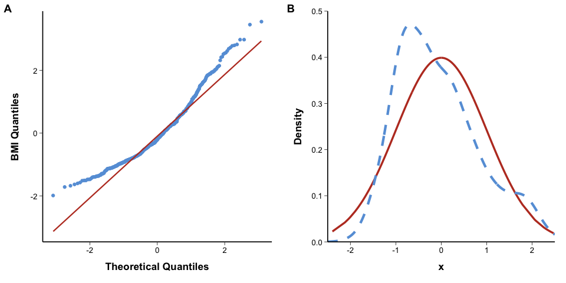
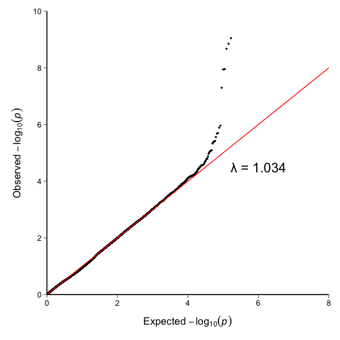
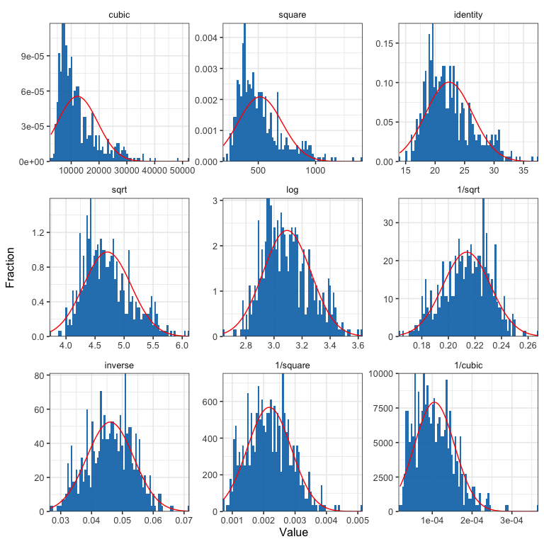
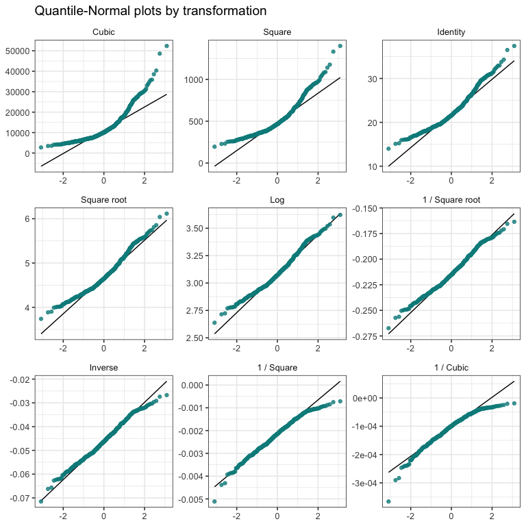

# Q-Q Plot

## 1. Scope and Definition

Q-Q plots compare observed sample quantiles with quantiles from a theoretical distribution or a second sample. Agreement with the reference line indicates approximate distributional agreement; systematic curvature, tail departure, or isolated points identifies where the distributions differ.

P-P plots compare cumulative probabilities rather than quantile values. Symmetry plots assess balance around the median, and ladder-of-powers displays compare candidate transformations. These are diagnostic tools and should not be used as the sole evidence for model validity.

## 2. Selection Guide

| Analytical purpose | Recommended chart |
|---|---|
| Compare one continuous variable with a theoretical distribution | Theoretical QQ Plot |
| Compare a Q-Q diagnosis with empirical and theoretical densities | QQ Plot with Density Comparison Panel |
| Compare the distributions of two independent samples | Two-sample QQ Plot |
| Compare empirical and theoretical cumulative probabilities | Probability–Probability Plot |
| Assess symmetry around the sample median | Symmetry Plot |
| Compare a sample with a chi-square distribution of known degrees of freedom | Chi-square Quantile Plot |
| Compare candidate transformations for approximate normality | Ladder of Powers for Normal Distribution |
| Assess calibration and upper-tail departure of GWAS `P` values | Theoretical QQ Plot |

## 3. Required Data Structure

- Theoretical Q-Q, P-P, symmetry, and transformation plots require individual observations from one continuous variable after prespecified exclusions and missing-value handling.
- Two-sample Q-Q plots require two samples measured on the same scale and a common probability grid for calculating matched quantiles.
- Chi-square Q-Q plots require a non-negative sample and a justified degrees-of-freedom parameter.
- GWAS Q-Q plots require valid `P` values in `(0, 1]`; expected quantiles are derived from the uniform null distribution and are commonly displayed as `-log10(P)`.
- Transformations require a valid mathematical domain. Logarithmic, square-root, and reciprocal transformations cannot be applied mechanically to incompatible values.

## 4. Common Statistical Principles

- A near-linear pattern supports approximate agreement with the target distribution; it does not prove that the distributional assumption is true.
- Interpret the pattern, not only overall closeness: location shift, scale difference, skewness, heavy or light tails, and isolated observations produce different departures.
- Q-Q plots are particularly sensitive to tail behavior, whereas P-P plots emphasize agreement in the central cumulative distribution.
- Standardization changes location and scale but not distributional shape. It cannot make skewed or heavy-tailed data normal.
- In GWAS, broad upward departure may indicate population structure, relatedness, technical artifacts, or model misspecification; upper-tail-only departure may reflect genuine associations. Genomic inflation must be interpreted with study size and analysis method.
- Choose transformations using clinical meaning and the intended statistical model, not solely by selecting the visually straightest panel.

## 5. Common Visual Rules

- Place the title and legend at the top and center them.
- Do not add a gridline background.
- Unless specifically requested, do not add subtitles or explanatory text outside the plot.
- Add value labels only when they improve interpretation without crowding the figure.
- Keep the reference line visually distinct from the points and use comparable axis ranges when panels are intended for direct comparison.
- Label the theoretical distribution, transformation, degrees of freedom, and probability scale clearly.

## 6. Variants

### Theoretical QQ Plot

**Statistical Features**

- Compares sample quantiles with quantiles from a prespecified theoretical distribution, most commonly the normal distribution.
- Systematic curvature indicates distributional mismatch; in GWAS, expected and observed `-log10(P)` quantiles assess calibration and upper-tail departure.

**Visual Features**

- Ordered sample quantiles form a point sequence against theoretical quantiles.
- A straight reference line provides the expected pattern under approximate distributional agreement.

**Code Features**

- Map the variable through `aes(sample = variable)` and draw points with `stat_qq()`.
- Add `stat_qq_line()` and specify `distribution` and its parameters when the target is not the default normal distribution.

- code reference:source script `\StatsVisual-Skill\assets\templates\qq_plot\Theoretical QQ Plot.R`

### QQ Plot with Density Comparison Panel

**Statistical Features**

- Combines a quantile-based diagnosis with a direct comparison of the empirical and theoretical density shapes.
- The density panel helps distinguish skewness, tail differences, and multimodality underlying the Q-Q departure.

**Visual Features**

- The first panel contains Q-Q points and a reference line; the second overlays the sample density and theoretical density.
- Matched colors connect the observed and theoretical distributions across panels.

**Code Features**

- Construct the Q-Q panel with `stat_qq()` and `stat_qq_line()`.
- Draw the theoretical curve with `geom_line()` and the empirical curve with `geom_density()` on the same transformed scale, then combine panels with `plot_grid()`.

- code reference:source script `\StatsVisual-Skill\assets\templates\qq_plot\QQ Plot with Density Comparison Panel.R`

### Two-sample QQ Plot

**Statistical Features**

- Compares corresponding quantiles from two samples to assess whether their distributions have similar location, scale, and shape.
- A straight but non-identity pattern may indicate a location or scale difference; curvature indicates a shape difference.

**Visual Features**

- Quantiles from one sample are plotted against matched quantiles from the other.
- The identity line represents equal quantiles across the full distribution.

**Code Features**

- Calculate both samples’ quantiles on the same probability grid, excluding unstable endpoints when appropriate.
- Plot matched quantiles with `geom_point()` and use `geom_abline(intercept = 0, slope = 1)` as the equality reference.

- code reference:source script `\StatsVisual-Skill\assets\templates\qq_plot\Two-sample QQ Plot.R`

### Probability–Probability Plot

**Statistical Features**

- Compares empirical cumulative probabilities with probabilities expected under a target distribution.
- It is useful for overall distributional agreement but is less sensitive than a Q-Q plot to extreme-tail differences.

**Visual Features**

- Points lie within the unit square and are compared with the `45°` equality line.
- Smooth systematic departure from the line indicates cumulative-distribution mismatch.

**Code Features**

- Map the sample with `aes(sample = variable)`.
- Draw the empirical probability points with `stat_pp_point()` and the equality reference with `stat_pp_line()`.

- code reference:source script `\StatsVisual-Skill\assets\templates\qq_plot\Probability–Probability Plot.R`

### Symmetry Plot

**Statistical Features**

- Assesses whether observations at equal ranks below and above the median are approximately equidistant from the median.
- Departure from the equality line indicates asymmetry but does not identify a specific parametric distribution.

**Visual Features**

- Distance below the median is plotted against the matched distance above the median.
- A symmetric distribution produces points near the diagonal; directional curvature indicates skewness.

**Code Features**

- Sort the observations and pair lower- and upper-tail distances from the sample median.
- Plot the paired distances with `geom_point()` and add `geom_abline(intercept = 0, slope = 1)`.

- code reference:source script `\StatsVisual-Skill\assets\templates\qq_plot\Symmetry Plot.R`

### Chi-square Quantile Plot

**Statistical Features**

- Compares a non-negative sample with a chi-square distribution having prespecified degrees of freedom.
- Interpretation is valid only when the theoretical degrees of freedom and independence assumptions are scientifically justified.

**Visual Features**

- The Q-Q panel compares observed and theoretical chi-square quantiles.
- A paired P-P panel may show agreement between empirical and theoretical cumulative probabilities.

**Code Features**

- Use `stat_qq(distribution = function(p) qchisq(p, df = k))` for the theoretical quantiles.
- Add the P-P panel with `stat_pp_point()` and `stat_pp_line()`, and report the selected `df` in the axis label or legend.

- code reference:source script `\StatsVisual-Skill\assets\templates\qq_plot\Chi-square Quantile Plot.R`

### Ladder of Powers for Normal Distribution

**Statistical Features**

- Compares a defined sequence of power, root, logarithmic, and reciprocal transformations to assess distributional shape.
- A visually improved Q-Q pattern does not by itself justify a transformation; interpretability, variance structure, and downstream model assumptions also matter.

**Visual Features**

- Faceted histograms or Q-Q plots display the same variable under several transformations.
- The panel sequence makes changes in skewness, tail behavior, and linearity directly comparable.

**Code Features**

- Generate each valid transformation in a separate column, reshape to long format, and facet by transformation.
- Draw transformed Q-Q panels with `geom_qq()` and `geom_qq_line()`, or use the project `gladder()` and `qqladder()` helpers.

- code reference:source script `\StatsVisual-Skill\assets\templates\qq_plot\Ladder of Powers for Normal Distribution.R`

## 7. QA Checklist

- Confirm the target distribution, parameter values, sample definition, and missing-value handling.
- Check whether deviations occur in the center, one tail, both tails, or only a few observations.
- Use an identity reference for two-sample equality and matched probability grids when sample sizes differ.
- For GWAS, remove invalid `P` values and verify genomic control, ancestry adjustment, relatedness handling, and the reported inflation metric.
- Confirm that every transformation is mathematically valid and clinically interpretable.
- Do not treat visual linearity as the sole criterion for normality, model adequacy, or inferential validity.