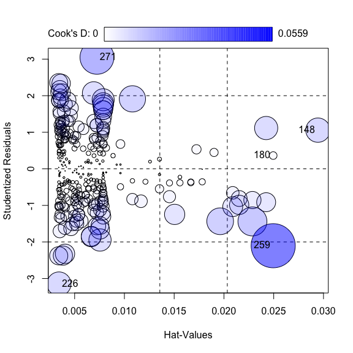

# Regression Model Diagnostics

## 1. Scope and Definition

Regression diagnostics evaluate whether a fitted model adequately represents the data and whether its estimates are sensitive to unusual observations. For ordinary linear regression, the main concerns are linearity of the conditional mean, independence, residual variance, residual distribution for interval estimation, and influential observations.

No single diagnostic plot validates a model. Residual, leverage, and influence diagnostics should be interpreted together with the study design, model specification, and subject-matter knowledge.

## 2. Selection Guide

| Diagnostic purpose | Recommended chart |
|---|---|
| Assess nonlinearity and residual variance patterns | Residuals vs Fitted Plot |
| Assess the distributional shape of residuals | Normal Q-Q Plot of Residuals |
| Assess whether residual spread changes with fitted values | Scale-Location Plot |
| Identify observations with unusually large residuals or order-related patterns | Standardized Residual Index Plot |
| Examine unusual predictor configurations and partial regression structure | Leverage Plot |
| Identify extreme leverage values | Half-normal Plot of Leverage |
| Rank observations by overall influence on the fitted model | Cook's Distance Needle Plot |
| Review several observation-level influence measures together | Influence Index Plot |
| Examine observations with both high leverage and large Cook's distance | Leverage vs Cook's Distance Plot |
| Combine leverage, residual magnitude, and Cook's distance | Leverage-Residual-Cook Bubble Plot |
| Jointly identify outliers, high-leverage points, and influential observations | Influence Plot |

## 3. Required Data Structure

- Use a fitted model object together with the exact analysis data and a stable observation identifier. Preserve identifiers after missing-value exclusion so flagged cases can be traced to the source data.
- Extract fitted values, residuals, standardized or studentized residuals, leverage, and Cook's distance from the same fitted model.
- Record the sample size, number of estimated parameters, model formula, transformations, weights, clustering, and missing-data handling.
- For generalized linear models, use model-appropriate residuals and diagnostics; ordinary linear-model assumptions and thresholds do not transfer unchanged.
- Independence is primarily determined by the sampling and repeated-measure structure. It cannot be confirmed from residual plots alone.

## 4. Common Statistical Principles

- Residuals measure outcome-space disagreement with the fitted model; leverage measures unusual predictor configurations; influence measures how strongly an observation changes fitted results. These concepts are related but not interchangeable.
- Diagnostic thresholds such as `|standardized residual| > 2`, leverage cutoffs, or Cook's distance rules are screening heuristics rather than automatic exclusion criteria.
- Residual normality mainly affects small-sample tests and interval estimates; the outcome itself does not need to be normally distributed.
- When assumptions fail, consider correcting the model structure, transformation, variance model, dependence structure, or model family before deleting observations.
- Every flagged observation should be checked for data error and clinical plausibility, followed by documented sensitivity analysis when appropriate.
- Multicollinearity is not diagnosed by residual or influence plots; assess it separately using the design matrix, correlations, condition indices, or variance inflation factors.

## 5. Common Visual Rules

- Do not add a gridline background.
- Unless specifically requested, do not add subtitles or explanatory text outside the plot.
- Add value labels only when they improve interpretation without crowding the figure.
- Keep observation identifiers consistent across all diagnostic plots and label only the most relevant flagged cases.
- Show reference lines only when their statistical meaning or heuristic definition is stated clearly.

## 6. Variants

### Residuals vs Fitted Plot

**Statistical Methods and Features**

- Assesses whether the conditional mean is adequately modeled and whether residual variation is approximately stable across fitted values.
- A satisfactory pattern is an unstructured cloud around zero. Curvature suggests missing nonlinear structure, while a funnel or changing spread suggests heteroscedasticity.
- The plot does not assess residual normality or independence directly.

**Code Features**

- Map fitted values `.fitted` to `x` and residuals `.resid` to `y`.
- Use `geom_point()`, add a zero reference with `geom_hline(yintercept = 0)`, and use a restrained `stat_smooth(method = "loess")` to reveal systematic structure.
- Avoid restrictive axis limits that silently remove extreme residuals.

- code reference: source script `\StatsVisual-Skill\assets\templates\regression_diagnostics\Residuals vs Fitted Plot.R`

### Normal Q-Q Plot of Residuals

**Statistical Methods and Features**

- Compares standardized or studentized residual quantiles with theoretical normal quantiles.
- Central alignment with tail departure indicates that normality problems are concentrated in the extremes; isolated departures may indicate unusual observations.
- A near-linear pattern supports approximate residual normality but does not validate linearity, constant variance, or independence.

**Code Features**

- Map standardized residuals through `aes(sample = .stdresid)` and draw with `geom_qq()`.
- Add a sample-based reference using `stat_qq_line()`; use a fixed `45°` line only when both axes have been standardized compatibly.
- Do not clip tail observations when the purpose is to assess tail behavior.

### Scale-Location Plot

**Statistical Methods and Features**

- Assesses homoscedasticity by plotting `sqrt(|standardized residual|)` against fitted values.
- An approximately horizontal trend with similar vertical spread supports constant residual variance; systematic increase, decrease, or curvature suggests a variance pattern.
- It does not test residual normality.

**Code Features**

- Map `.fitted` to `x` and `sqrt(abs(.stdresid))` to `y`.
- Use `geom_point()` and a restrained LOESS trend to summarize changes in spread.
- Any horizontal reference line is a visual guide, not a universal statistical threshold.

### Standardized Residual Index Plot

**Statistical Methods and Features**

- Displays standardized residuals by observation order to identify large residuals and possible sequence-related structure.
- Values beyond approximately `±2` or `±3` warrant review, but the expected number of extreme residuals increases with sample size.
- Runs, cycles, or clusters across observation order may suggest dependence or omitted time structure.

**Code Features**

- Map `seq_along(.stdresid)` to `x` and `.stdresid` to `y`.
- Add zero and prespecified screening lines with `geom_hline()`; emphasize observations rather than the optional smoothing curve.
- Retain the original row or subject identifier for any labeled observation.

### Leverage Plot

**Statistical Methods and Features**

- Identifies observations with unusual predictor combinations and examines each predictor's adjusted relationship with the outcome in multivariable models.
- High leverage alone does not imply a large residual or strong influence; influence depends on both leverage and model disagreement.
- Thresholds based on the average leverage are heuristic and depend on the number of estimated parameters and sample size.

**Code Features**

- Calculate numerical leverage with `hatvalues(lmfit)`.
- Use `car::leveragePlots(lmfit)` or `car::avPlots(lmfit)` for predictor-specific adjusted views, while interpreting them together with the hat values.
- Preserve observation labels so extreme predictor configurations can be reviewed in the source data.

- code reference: source script `\StatsVisual-Skill\assets\templates\regression_diagnostics\Leverage Plot.R`

### Half-normal Plot of Leverage

**Statistical Methods and Features**

- Compares ordered leverage values with half-normal quantiles to identify leverage values that depart markedly from the overall pattern.
- It diagnoses unusual predictor positions, not influence by itself; an extreme leverage point may have little effect if it follows the fitted relationship closely.

**Code Features**

- Extract leverage with `influence(lmfit)$hat` or `hatvalues(lmfit)`.
- Draw the diagnostic with `faraway::halfnorm(h, ylab = "leverage")` and label only observations that clearly depart from the reference pattern.

- code reference: source script `\StatsVisual-Skill\assets\templates\regression_diagnostics\Half-normal Plot of Leverage.R`

### Cook's Distance Needle Plot

**Statistical Methods and Features**

- Cook's distance summarizes the combined effect of residual magnitude and leverage on the fitted regression results when one observation is deleted.
- Larger values indicate greater influence, but rules such as `4/n` or `4/(n - p - 1)` are screening heuristics, not universal decision boundaries.
- Flagged observations should be assessed through coefficient, prediction, and sensitivity changes rather than removed automatically.

**Code Features**

- Draw Cook's distance by observation index with `lindia::gg_cooksd(lmfit)` or from `cooks.distance(lmfit)`.
- Add a clearly defined heuristic threshold when required and retain the full y-range so the largest observations remain visible.

- code reference: source script `\StatsVisual-Skill\assets\templates\regression_diagnostics\Cook's Distance Needle Plot.R`

### Influence Index Plot

**Statistical Methods and Features**

- Reviews several casewise diagnostics, commonly studentized residuals, leverage, Cook's distance, and an outlier-test measure.
- It helps distinguish observations that are unusual in outcome space, predictor space, or both.
- A case flagged by one measure is not necessarily influential across all coefficients.

**Code Features**

- Use `car::infIndexPlot(lmfit)` for the combined index display.
- Obtain numerical details with `influence.measures(lmfit)` and use the same observation identifiers in the plot and diagnostic table.

- code reference: source script `\StatsVisual-Skill\assets\templates\regression_diagnostics\Influence Index Plot.R`

### Leverage vs Cook's Distance Plot

**Statistical Methods and Features**

- Examines whether observations with unusual predictor positions also exert substantial overall influence.
- High Cook's distance can arise from high leverage, a large residual, or both; the two axes should therefore be interpreted jointly.
- Auxiliary diagonal lines are descriptive unless they are derived from a stated diagnostic formula.

**Code Features**

- Map leverage `.hat` to `x` and Cook's distance `.cooksd` to `y`, then draw with `geom_point()`.
- Add labels for selected observations and use a smoothing curve only as a secondary descriptive aid.
- Do not describe arbitrary `geom_abline()` slopes as standardized-residual contours unless they are calculated from the correct relationship.

### Leverage-Residual-Cook Bubble Plot

**Statistical Methods and Features**

- Combines leverage on the horizontal axis, standardized residuals on the vertical axis, and Cook's distance as bubble area.
- Observations with high leverage and large absolute residuals are most likely to be influential, but the actual Cook's distance remains the relevant combined measure.
- Bubble size is descriptive and should not replace the numerical diagnostic values.

**Code Features**

- Map `.hat` to `x`, `.stdresid` to `y`, and `.cooksd` directly to point size.
- Use hollow or transparent points and a controlled area scale; avoid arbitrary transformations such as `exp(.cooksd)` that exaggerate differences.
- Add zero and prespecified residual screening lines with `geom_hline()`.

### Influence Plot

**Statistical Methods and Features**

- Jointly displays studentized residuals, leverage, and Cook's distance to separate response outliers, high-leverage observations, and strongly influential cases.
- A response outlier has a large residual, a high-leverage point is unusual in predictor space, and an influential point materially changes the fitted model.
- The same observation may satisfy one, two, or all three definitions.

**Code Features**

- Use `car::influencePlot(lmfit)`, where the horizontal axis represents leverage, the vertical axis studentized residuals, and bubble size Cook's distance.
- Retain automatic or selected case labels and verify all flagged observations against the numerical diagnostics and source data.

## 7. QA Checklist

- Confirm that all diagnostic quantities come from the same fitted model and analysis sample.
- Verify observation identifiers after missing-data exclusion, sorting, or data reshaping.
- Inspect linearity, residual variance, residual distribution, dependence, leverage, and influence as separate questions.
- Treat thresholds as screening rules and document any case review, correction, exclusion, or sensitivity analysis.
- Refit the model with and without influential observations when scientifically justified and report whether conclusions change.
- Assess multicollinearity separately and use model-specific diagnostics when extending beyond ordinary linear regression.
