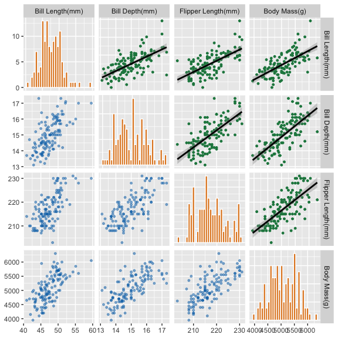
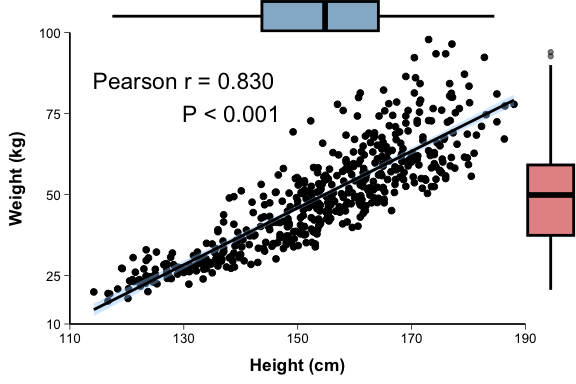
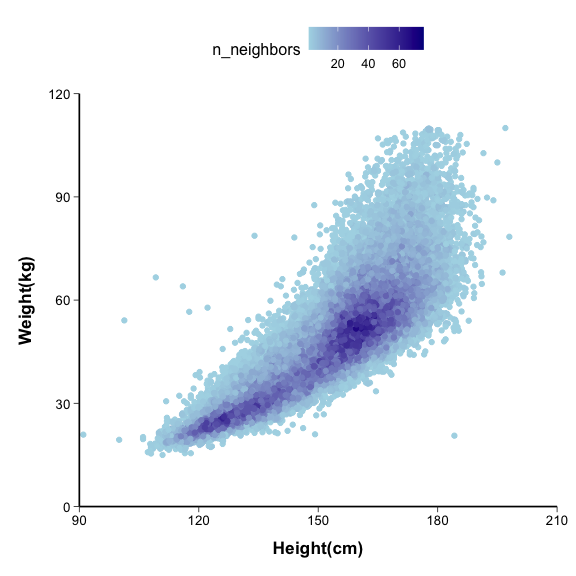
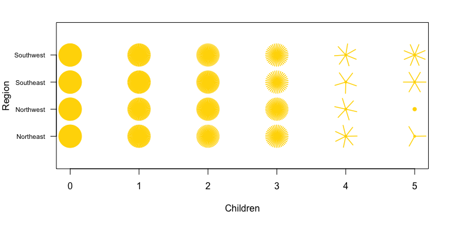
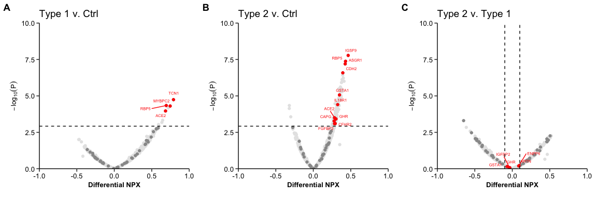

# Scatter Plot

## 1. Scope and Definition

Scatter plots display the joint pattern of two numerical variables. The position of each observation can reveal direction, form, strength, clusters, heteroscedasticity, and potential outliers. A scatter plot shows association or covariation, not causality.

Scatterplot matrices extend this logic to several variables. Marginal, smoothed, density, sunflower, bubble, and volcano plots add distributional, model-based, overlap, multivariable, or hypothesis-testing information.

## 2. Selection Guide

| Analytical purpose | Recommended chart |
|---|---|
| Examine the relationship between two numerical variables | Scatter Plot |
| Explore pairwise relationships among several numerical variables | Scatterplot Matrix |
| Show the joint relationship and both marginal distributions | Scatter Plot with Marginal Distribution |
| Add a descriptive or model-based trend to raw observations | Scatter Plot with Smooth Curve |
| Display a dense point cloud with local point density | Smooth Scatter Plot |
| Show repeated observations at identical or discrete coordinates | Sunflower Plot |
| Encode a third numerical variable by point area | Bubble Plot |
| Display effect magnitude and statistical evidence from omics comparisons | Volcano Plot |

## 3. Required Data Structure

- Standard scatter plots require paired numerical `x` and `y` values for each observation, with optional group, subject, or time identifiers.
- Scatterplot matrices require several numerical variables measured on the same observational units. Marginal and smoothed variants use the same paired data as the main scatter plot.
- Smooth Scatter Plot requires sufficiently dense paired observations. Sunflower Plot is most useful for discrete or rounded coordinates with repeated combinations.
- Bubble Plot additionally requires a non-negative size variable and an optional categorical color variable. Volcano Plot requires one effect measure and one valid `P` value or adjusted `P` value per feature.

## 4. Common Statistical Principles

- Association does not imply causation. Consider study design, temporality, confounding, selection, and measurement error before making substantive conclusions.
- Do not remove unusual observations solely because they appear isolated. Verify data quality and assess their influence using prespecified diagnostic methods.
- Choose correlation and fitted models according to scale, distribution, linearity, and independence assumptions. Report the method used.
- Preserve raw observations when displaying fitted trends. Smoothing summarizes pattern but does not remove outliers or establish a valid regression model.
- For omics analyses, distinguish effect magnitude from statistical evidence and apply the prespecified multiple-testing procedure.

## 5. Common Visual Rules

- Place the title and legend at the top and center them.
- Do not add a gridline background.
- Unless specifically requested, do not add subtitles or explanatory text outside the plot.
- Add value labels only when they improve interpretation without crowding the figure.
- State axis variables and units clearly, and use consistent group encodings across related panels.
- Control overplotting with point size, transparency, sampling, or density-based methods without concealing clinically important observations.

## 6. Variants

### Scatter Plot

**Statistical Features**

- Shows the joint distribution and empirical association between two numerical variables.
- Patterns may suggest linearity, nonlinearity, clustering, unequal variance, or influential observations, but require formal analysis for inference.

**Visual Features**

- Each observation appears as one point positioned by its `x` and `y` values.
- Point-cloud direction, curvature, spread, gaps, and isolated points provide the main visual evidence.

**Code Features**

- Map the two numerical variables to `x` and `y` and draw with `geom_point()`.
- Add group to `color` or `shape` only when it represents a defined comparison; use transparency or sampling for dense data.

- Code Reference: source script `\StatsVisual-Skill\assets\templates\scatter_plot\Scatter Plot.R`

### Scatterplot Matrix

**Statistical Features**

- Provides an exploratory overview of pairwise relationships among several numerical variables measured on the same observations.
- Correlation values should be interpreted according to the selected method and do not summarize nonlinear or confounded relationships completely.

**Visual Features**

- Pairwise scatter plots occupy off-diagonal cells, while diagonal cells show each variable’s marginal distribution.
- The opposite triangle may contain correlation coefficients or fitted trends, producing a symmetric matrix layout.

**Code Features**

- Use `GGally::ggpairs()` and specify the numerical variables through `columns`.
- Define `lower`, `diag`, and `upper` layers explicitly so points, distributions, correlations, or smooths have distinct roles.

- code reference:source script `\StatsVisual-Skill\assets\templates\scatter_plot\Scatterplot Matrix.R`

### Scatter Plot with Marginal Distribution

**Statistical Features**

- Displays the bivariate association together with the separate distributions of `x` and `y`.
- A reported correlation coefficient and fitted line should use the same observations and a method appropriate to the data.

**Visual Features**

- The central panel contains the scatter plot, while histograms, densities, or box plots run along the upper and side margins.
- The marginal panels reveal skewness, spread, and outliers that may influence the joint pattern.

**Code Features**

- Build the main scatter plot first and pass it to `ggExtra::ggMarginal()`.
- Use the same data subset in all layers; add a fitted line or correlation annotation only when its method and placement are clearly defined.

- Code Reference: source script `\StatsVisual-Skill\assets\templates\scatter_plot\Marginal Distribution Scatter Plot.R`

### Scatter Plot with Smooth Curve

**Statistical Features**

- Summarizes the mean trend between two numerical variables using a specified smoother or regression model.
- `LOESS` is primarily descriptive for flexible local patterns, whereas `lm` represents a linear model whose interpretation depends on model assumptions.

**Visual Features**

- Raw observations remain visible beneath a fitted line.
- A shaded band may show uncertainty around the estimated mean trend; separate panels can contrast nonlinear and linear fits.

**Code Features**

- Draw observations with `geom_point()` and add the fitted trend with `geom_smooth()`.
- Set `method = "loess"` or `method = "lm"` deliberately, define smoothing parameters when needed, and use `se = TRUE` only when an uncertainty band is intended.

### Smooth Scatter Plot

**Statistical Features**

- Displays local two-dimensional point density when ordinary points overlap heavily.
- Color represents concentration of observations, not a fitted outcome, probability, or regression effect.

**Visual Features**

- Points retain their original coordinates but change color according to surrounding density.
- Dense clusters and dominant bands appear more strongly than sparse regions.

**Code Features**

- Map the two numerical variables to `x` and `y` and draw with `ggpointdensity::geom_pointdensity()`.
- Tune the density adjustment when required and apply a perceptually ordered continuous color scale.

- code reference:source script `\StatsVisual-Skill\assets\templates\scatter_plot\Smooth Scatter Plot.R`

### Sunflower Plot

**Statistical Features**

- Represents the frequency of repeated observations at the same discrete or rounded coordinate.
- It is suited to overlap counts rather than estimation of a continuous association or fitted trend.

**Visual Features**

- A single observation appears as a point, while repeated observations form a sunflower whose petal count reflects multiplicity.
- Categories or discrete values occupy fixed axis positions.

**Code Features**

- Use the base-graphics `sunflowerplot()` with the two discrete or semi-discrete variables.
- Set factor or axis labels explicitly and retain a clear explanation that petals encode repeated observations.

- code reference:source script `\StatsVisual-Skill\assets\templates\scatter_plot\Sunflower Plot.R`

### Bubble Plot

**Statistical Features**

- Extends a two-variable association by encoding a third non-negative numerical variable with point area and optionally a fourth categorical variable with color.
- Bubble size can dominate perception, so the third variable should be substantively relevant and clearly scaled.

**Visual Features**

- Point position represents `x` and `y`, bubble area represents magnitude, and color can distinguish groups.
- Overlapping semi-transparent circles create a multivariable point cloud.

**Code Features**

- Map the third variable to `size` and an optional grouping variable to `color` in `geom_point()`.
- Control the area scale and maximum bubble size carefully; add `geom_smooth()` only when a trend across `x` and `y` is analytically justified.

- code reference:source script `\StatsVisual-Skill\assets\templates\scatter_plot\Bubble Plot.R`

### Volcano Plot

**Statistical Features**

- Displays feature-level effect magnitude on the horizontal axis and statistical evidence on the vertical axis.
- Up- and down-regulation depend on the sign of the defined effect measure; significance should use the prespecified raw or adjusted threshold, preferably accounting for multiple testing.

**Visual Features**

- Features with large positive or negative effects and strong evidence rise toward the upper left and upper right, producing a volcano-like shape.
- Neutral features form the central body, while selected findings may be highlighted and labeled.

**Code Features**

- Map the defined effect measure to `x` and `-log10(P)` or `-log10(adjusted P)` to `y`; ensure all probability values are numeric and greater than zero.
- Create significance groups from effect and probability thresholds, add `geom_hline()` and `geom_vline()`, and label only selected features with `geom_text_repel()`.

- Code Reference: source script `\StatsVisual-Skill\assets\templates\scatter_plot\Volcano Plot.R`

## 7. QA Checklist

- Confirm that `x` and `y` are paired measurements from the same observational units and that units are correct.
- Check missing values, duplicated coordinates, influential observations, and whether transformations are clinically and statistically justified.
- State the correlation, smoothing, or regression method and verify its assumptions before interpreting the fitted pattern.
- Confirm that density color, sunflower petals, and bubble area encode the stated quantities.
- For volcano plots, verify the effect definition, comparison direction, valid probability values, multiplicity adjustment, and threshold logic.
- Ensure axis limits do not silently remove observations or distort the apparent association.
