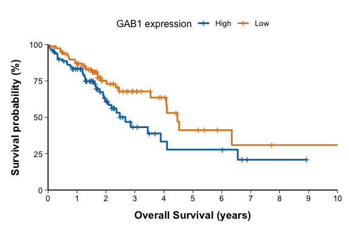
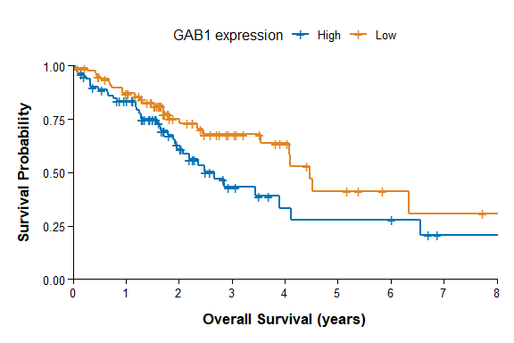
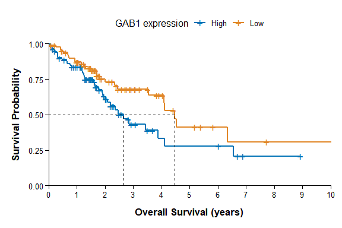
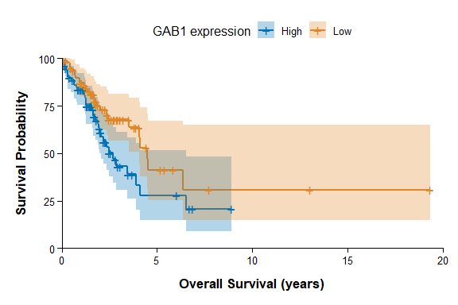
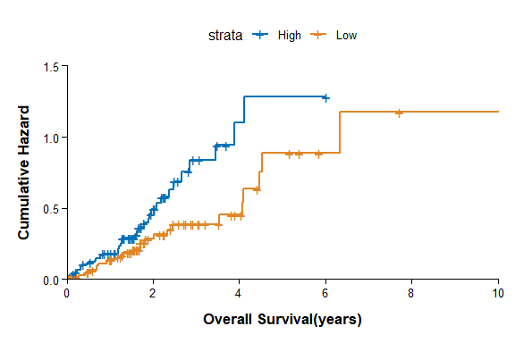
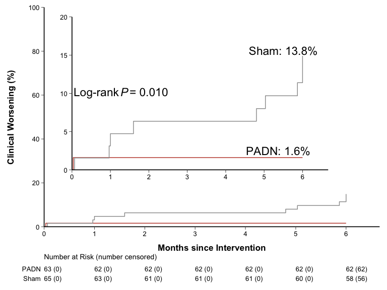
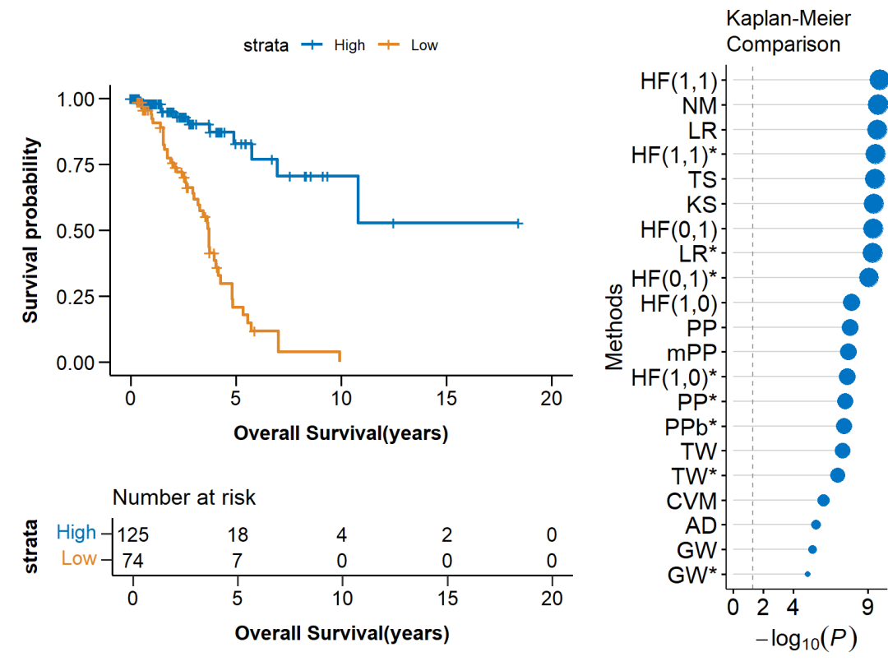
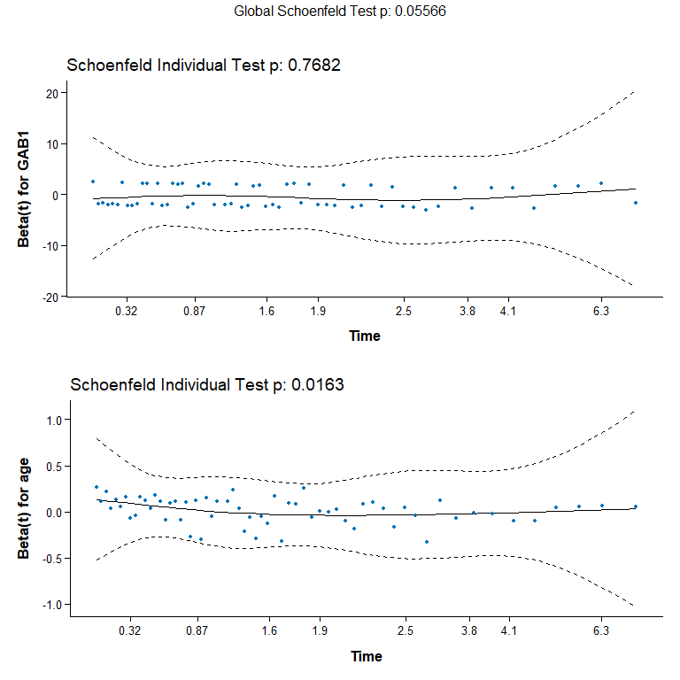
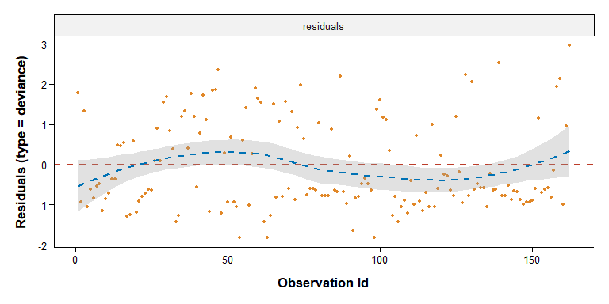
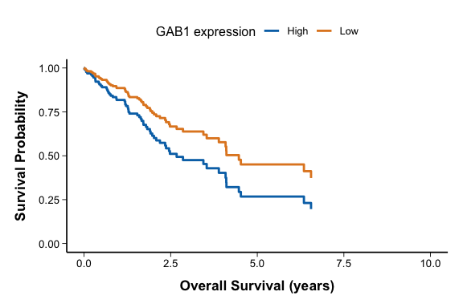

# Survival Curve

## 1. Scope and Definition

Survival curves describe the distribution of time from a defined origin to a prespecified event while accounting for right censoring. The Kaplan–Meier estimator reports the probability of remaining event-free beyond time `t`; each downward step occurs at an observed event time.

Survival graphics may also display cumulative hazard, numbers at risk, model-adjusted survival, or Cox-model diagnostics. These quantities answer different statistical questions and must be labeled accordingly.

## 2. Selection Guide

| Analytical purpose | Recommended chart |
|---|---|
| Describe unadjusted time-to-event experience by group | Kaplan–Meier Survival Plot |
| Restrict the displayed follow-up window | Truncated Survival Plot |
| Mark the time at which estimated survival reaches `0.50` | Median Survival Reference Plot |
| Display uncertainty around Kaplan–Meier estimates | Survival Plot with Confidence Band |
| Display accumulated hazard over follow-up | Cumulative Hazard Plot |
| Show the remaining risk set at clinically meaningful times | Survival Plot with Risk Table |
| Magnify low event probabilities or small early differences | Survival Curve with Inset Plot |
| Compare prespecified survival-curve tests | Survival Curve Comparison Methods Plot |
| Combine curves, risk table, and comparison results | Integrated Survival-and-Comparison Plot |
| Assess the proportional-hazards assumption of a Cox model | Schoenfeld Residual Plot |
| Identify observations poorly represented by a Cox model | Cox Deviance Residual Plot |
| Display covariate-standardized survival from a fitted Cox model | Adjusted Survival Curve |

## 3. Required Data Structure

- Individual-level data require a clearly defined time origin, non-negative follow-up time, and event indicator; document the coding direction, usually `1 = event` and `0 = censored`.
- Grouped curves require a prespecified grouping variable. Cox models additionally require correctly coded covariates and the exact analysis sample.
- Dates or time units must be harmonized before fitting. Delayed entry, time-dependent covariates, recurrent events, interval censoring, and competing risks require specialized data structures and methods.
- Retain subject identifiers, censoring reasons when available, and the numbers at risk and events over time.
- Missing-data handling and administrative study-end rules must be defined before model fitting.

## 4. Common Statistical Principles

- Kaplan–Meier estimation assumes that censoring is independent of the future event process conditional on the analysis structure. Differential or informative loss to follow-up can bias estimates and comparisons.
- Report the event definition, time origin, censoring rule, follow-up unit, and analysis population. Survival probability, cumulative event probability, cumulative hazard, and hazard ratio are not interchangeable.
- A log-rank test compares unadjusted survival functions and is most efficient for proportional-type alternatives. Crossing curves or time-localized differences may require a prespecified weighted or robust alternative.
- Confidence-band overlap is not a valid test of equality between groups. Use an appropriate survival comparison or regression model.
- A Cox hazard ratio is conditional on the fitted model and assumes proportional hazards unless modeled otherwise. It does not equal a risk ratio or a difference in survival probability.
- Curves become unstable when few participants remain at risk; interpret late follow-up together with the risk table and confidence intervals.

## 5. Common Visual Rules

- Place the title and legend at the top and center them.
- Do not add a gridline background.
- Unless specifically requested, do not add subtitles or explanatory text outside the plot.
- Add value labels only when they improve interpretation without crowding the figure.
- Preserve the step-function form of Kaplan–Meier estimates and show censor marks unless omission is explicitly justified.
- Keep curve order, colors, time units, axis limits, and risk-table order consistent across related panels.

## 6. Variants

### Kaplan–Meier Survival Plot

**Statistical Methods and Features**

- Estimates the unadjusted survival or event-free probability for one or more groups using the product-limit estimator.
- Downward steps represent events; censor marks indicate observed follow-up ending without the event and do not reduce the curve directly.
- Group separation is descriptive unless accompanied by a prespecified comparison test or effect estimate.

**Code Features**

- Fit `survfit(Surv(time, event) ~ group, data = df)` and draw with `ggsurvplot()` or `ggsurvfit()`.
- Specify time units, group labels, censor marks, and whether the y-axis is shown as a proportion or percentage.
- Keep the estimator as a step function; do not replace it with a smoothed line.

- code reference: source script `\StatsVisual-Skill\assets\templates\survival_curve\Kaplan–Meier Survival Plot.R`

### Truncated Survival Plot

**Statistical Methods and Features**

- Restricts attention to a clinically or operationally meaningful follow-up window, particularly when the late risk set is very small.
- Setting an axis limit changes only the displayed range; it does not administratively censor observations or refit the estimator.
- The selected window should be prespecified or justified, and omitted late information should not be ignored in interpretation.

**Code Features**

- Retain the original `survfit()` object and set `xlim = c(t0, t1)` and compatible time breaks for display restriction.
- Keep the risk table on the same time range.
- If the analysis itself must be administratively censored at `t1`, recode follow-up time and event status before constructing `Surv()`.

- code reference: source script `\StatsVisual-Skill\assets\templates\survival_curve\Truncated Survival Plot.R`

### Median Survival Reference Plot

**Statistical Methods and Features**

- Marks the earliest time at which the estimated survival function reaches or falls below `0.50`.
- Median survival is a Kaplan–Meier summary and is not the raw median of observed follow-up times.
- When fewer than half the participants experience the event during follow-up, median survival is not reached and should be reported as `NR`.

**Code Features**

- Use `surv.median.line = "hv"` in `ggsurvplot()` to add the `S(t) = 0.50` horizontal line and corresponding vertical reference.
- Verify the median and its confidence interval from the fitted survival summary rather than reading only from the plotted line.

- code reference: source script `\StatsVisual-Skill\assets\templates\survival_curve\Median Survival Reference Plot.R`

### Survival Plot with Confidence Band

**Statistical Methods and Features**

- Displays pointwise uncertainty around each estimated survival curve, commonly as a `95%` confidence band.
- Bands usually widen late in follow-up as the risk set decreases.
- Overlap or non-overlap of two bands is not a formal test of between-group survival differences.

**Code Features**

- Add intervals with `ggsurvplot(fit, conf.int = TRUE, ...)` or the corresponding `ggsurvfit` interval layer.
- Match each band to its curve and retain sufficient transparency so the step estimates remain visible.
- State the confidence level and interval transformation when it differs from the package default.

- code reference: source script `\StatsVisual-Skill\assets\templates\survival_curve\Survival Plot with Confidence Band.R`

### Cumulative Hazard Plot

**Statistical Methods and Features**

- Displays the accumulated hazard `H(t)`, commonly estimated as `-log[S(t)]` from a Kaplan–Meier fit or by the Nelson–Aalen estimator.
- Cumulative hazard is non-decreasing and is not a probability; it may exceed `1`.
- If the intended estimand is cumulative event probability, plot `1 - S(t)` rather than cumulative hazard.

**Code Features**

- Use `fun = "cumhaz"` in `ggsurvplot()` or `type = "cumhaz"` in `ggsurvfit()`.
- Label the y-axis as `Cumulative Hazard` and do not format it as a percentage.
- Use a cumulative-event transformation instead when the axis is labeled as event incidence or percentage.

- code reference: source script `\StatsVisual-Skill\assets\templates\survival_curve\Cumulative Hazard Plot.R`

### Survival Plot with Risk Table

**Statistical Methods and Features**

- Reports the number of participants still under observation and event-free immediately before selected time points.
- The table reveals when curve estimates are supported by few participants and may optionally include interval-specific censoring or event counts.
- Risk-set imbalance should be considered when interpreting late differences between groups.

**Code Features**

- Fit with `survfit2()` when using the `ggsurvfit` workflow, then add the table with `add_risktable()`.
- Use `risktable_stats = "{n.risk} ({n.censor})"` only when the parenthetical value is clearly labeled as censoring.
- Align time breaks, group order, colors, and units exactly with the main panel.
- For publication-style manual risk tables, build the KM panel and risk table as separate `ggplot` objects, then combine them with `cowplot::plot_grid(main_plot, risk_plot, ncol = 1, align = "v", axis = "lr")`.
- Use identical `xlim`, `time_breaks`, and `expand = expansion(mult = c(0, 0))` in both panels. Risk-table numbers must be placed at the true time points so each column sits directly under the corresponding KM-axis tick.
- Do not widen the risk-table x scale to make room for labels. Keep numeric columns controlled by the same x scale as the KM panel; create label space only with `coord_cartesian(xlim = c(x_min, x_max), clip = "off")` and a sufficient left `plot.margin`.
- Draw `No. at Risk` and all group names with one shared off-panel x anchor and `hjust = 0` so their left edges are identical. Choose the anchor far enough left that the full label column stays outside the y-axis line and does not overlap the 0-time risk counts.
- Keep risk-table numeric text and group-name text the same size as the KM tick labels. Keep `No. at Risk` the same size and weight as the KM axis titles unless a target journal example clearly shows otherwise.
- Use compact but non-overlapping row spacing. The risk table should read as one attached table block; increase table height only when group count or row text requires it.
- Direct curve labels should sit near clear curve-adjacent whitespace, with consistent offset from their corresponding curves. Use regular-weight labels unless the journal style requires bold .

- code reference: source script `\StatsVisual-Skill\assets\templates\survival_curve\Survival Plot with Risk Table.R`

### Survival Curve with Inset Plot

**Statistical Methods and Features**

- Magnifies a prespecified low-probability or early-time region when clinically important differences are compressed in the full-scale panel.
- The inset changes visual scale only and must not imply a larger absolute difference than the underlying estimand.
- Reported event rates, log-rank `P` values, and hazard ratios must come from the stated analyses and should not be inferred from the inset.

**Code Features**

- Build the full-range plot and a second plot with the same data and time scale but a narrower y-range.
- Embed the second plot with `annotation_custom(ggplotGrob(subplot), ...)` and place it outside dense curve regions.
- If the y-axis is event percentage, plot cumulative event probability rather than labeling cumulative hazard as a percentage.

### Survival Curve Comparison Methods Plot

**Statistical Methods and Features**

- Summarizes `P` values from several survival-curve comparison tests that weight event times differently.
- Standard log-rank emphasizes proportional-type alternatives; other methods may emphasize early, late, or crossing-curve differences.
- The test should be prespecified from the clinical alternative or analysis plan. Selecting the smallest result after examining many methods creates multiplicity and reporting bias.

**Code Features**

- Generate a reproducible table containing method name, test definition, and `P` value, then map `-log10(P)` to the horizontal axis.
- Add a reference at `-log10(0.05)` only as the stated nominal threshold and identify any multiplicity adjustment.
- Pin the version of any external comparison script and verify that the method supports the number of groups and censoring pattern.

- code reference: source script `\StatsVisual-Skill\assets\templates\survival_curve\Survival Curve Comparison Methods Plot.R`

### Integrated Survival-and-Comparison Plot

**Statistical Methods and Features**

- Combines the estimated survival process, supporting risk-set information, and prespecified group-comparison results.
- The curve and risk table remain the primary evidence; the method-comparison panel is supplementary and should not encourage post hoc test selection.

**Code Features**

- Construct the survival panel and risk table from the same fit and time breaks, then build the comparison panel from the corresponding test table.
- Arrange components with `ggdraw()` and `draw_plot()` or an equivalent `cowplot`/`patchwork` layout.
- Preserve exact timeline alignment and allocate sufficient space for the main curve and risk table.

- code reference: source script `\StatsVisual-Skill\assets\templates\survival_curve\Integrated Survival-and-Comparison Plot.R`

### Schoenfeld Residual Plot

**Statistical Methods and Features**

- Assesses whether each Cox-model log hazard ratio is approximately constant over follow-up.
- A systematic residual trend suggests time-varying effects; interpretation should combine the smoothed pattern, covariate-specific test, global test, and clinical relevance.
- Failure of proportional hazards does not invalidate the observed survival data but may make a single constant hazard ratio inadequate.

**Code Features**

- Fit `coxph(Surv(time, event) ~ covariates, data = df)`, calculate `cox.zph(fit, global = TRUE)`, and draw with `ggcoxzph()`.
- Check each covariate and the global result rather than relying on one `P`-value cutoff.
- If proportional hazards fails, consider time interactions, stratification, or time-specific effect summaries before plotting a constant adjusted effect.

- code reference: source script `\StatsVisual-Skill\assets\templates\survival_curve\Schoenfeld Residual Plot.R`

### Cox Deviance Residual Plot

**Statistical Methods and Features**

- Uses a transformed martingale residual to identify observations poorly represented by a Cox model.
- Large absolute residuals are screening signals, not formal deletion rules. Positive values generally indicate an event occurring earlier or more strongly than expected; negative values commonly reflect longer event-free follow-up or censoring.
- Influence on individual coefficients should be assessed separately with DFBETA or case-deletion diagnostics.

**Code Features**

- Draw with `ggcoxdiagnostics(fit, type = "deviance", ...)` using observation index or linear predictor on the horizontal axis.
- Retain the zero reference and optional LOESS trend, but do not treat a generic `±1.96` band as a universal cutoff.
- Use `type = "dfbeta"` when the objective is coefficient-specific influence rather than overall residual fit.

- code reference: source script `\StatsVisual-Skill\assets\templates\survival_curve\Cox Deviance Residual Plot.R`

### Adjusted Survival Curve

**Statistical Methods and Features**

- Displays model-based survival estimates for exposure groups after standardizing or conditioning on covariates in a fitted Cox model.
- These are not Kaplan–Meier curves and depend on the model specification, proportional-hazards assumption, covariate distribution, and selected adjustment method.
- Adjusted curves support interpretation of covariate-standardized prognosis; they do not by themselves establish a causal exposure effect.

**Code Features**

- Fit `coxph(Surv(time, event) ~ exposure + covariates, data = df)` and draw with `ggadjustedcurves(..., variable = "exposure", method = "average")`.
- State the standardization method and covariates used, and use the same target population across exposure groups.
- Do not add censor marks to model-standardized curves; compare them with unadjusted Kaplan–Meier curves when useful.

- code reference: source script `\StatsVisual-Skill\assets\templates\survival_curve\Adjusted Survival Curve.R`

## 7. QA Checklist

- Verify the time origin, event definition, event coding, censoring rule, units, and analysis population.
- Confirm that survival probability, cumulative event probability, cumulative hazard, and hazard ratio are labeled correctly.
- Show censor marks and numbers at risk at clinically meaningful times; interpret late tails cautiously.
- Prespecify the group-comparison method and report an effect estimate with confidence interval when appropriate.
- For Cox models, check proportional hazards, influential observations, functional form, and missing-data handling.
- Ensure every annotated `P` value, hazard ratio, confidence interval, event rate, and risk-table count matches the fitted analysis.
- For manually composed KM curves with risk tables, verify that the risk-table numbers are vertically aligned under the KM-axis ticks at every displayed time point. If numbers are shifted, remove risk-table scale expansion and restore identical `xlim`, breaks, and `expand = 0` in both panels.
- Verify that `No. at Risk` and all group labels share one strict left edge while the whole label column remains outside the y-axis line. Do not use different manual `hjust` values for different labels; use one shared off-panel x coordinate with `hjust = 0` and enough left margin.
