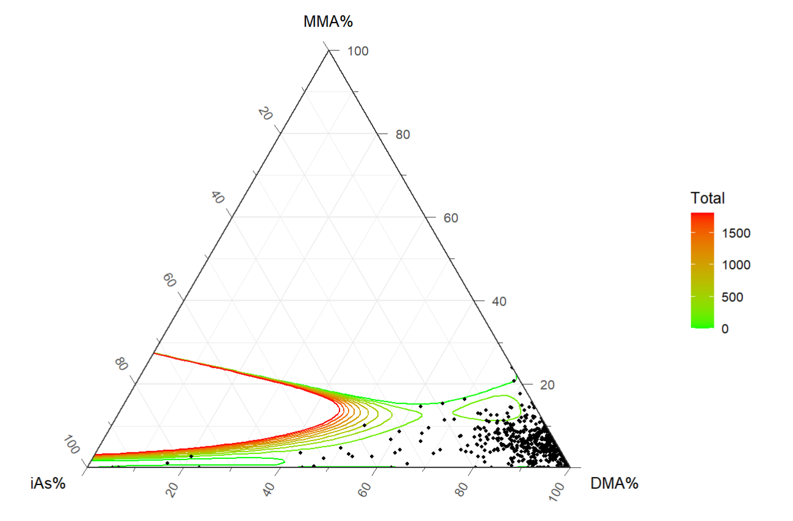

# Ternary Plot

## 1. Scope and Definition

Ternary plots display three non-negative components whose sum is constant, usually `1` or `100%`. Each observation is represented by one point inside an equilateral triangle: proximity to a vertex indicates a larger share of that component, proximity to an edge indicates a small share of the opposite component, and the center indicates broadly similar proportions.

Ternary plots are descriptive displays of composition. Confidence, density, and interpolated variants add estimated regions or surfaces, but do not change the compositional constraint.

## 2. Selection Guide

| Analytical purpose | Recommended chart |
|---|---|
| Show individual three-part compositions and group patterns | Basic Ternary Plot |
| Show estimated concentration regions of the observed compositions | Confidence Ternary Plot |
| Identify dense and sparse regions in ternary space | Density Ternary Plot |
| Show how an additional continuous outcome varies across compositions | Interpolated Ternary Plot |

## 3. Required Data Structure

- Each observation must contain three non-negative component variables measured on a common basis and summing to the same constant within an appropriate numerical tolerance.
- If raw amounts are converted to proportions, the denominator must represent a scientifically meaningful total; retain the original total when absolute burden may also matter.
- Optional variables may define clinical groups or a continuous target outcome. Confidence and density variants require adequate sample size across the ternary space.
- Missing values and true zeros must be distinguished. Do not renormalize incomplete observations without a prespecified missing-data rule.

## 4. Common Statistical Principles

- The three components are compositionally dependent: increasing one share necessarily reduces at least one other share. Pairwise interpretations should therefore respect the constant-sum constraint.
- Ternary position describes relative composition, not absolute concentration. Similar proportions can arise from very different total exposures or biomarker levels.
- Normalization is appropriate only when the three variables form a coherent whole. Unrelated measurements should not be forced to sum to `100%`.
- Confidence and density regions are estimated population-level summaries, not confidence intervals for individual observations and not formal tests of between-group differences.
- For regression or inference with compositional predictors, use an appropriate compositional-data method; the ternary plot alone is exploratory.

## 5. Common Visual Rules

- Unless specifically requested, do not add subtitles or explanatory text outside the plot.
- Add value labels only when they improve interpretation without crowding the figure.
- Retain only a light triangular reference mesh and label all three component axes clearly, including units or `%`.
- Keep vertex assignment, axis direction, scale, and group colors consistent across related ternary plots.

## 6. Variants

### Basic Ternary Plot

**Statistical Features**

- Displays each observation as a three-part composition and allows comparison of dominant components, mixtures, and group clustering.
- Color may identify clinical groups, but visual overlap or separation does not establish a statistically significant group difference.

**Visual Features**

- Points lie within a triangular coordinate system, with each vertex representing `100%` of one component.
- Points near the center have similar component shares; points near a vertex or edge indicate compositional dominance or near absence.

**Code Features**

- Use `ggtern(data, aes(x = comp1, y = comp2, z = comp3))` and add observations with `geom_point()`.
- Map an optional group to `color`, label the axes with `Tlab()`, `Llab()`, and `Rlab()`, and use `theme_showarrows()` when axis direction needs emphasis.

- code reference: source script `\StatsVisual-Skill\assets\templates\ternary_plot\Ternary Plot.R`

### Confidence Ternary Plot

**Statistical Features**

- Summarizes estimated regions containing specified proportions of the observed compositional distribution.
- The regions describe population concentration under the implemented estimator; they are not pointwise confidence intervals or evidence of group differences.

**Visual Features**

- Nested polygon regions occupy progressively broader areas of the triangle as the stated level increases.
- Original observations may be overlaid to show how the estimated regions relate to the actual data cloud.

**Code Features**

- Add regions with `stat_confidence_tern(mapping = aes(fill = after_stat(level)), geom = "polygon", breaks = ...)`.
- Use `geom_mask()` to respect the triangular boundary and overlay restrained points with `geom_point()`.

### Density Ternary Plot

**Statistical Features**

- Estimates the spatial density of compositions and identifies common and sparse mixtures within the simplex.
- Density shape depends on sample size, smoothing, and contour breaks; apparent hot spots should be treated as exploratory.

**Visual Features**

- Filled contours form continuous high- and low-density regions inside the triangle.
- Warmer or darker regions indicate greater estimated concentration, while overlaid points retain the observed sample locations.

**Code Features**

- Use `stat_density_tern()` with `fill = after_stat(level)` and, when useful, `alpha = after_stat(level)`.
- Draw polygon contours with a controlled set of `breaks` and overlay small points so the density surface remains visible.

### Interpolated Ternary Plot

**Statistical Features**

- Displays a model-estimated surface for an additional continuous outcome across the three-part composition.
- The surface represents predictions between observed compositions and depends on the chosen model; it should not be interpreted as measured data in poorly supported regions.

**Visual Features**

- Colored contour bands or lines spread across the triangle, with color representing the predicted target value.
- Observed compositions can be superimposed to reveal where the fitted surface is supported by data.

**Code Features**

- Map the target variable to `value` in `geom_interpolate_tern()` and specify the fitting `method`, `base`, and `formula`.
- Keep polynomial complexity compatible with sample size and coverage; add `geom_point()` to show the observations used for interpolation.

## 7. QA Checklist

- Verify that all three components are non-negative and sum to the same constant after missing-value handling.
- Confirm that normalization is scientifically valid and that absolute totals are retained when clinically relevant.
- Check vertex labels, axis directions, units, scale consistency, and group encodings.
- For confidence and density plots, review sample size, smoothing, contour levels, and whether original points remain visible.
- For interpolated plots, inspect model specification, overfitting, extrapolation into sparse regions, and the distribution of the target outcome.
- Avoid causal or inferential claims based only on visual separation, density, or an interpolated surface.
